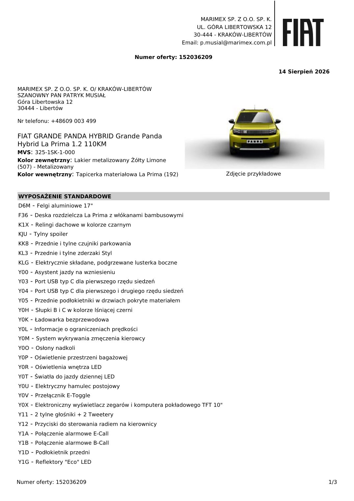

# Fiat Grande Panda — La Prima

> **Stan danych:** 2026-08-17. Dossier rozdziela dane konkretnej oferty od danych ogólnomodelowych i innych rynków. Pole `status` jest częścią danych i nie powinno być ignorowane przez kod.

## Konfiguracje z dokumentów

| Konfiguracja | Cena | Katalogowa | Rok prod./model | Kolor | Wnętrze | Koła | Identyfikatory | Źródło |
|---|---:|---:|---|---|---|---|---|---|
| La Prima — Żółty Limone | 90212 zł | 100800 zł | 2026 / — | Żółty Limone metalizowany (507) | La Prima materiałowa (192) | aluminiowe 17" | ID 152036209 | [01-grande-panda-hybrid-la-prima.md](../offers/01-grande-panda-hybrid-la-prima.md) |

## Napęd

| Pole | Wartość | Status / zakres | Źródła | Uwagi |
|---|---:|---|---|---|
| Paliwo | benzyna + mild hybrid 48 V | `exact-offer+official-model` | LOCAL-01, FIAT_PRESS |  |
| Typ napędu | MHEV | `official-model` | FIAT_PRESS |  |
| Pojemność [cm³] | 1199 | `model-level` | FIAT_HYBRID_PRESS |  |
| Moc [KM] | 110 | `exact-offer` | LOCAL-01 |  |
| Moc [kW] | 81 | `derived-from-110-hp` | LOCAL-01 | Zaokrąglenie przeliczenia KM→kW. |
| Moment [Nm] | 205 | `model-level-other-market` | FIAT_HYBRID_PRESS |  |
| Skrzynia | 6-biegowa eDCT, dwusprzęgłowa | `official-model` | FIAT_PRESS |  |
| Napęd | FWD | `model-level` | FIAT_HYBRID_PRESS |  |

## Osiągi

| Pole | Wartość | Status / zakres | Źródła | Uwagi |
|---|---:|---|---|---|
| 0–100 km/h [s] | 10 | `model-level-other-market` | FIAT_HYBRID_PRESS |  |
| Prędkość maks. [km/h] | — | `not-found` | — | Brak wiarygodnej wartości w dokumentach i zebranych oficjalnych stronach. |

## Zużycie, emisje i ładowanie

| Pole | Wartość | Status / zakres | Źródła | Uwagi |
|---|---:|---|---|---|
| WLTP mieszane [l/100 km] | 5,10 | `exact-offer` | LOCAL-01 |  |
| CO₂ WLTP [g/km] | 116 | `exact-offer` | LOCAL-01 |  |

## Wymiary, masy i praktyczność

| Pole | Wartość | Status / zakres | Źródła | Uwagi |
|---|---:|---|---|---|
| Długość [mm] | 3999 | `official-current-model` | FIAT_TECH |  |
| Szerokość bez lusterek [mm] | — | `not-found` | — | Oficjalna strona podaje tylko szerokość z lusterkami. |
| Szerokość z lusterkami [mm] | 2017 | `official-current-model` | FIAT_TECH |  |
| Wysokość [mm] | 1586 | `official-current-model` | FIAT_TECH |  |
| Rozstaw osi [mm] | — | `not-found` | — |  |
| Prześwit [mm] | — | `not-found` | — |  |
| Średnica zawracania [m] | — | `not-found` | — |  |
| Bagażnik [l] | 412 | `official-current-model` | FIAT_TECH |  |
| Bagażnik max [l] | — | `not-found` | — |  |
| Zbiornik [l] | — | `not-found` | — |  |
| Przyczepa hamowana [kg] | — | `not-found` | — |  |
| Przyczepa bez hamulca [kg] | — | `not-found` | — |  |
| Masa własna [kg] | — | `not-found` | — |  |
| DMC [kg] | — | `not-found` | — |  |

## Najważniejsze wyposażenie z oferty

felgi 17", automatyczna klimatyzacja, kamera cofania, czujniki przód/tył, elektrycznie składane i podgrzewane lusterka, ładowarka bezprzewodowa, Uconnect 10,25", zestaw wskaźników 10".

## Gwarancja i serwis

- Gwarancja ogólna: 24 miesiące bez limitu kilometrów — warunki ogólne Fiat.
- Lakier: 24 miesiące; perforacja nadwozia: 8 lat — zweryfikować książkę gwarancyjną konkretnego auta.

## Konflikty i rozbieżności

_Nie wykryto istotnych konfliktów pomiędzy źródłami._

## Nadal brakujące dane

- prędkość maksymalna
- rozstaw osi
- masa
- dopuszczalne masy przyczepy
- pojemność zbiornika

## Lokalny podgląd dokumentów

## Oficjalne zdjęcia i galerie internetowe

- [widok zewnętrzny / jazda](https://stellantis3.dam-broadcast.com/medias/domain12808/media108936/2680846-iqmf7uo58c-whr.jpg) — `official-illustrative`; skrót: [`fiat-grande-panda-hybrid-la-prima-01.url`](../../research/url_shortcuts/images/fiat-grande-panda-hybrid-la-prima-01.url).

Zdjęcia internetowe są **poglądowe**: mogą przedstawiać inny kolor, wyposażenie, rok modelowy lub rynek. Dokładny wygląd konfiguracji rozstrzygają lokalne rendery stron oraz umowa sprzedaży.

## Źródła lokalne

- **LOCAL-01** — [Fiat Grande Panda Hybrid La Prima — oferta 152036209](../offers/01-grande-panda-hybrid-la-prima.md) — źródło konkretnej oferty/kalkulacji.

## Źródła internetowe

- **FIAT_TECH** — [Fiat Grande Panda Hybrid — dane techniczne](https://www.fiat.pl/modele/grande-panda-hybryda/dane-techniczne) — `Fiat:official-current-model`. Wymiary i pojemność bagażnika.
- **FIAT_PRESS** — [Grande Panda — rodzina układów napędowych](https://www.media.stellantis.com/pl-pl/fiat/press/trzy-uklady-napedowe-jedna-ikona-fiat-wprowadza-model-grande-panda-z-silnikiem-benzynowym-ktory-dolacza-do-wersji-z-napedem-hybrydowym-i-elektrycznym) — `Fiat/Stellantis:official-press`. Opis układu hybrydowego 48 V i skrzyni eDCT.
- **FIAT_HYBRID_PRESS** — [Fiat Grande Panda Hybrid — materiał techniczny](https://www.media.stellantis.com/gr-el/fiat/press/neo-fiat-grande-panda-hybrid-o-exilektrismos-pou-kani-ti-diafora-sto-b-segment) — `Fiat/Stellantis:official-press-other-market`. Osiągi, moment obrotowy i homologacyjne zużycie; dane ogólnomodelowe, nie konfiguracja dealera.
- **FIAT_WARRANTY** — [Fiat — warunki gwarancji](https://www.fiat.pl/mopar/gwarancja) — `Fiat:official-warranty`. Ogólne warunki gwarancji dla nowych samochodów Fiat.
- **FIAT_MEDIA** — [Fiat Grande Panda Hybrid — oficjalna galeria](https://www.media.stellantis.com/de-de/fiat/fiat-grande-panda-hybrid) — `Fiat/Stellantis:official-media-gallery`. Zdjęcia poglądowe; mogą przedstawiać inną wersję i rynek.
