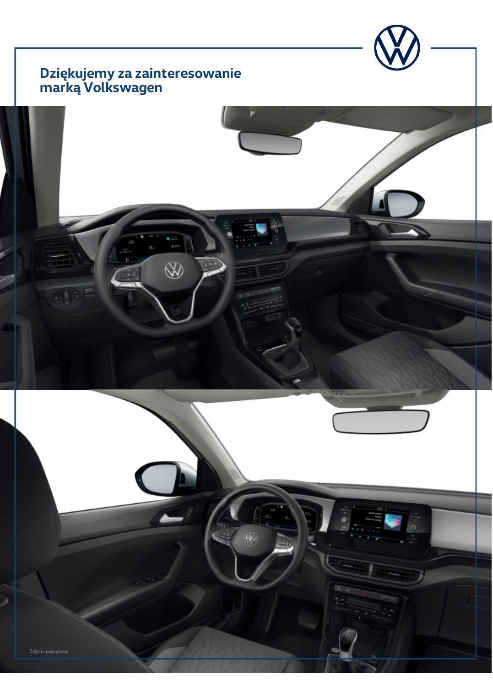

# Volkswagen T-Cross — Life Plus

> **Stan danych:** 2026-08-17. Dossier rozdziela dane konkretnej oferty od danych ogólnomodelowych i innych rynków. Pole `status` jest częścią danych i nie powinno być ignorowane przez kod.

## Konfiguracje z dokumentów

| Konfiguracja | Cena | Katalogowa | Rok prod./model | Kolor | Wnętrze | Koła | Identyfikatory | Źródło |
|---|---:|---:|---|---|---|---|---|---|
| Life Plus — Srebrny Reflex | 129290 zł | — zł | 2026 / 2027 | Srebrny Reflex metalizowany | szary melanż / czarny | Bangalore 17" | ID GOV-26-286981 | [02-gov-26-286981.md](../offers/02-gov-26-286981.md) |

## Napęd

| Pole | Wartość | Status / zakres | Źródła | Uwagi |
|---|---:|---|---|---|
| Paliwo | benzyna | `exact-offer` | LOCAL-02 |  |
| Typ napędu | ICE turbo | `exact-offer` | LOCAL-02 |  |
| Pojemność [cm³] | 999 | `exact-offer` | LOCAL-02 |  |
| Moc [KM] | 116 | `exact-offer` | LOCAL-02 |  |
| Moc [kW] | 85 | `exact-offer` | LOCAL-02 |  |
| Moment [Nm] | 200 | `exact-offer` | LOCAL-02 |  |
| Skrzynia | 7-biegowa DSG | `exact-offer` | LOCAL-02 |  |
| Napęd | FWD | `model-level` | VW_TCROSS_PRICE |  |

## Osiągi

| Pole | Wartość | Status / zakres | Źródła | Uwagi |
|---|---:|---|---|---|
| 0–100 km/h [s] | 10,30 | `exact-offer` | LOCAL-02 |  |
| Prędkość maks. [km/h] | 192 | `exact-offer` | LOCAL-02 |  |

## Zużycie, emisje i ładowanie

| Pole | Wartość | Status / zakres | Źródła | Uwagi |
|---|---:|---|---|---|
| WLTP mieszane [l/100 km] | 5,80 | `exact-offer` | LOCAL-02 |  |
| CO₂ WLTP [g/km] | 132 | `exact-offer` | LOCAL-02 |  |

## Wymiary, masy i praktyczność

| Pole | Wartość | Status / zakres | Źródła | Uwagi |
|---|---:|---|---|---|
| Długość [mm] | 4127–4135 | `exact-offer-range` | LOCAL-02 |  |
| Szerokość bez lusterek [mm] | 1760–1784 | `exact-offer-range` | LOCAL-02 |  |
| Szerokość z lusterkami [mm] | — | `not-found` | — |  |
| Wysokość [mm] | 1573 | `exact-offer` | LOCAL-02 |  |
| Rozstaw osi [mm] | 2551 | `exact-offer` | LOCAL-02 |  |
| Prześwit [mm] | — | `not-found` | — |  |
| Średnica zawracania [m] | 10,70 | `exact-offer` | LOCAL-02 |  |
| Bagażnik [l] | 455 | `exact-offer` | LOCAL-02 |  |
| Bagażnik max [l] | 1281 | `exact-offer` | LOCAL-02 |  |
| Zbiornik [l] | 40 | `exact-offer` | LOCAL-02 |  |
| Przyczepa hamowana [kg] | 1100 | `exact-offer` | LOCAL-02 |  |
| Przyczepa bez hamulca [kg] | 640 | `exact-offer` | LOCAL-02 |  |
| Masa własna [kg] | — | `not-found` | — |  |
| DMC [kg] | — | `not-found` | — |  |

## Najważniejsze wyposażenie z oferty

Reflex Silver metalik, Bangalore 17", pakiet Style, pakiet Comfort, podgrzewane fotele, bezprzewodowy App-Connect, LED, przesuwna tylna kanapa.

## Gwarancja i serwis

- Warunki gwarancji nie zostały dołączone do oferty; przed zakupem należy pobrać aktualną książkę gwarancyjną VW dla rynku polskiego.

## Konflikty i rozbieżności

1. Symulacja 6177859 dotyczy T-Cross Life za 106 000 zł, a nie dokładnie Life Plus z informacji handlowej za 129 290 zł. Nie wolno automatycznie łączyć tych dokumentów jako jednej konfiguracji.

## Nadal brakujące dane

- masa własna/DMC
- szerokość z lusterkami
- warunki gwarancji konkretnej oferty

## Lokalny podgląd dokumentów

## Oficjalne zdjęcia i galerie internetowe

- [przód / jazda](https://uploads.vw-mms.de/system/production/images/vwn/079/456/images/2db0787da05557834c3fb08af01d4b22d5562d11/DB2023AU00622_web_1600.jpg?1717575978=) — `official-illustrative`; skrót: [`volkswagen-t-cross-life-plus-116-dsg-01.url`](../../research/url_shortcuts/images/volkswagen-t-cross-life-plus-116-dsg-01.url).
- [widok zewnętrzny](https://uploads.vw-mms.de/system/production/images/vwn/079/465/images/d93e4e7d7fa9166d4613d4128f4b04352cee6704/DB2023AU00631_web_1600.jpg?1717576001=) — `official-illustrative`; skrót: [`volkswagen-t-cross-life-plus-116-dsg-02.url`](../../research/url_shortcuts/images/volkswagen-t-cross-life-plus-116-dsg-02.url).
- [wnętrze](https://uploads.vw-mms.de/system/production/images/vwn/079/471/images/cde6bcdd87abc28ee5dd9074e68351c4a7d48c5f/DB2023AU00637_web_1600.jpg?1717576202=) — `official-illustrative`; skrót: [`volkswagen-t-cross-life-plus-116-dsg-03.url`](../../research/url_shortcuts/images/volkswagen-t-cross-life-plus-116-dsg-03.url).

Zdjęcia internetowe są **poglądowe**: mogą przedstawiać inny kolor, wyposażenie, rok modelowy lub rynek. Dokładny wygląd konfiguracji rozstrzygają lokalne rendery stron oraz umowa sprzedaży.

## Źródła lokalne

- **LOCAL-02** — [Volkswagen T-Cross Life Plus — GOV-26-286981](../offers/02-gov-26-286981.md) — źródło konkretnej oferty/kalkulacji.
- **LOCAL-03** — [Volkswagen T-Cross — symulacja 6177859](../offers/03-simulation-6177859.md) — źródło konkretnej oferty/kalkulacji.

## Źródła internetowe

- **VW_TCROSS_PRICE** — [Volkswagen T-Cross — aktualny cennik, wyposażenie i dane](https://cenniki.volkswagen.pl/T-Cross.html) — `Volkswagen:official-current-model`. Rok modelowy 2027 / produkcja 2026; konfiguracje i wyposażenie rynku polskiego.
- **VW_TCROSS_MEDIA** — [Volkswagen T-Cross — oficjalny album prasowy](https://www.volkswagen-newsroom.com/de/bilder/alben/t-cross-6688) — `Volkswagen:official-media-gallery`. Zdjęcia poglądowe, nie konkretne auto z oferty.
