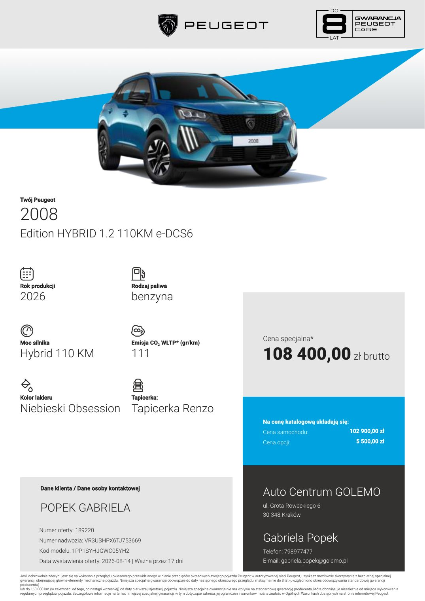
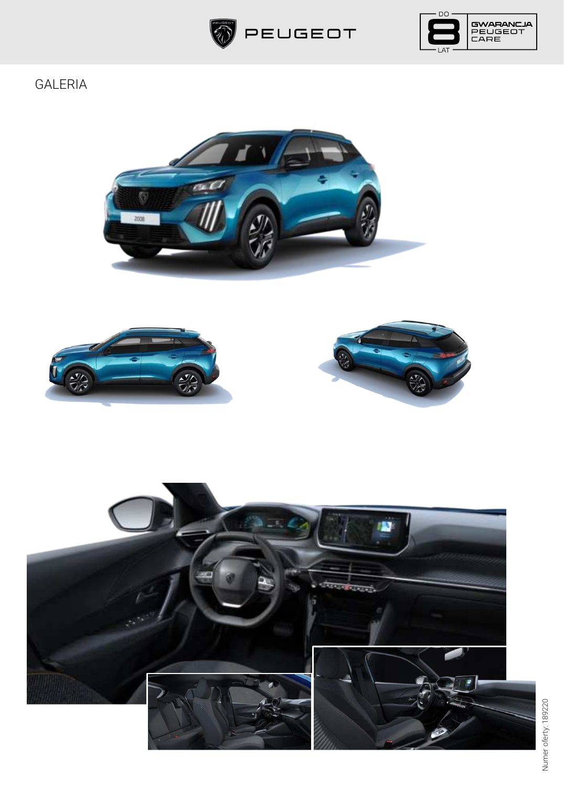

# Peugeot 2008 — Edition

> **Stan danych:** 2026-08-17. Dossier rozdziela dane konkretnej oferty od danych ogólnomodelowych i innych rynków. Pole `status` jest częścią danych i nie powinno być ignorowane przez kod.

## Konfiguracje z dokumentów

| Konfiguracja | Cena | Katalogowa | Rok prod./model | Kolor | Wnętrze | Koła | Identyfikatory | Źródło |
|---|---:|---:|---|---|---|---|---|---|
| 2008 Edition Hybrid 110 | 108400 zł | 108400 zł | 2026 / — | Niebieski Obsession | Tapicerka Renzo | brak precyzyjnego opisu w tekście oferty | VIN VR3USHPX6TJ753669, ID 189220 | [04-oferta-2008-pan-krzysztof-krawczynski.md](../offers/04-oferta-2008-pan-krzysztof-krawczynski.md) |

## Napęd

| Pole | Wartość | Status / zakres | Źródła | Uwagi |
|---|---:|---|---|---|
| Paliwo | benzyna + hybryda 48 V | `exact-offer` | LOCAL-04 |  |
| Typ napędu | mild/full hybrid 48 V wg nazewnictwa Peugeot | `exact-offer` | LOCAL-04 |  |
| Pojemność [cm³] | 1199 | `model-level-comparable` | PEUGEOT_PRICES |  |
| Moc [KM] | 110 | `exact-offer` | LOCAL-04 |  |
| Moc [kW] | 81 | `derived-from-110-hp` | LOCAL-04 |  |
| Moment [Nm] | — | `not-found-exact` | — |  |
| Skrzynia | 6-biegowa e-DCS6 | `exact-offer` | LOCAL-04 |  |
| Napęd | FWD | `model-level` | PEUGEOT_2008_MODEL |  |

## Osiągi

| Pole | Wartość | Status / zakres | Źródła | Uwagi |
|---|---:|---|---|---|
| 0–100 km/h [s] | — | `not-found-exact` | — |  |
| Prędkość maks. [km/h] | — | `not-found-exact` | — |  |

## Zużycie, emisje i ładowanie

| Pole | Wartość | Status / zakres | Źródła | Uwagi |
|---|---:|---|---|---|
| WLTP mieszane [l/100 km] | 4,90 | `exact-offer` | LOCAL-04 |  |
| CO₂ WLTP [g/km] | 111 | `exact-offer-cover` | LOCAL-04 | Nagłówek oferty podaje 111 g/km; tabela niżej zawiera błędnie 4,9 w polu CO₂. |

## Wymiary, masy i praktyczność

| Pole | Wartość | Status / zakres | Źródła | Uwagi |
|---|---:|---|---|---|
| Długość [mm] | 4300 | `exact-offer` | LOCAL-04 |  |
| Szerokość bez lusterek [mm] | 1770 | `exact-offer` | LOCAL-04 |  |
| Szerokość z lusterkami [mm] | — | `not-found` | — |  |
| Wysokość [mm] | 1550 | `exact-offer` | LOCAL-04 |  |
| Rozstaw osi [mm] | 2605 | `exact-offer` | LOCAL-04 |  |
| Prześwit [mm] | — | `not-found` | — |  |
| Średnica zawracania [m] | — | `not-found` | — |  |
| Bagażnik [l] | 434 | `official-current-model-generic` | PEUGEOT_2008_MODEL |  |
| Bagażnik max [l] | 1467 | `official-current-model-generic` | PEUGEOT_2008_MODEL |  |
| Zbiornik [l] | 44 | `exact-offer` | LOCAL-04 |  |
| Przyczepa hamowana [kg] | — | `not-found-exact` | — |  |
| Przyczepa bez hamulca [kg] | — | `not-found-exact` | — |  |
| Masa własna [kg] | — | `not-found-exact` | — |  |
| DMC [kg] | 1790 | `exact-offer` | LOCAL-04 |  |

## Najważniejsze wyposażenie z oferty

Obsession Blue, Renzo, kamera HD 180 Visiopark 1, Peugeot i-Connect Advanced, nawigacja 3D, automatyczna klimatyzacja, podgrzewane fotele, elektrycznie składane lusterka.

## Gwarancja i serwis

- Oferta opisuje warunkową specjalną ochronę do 8 lat / 160 000 km po wykonywaniu przeglądów w autoryzowanej sieci; zakres i ograniczenia trzeba sprawdzić w OWG Peugeot.

## Konflikty i rozbieżności

1. W tabeli technicznej oferty pole „Emisja CO₂” zawiera 4,9 — to wartość zużycia paliwa, nie g/km. Za właściwą wartość exact przyjęto 111 g/km z nagłówka.
2. Aktualna strona modelu podaje około 4304 × 1815 × 1523/1550 mm, podczas gdy konkretna oferta podaje 4300 × 1770 × 1550 mm. W kodzie należy zachować obie wartości z zakresem pochodzenia, nie nadpisywać danych konfiguracji wartością ogólnomodelową.

## Nadal brakujące dane

- 0–100 km/h exact
- prędkość maksymalna exact
- moment obrotowy exact
- masa własna
- uciąg

## Lokalny podgląd dokumentów

## Oficjalne zdjęcia i galerie internetowe

- [Peugeot 2008 — oficjalna galeria produktowa](https://www.media.stellantis.com/cz-cs/peugeot/press/produktove-foto-peugeot-2008) — oficjalna galeria; obrazy nie zostały redystrybuowane w paczce.

Zdjęcia internetowe są **poglądowe**: mogą przedstawiać inny kolor, wyposażenie, rok modelowy lub rynek. Dokładny wygląd konfiguracji rozstrzygają lokalne rendery stron oraz umowa sprzedaży.

## Źródła lokalne

- **LOCAL-04** — [Peugeot 2008 Edition Hybrid 110 — oferta 189220](../offers/04-oferta-2008-pan-krzysztof-krawczynski.md) — źródło konkretnej oferty/kalkulacji.

## Źródła internetowe

- **PEUGEOT_2008_MODEL** — [Peugeot 2008 — oficjalna strona modelu](https://www.peugeot.pl/modele/nowy-peugeot-2008/petrol-hybrid.html) — `Peugeot:official-current-model`. Wymiary i pojemność bagażnika obecnej gamy.
- **PEUGEOT_PRICES** — [Peugeot — oficjalne cenniki i specyfikacje](https://www.peugeot.pl/tools/cenniki-peugeot.html) — `Peugeot:official-download-index`. Punkt wejścia do aktualnych cenników i broszur.
- **PEUGEOT_2008_MEDIA** — [Peugeot 2008 — oficjalna galeria produktowa](https://www.media.stellantis.com/cz-cs/peugeot/press/produktove-foto-peugeot-2008) — `Peugeot/Stellantis:official-media-gallery`. Zdjęcia do użytku prasowego/poglądowego; nie są kopią konkretnego egzemplarza.
