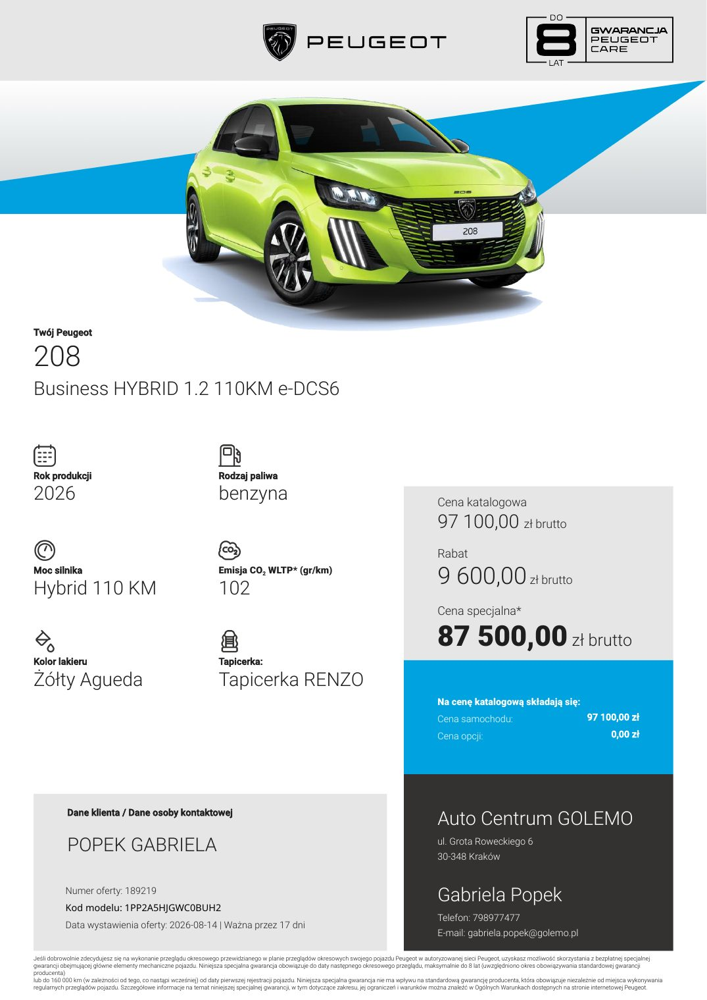
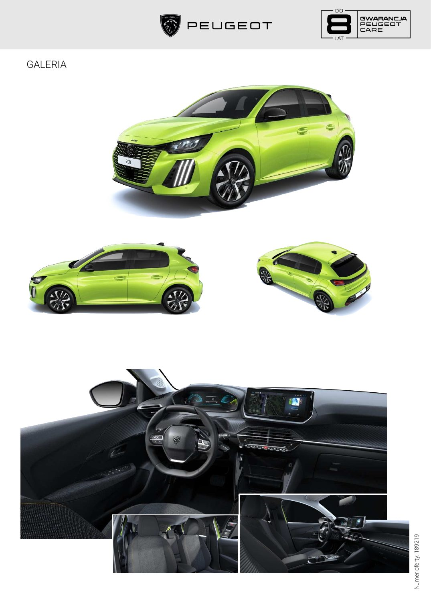

# Peugeot 208 — Business

> **Stan danych:** 2026-08-17. Dossier rozdziela dane konkretnej oferty od danych ogólnomodelowych i innych rynków. Pole `status` jest częścią danych i nie powinno być ignorowane przez kod.

## Konfiguracje z dokumentów

| Konfiguracja | Cena | Katalogowa | Rok prod./model | Kolor | Wnętrze | Koła | Identyfikatory | Źródło |
|---|---:|---:|---|---|---|---|---|---|
| 208 Business Hybrid 110 | 87500 zł | 97100 zł | 2026 / — | Żółty Agueda | Tapicerka Renzo | brak precyzyjnego opisu w tekście oferty | ID 189219 | [05-oferta-208-pan-krzysztof-krawczynski.md](../offers/05-oferta-208-pan-krzysztof-krawczynski.md) |

## Napęd

| Pole | Wartość | Status / zakres | Źródła | Uwagi |
|---|---:|---|---|---|
| Paliwo | benzyna + hybryda 48 V | `exact-offer` | LOCAL-05 |  |
| Typ napędu | hybrid 48 V | `exact-offer` | LOCAL-05 |  |
| Pojemność [cm³] | 1199 | `official-comparable-stock` | PEUGEOT_208_STOCK |  |
| Moc [KM] | 110 | `exact-offer` | LOCAL-05 |  |
| Moc [kW] | 81 | `exact-offer-total/official-comparable` | LOCAL-05, PEUGEOT_208_STOCK |  |
| Moment [Nm] | — | `not-found-exact` | — |  |
| Skrzynia | 6-biegowa e-DCS6 | `exact-offer` | LOCAL-05 |  |
| Napęd | FWD | `model-level` | PEUGEOT_208_STOCK |  |

## Osiągi

| Pole | Wartość | Status / zakres | Źródła | Uwagi |
|---|---:|---|---|---|
| 0–100 km/h [s] | — | `not-found-exact` | — |  |
| Prędkość maks. [km/h] | 193 | `official-comparable-stock` | PEUGEOT_208_STOCK | Porównywalny wariant, nie VIN z oferty. |

## Zużycie, emisje i ładowanie

| Pole | Wartość | Status / zakres | Źródła | Uwagi |
|---|---:|---|---|---|
| WLTP mieszane [l/100 km] | 4,50 | `exact-offer` | LOCAL-05 |  |
| CO₂ WLTP [g/km] | 102 | `exact-offer-cover` | LOCAL-05 | Nagłówek oferty; tabela niżej błędnie zawiera 4,5 w polu CO₂. |

## Wymiary, masy i praktyczność

| Pole | Wartość | Status / zakres | Źródła | Uwagi |
|---|---:|---|---|---|
| Długość [mm] | 4055 | `exact-offer` | LOCAL-05 |  |
| Szerokość bez lusterek [mm] | 1745 | `exact-offer` | LOCAL-05 |  |
| Szerokość z lusterkami [mm] | — | `not-found` | — |  |
| Wysokość [mm] | 1465 | `exact-offer` | LOCAL-05 |  |
| Rozstaw osi [mm] | 2540 | `exact-offer` | LOCAL-05 |  |
| Prześwit [mm] | — | `not-found` | — |  |
| Średnica zawracania [m] | — | `not-found` | — |  |
| Bagażnik [l] | 352 | `official-current-model-generic` | PEUGEOT_208_FAQ |  |
| Bagażnik max [l] | 1163 | `official-current-model-generic` | PEUGEOT_208_FAQ |  |
| Zbiornik [l] | 44 | `exact-offer` | LOCAL-05 |  |
| Przyczepa hamowana [kg] | 1200 | `official-comparable-stock` | PEUGEOT_208_STOCK |  |
| Przyczepa bez hamulca [kg] | 645 | `official-comparable-stock` | PEUGEOT_208_STOCK |  |
| Masa własna [kg] | 1295 | `official-comparable-stock` | PEUGEOT_208_STOCK |  |
| DMC [kg] | 1690 | `exact-offer` | LOCAL-05 |  |

## Najważniejsze wyposażenie z oferty

Agueda Yellow, Renzo, czujniki przód/tył, kamera 180°, akustyczna szyba przednia, podgrzewane fotele, nawigacja i-Connect Advanced, ekran 10", 4 USB.

## Gwarancja i serwis

- Oferta opisuje warunkową specjalną ochronę do 8 lat / 160 000 km przy wykonywaniu przeglądów w autoryzowanej sieci; zweryfikować OWG i dokładny zakres.

## Konflikty i rozbieżności

1. W tabeli technicznej oferty fazy WLTP mają wartości 0, a pole „Emisja CO₂” ma 4,5. Za exact przyjęto 4,5 l/100 km i 102 g/km z nagłówka, a błędne pola zachowano jako konflikt.
2. Parametry masy, prędkości i uciągu pochodzą z porównywalnego egzemplarza w oficjalnym sklepie Peugeot, nie z VIN oferty. Muszą pozostać oznaczone jako comparable-stock.

## Nadal brakujące dane

- 0–100 km/h exact
- moment obrotowy exact
- prześwit
- promień zawracania

## Lokalny podgląd dokumentów

## Oficjalne zdjęcia i galerie internetowe

- Brak bezpośredniego oficjalnego pliku obrazu zweryfikowanego dla tej wersji; użyj podglądów PDF i stron źródłowych.

Zdjęcia internetowe są **poglądowe**: mogą przedstawiać inny kolor, wyposażenie, rok modelowy lub rynek. Dokładny wygląd konfiguracji rozstrzygają lokalne rendery stron oraz umowa sprzedaży.

## Źródła lokalne

- **LOCAL-05** — [Peugeot 208 Business Hybrid 110 — oferta 189219](../offers/05-oferta-208-pan-krzysztof-krawczynski.md) — źródło konkretnej oferty/kalkulacji.

## Źródła internetowe

- **PEUGEOT_208_FAQ** — [Peugeot 208 — FAQ i wymiary](https://www.peugeot.pl/modele/nowy-peugeot-208/faq.html) — `Peugeot:official-current-model`. Pojemność bagażnika i dane ogólnomodelowe.
- **PEUGEOT_208_STOCK** — [Peugeot 208 Business Hybrid 110 e-DCS6 — oficjalny sklep](https://sklep.peugeot.pl/produkt/208/vr3uphpx0t5045881/) — `Peugeot:official-stock-comparable-vehicle`. Porównywalny wariant napędowy; nie VIN z oferty użytkownika.
- **PEUGEOT_PRICES** — [Peugeot — oficjalne cenniki i specyfikacje](https://www.peugeot.pl/tools/cenniki-peugeot.html) — `Peugeot:official-download-index`. Punkt wejścia do aktualnych cenników i broszur.
