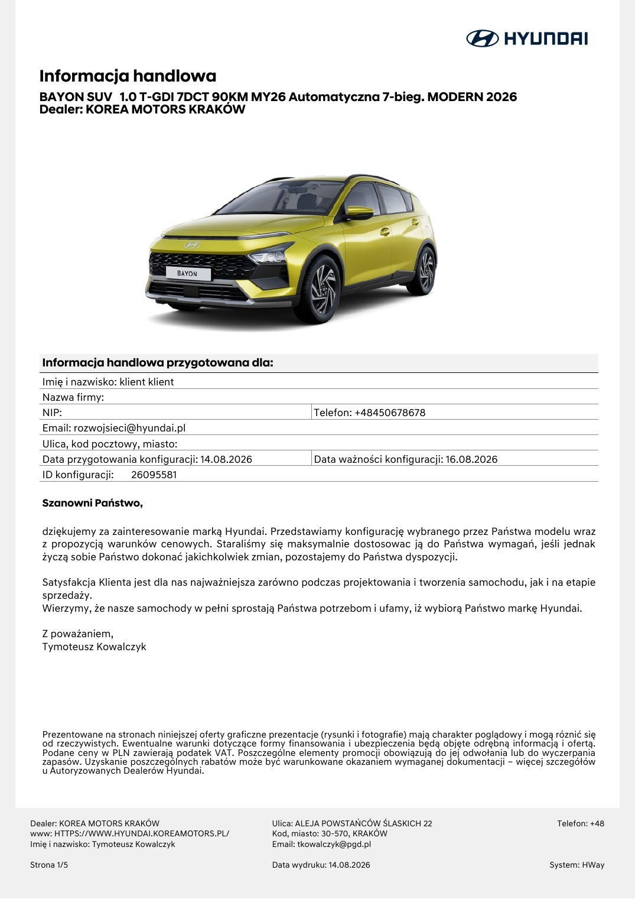

# Hyundai Bayon — Modern + Comfort

> **Stan danych:** 2026-08-17. Dossier rozdziela dane konkretnej oferty od danych ogólnomodelowych i innych rynków. Pole `status` jest częścią danych i nie powinno być ignorowane przez kod.

## Konfiguracje z dokumentów

| Konfiguracja | Cena | Katalogowa | Rok prod./model | Kolor | Wnętrze | Koła | Identyfikatory | Źródło |
|---|---:|---:|---|---|---|---|---|---|
| Bayon Modern 90 7DCT | 103600 zł | 103600 zł | 2026 / 2026 | Lucid Lime Metallic | Black | aluminiowe 16" | ID 26095581 | [10-ha0520260814124843-00000026095581.md](../offers/10-ha0520260814124843-00000026095581.md) |

## Napęd

| Pole | Wartość | Status / zakres | Źródła | Uwagi |
|---|---:|---|---|---|
| Paliwo | benzyna | `exact-offer` | LOCAL-10 |  |
| Typ napędu | ICE turbo | `exact-offer` | LOCAL-10 |  |
| Pojemność [cm³] | 998 | `official-current-uk-variant` | HYUNDAI_BAYON_UK_TECH |  |
| Moc [KM] | 90 | `exact-offer` | LOCAL-10 |  |
| Moc [kW] | 66 | `official-current-uk-variant` | HYUNDAI_BAYON_UK_TECH |  |
| Moment [Nm] | 172 | `official-current-uk-variant` | HYUNDAI_BAYON_UK_TECH |  |
| Skrzynia | 7DCT | `exact-offer` | LOCAL-10 |  |
| Napęd | FWD | `model-level` | HYUNDAI_BAYON_UK_TECH |  |

## Osiągi

| Pole | Wartość | Status / zakres | Źródła | Uwagi |
|---|---:|---|---|---|
| 0–100 km/h [s] | 13,30 | `official-current-uk-variant` | HYUNDAI_BAYON_UK_TECH |  |
| Prędkość maks. [km/h] | 172 | `official-current-uk-variant-converted` | HYUNDAI_BAYON_UK_TECH | 107 mph ≈ 172 km/h. |

## Zużycie, emisje i ładowanie

| Pole | Wartość | Status / zakres | Źródła | Uwagi |
|---|---:|---|---|---|
| WLTP mieszane [l/100 km] | 5,80 | `official-current-uk-variant` | HYUNDAI_BAYON_UK_TECH |  |
| CO₂ WLTP [g/km] | 131–132 | `official-current-uk-variant-by-wheel-trim` | HYUNDAI_BAYON_UK_TECH |  |

## Wymiary, masy i praktyczność

| Pole | Wartość | Status / zakres | Źródła | Uwagi |
|---|---:|---|---|---|
| Długość [mm] | 4180 | `official-current-model` | HYUNDAI_BAYON_DESIGN, HYUNDAI_BAYON_UK_TECH |  |
| Szerokość bez lusterek [mm] | 1775 | `official-current-model` | HYUNDAI_BAYON_DESIGN, HYUNDAI_BAYON_UK_TECH |  |
| Szerokość z lusterkami [mm] | — | `not-found` | — |  |
| Wysokość [mm] | 1490–1500 | `official-current-model` | HYUNDAI_BAYON_DESIGN, HYUNDAI_BAYON_UK_TECH | Zależnie od relingów/rynku/specyfikacji. |
| Rozstaw osi [mm] | 2580 | `official-current-model` | HYUNDAI_BAYON_DESIGN, HYUNDAI_BAYON_UK_TECH |  |
| Prześwit [mm] | — | `not-found` | — |  |
| Średnica zawracania [m] | 10.4–10.6 | `official-market-variation` | HYUNDAI_BAYON_UK_TECH, HYUNDAI_BAYON_DESIGN |  |
| Bagażnik [l] | 411 | `official-current-model` | HYUNDAI_BAYON_DESIGN, HYUNDAI_BAYON_UK_TECH |  |
| Bagażnik max [l] | 1205 | `official-current-model` | HYUNDAI_BAYON_DESIGN, HYUNDAI_BAYON_UK_TECH |  |
| Zbiornik [l] | 40 | `official-current-uk-variant` | HYUNDAI_BAYON_UK_TECH |  |
| Przyczepa hamowana [kg] | 910 | `official-current-uk-variant` | HYUNDAI_BAYON_UK_TECH |  |
| Przyczepa bez hamulca [kg] | 450 | `official-current-uk-variant` | HYUNDAI_BAYON_UK_TECH |  |
| Masa własna [kg] | 1125–1235 | `official-current-uk-variant` | HYUNDAI_BAYON_UK_TECH |  |
| DMC [kg] | 1650 | `official-current-uk-variant` | HYUNDAI_BAYON_UK_TECH |  |

## Najważniejsze wyposażenie z oferty

Lucid Lime, pakiet Comfort, podgrzewane fotele i kierownica, kamera cofania, 10,25" nawigacja/Bluelink, felgi 16", relingi, LFA/LKA/FCA.

## Gwarancja i serwis

- 5 lat gwarancji bez limitu kilometrów, 5 lat Assistance i 5 lat bezpłatnej kontroli stanu technicznego — zgodnie z ofertą; wyjątki dla niektórych zastosowań komercyjnych.

## Konflikty i rozbieżności

1. Oferta polska nie podaje osiągów ani WLTP. Uzupełnienia techniczne 90 PS 7DCT pochodzą z bieżącej oficjalnej specyfikacji rynku UK i mogą różnić się homologacją, oponami lub wyposażeniem od auta w Polsce.

## Nadal brakujące dane

- dokładne polskie WLTP/CO₂ konkretnego VIN
- prześwit
- masa konkretnej konfiguracji

## Lokalny podgląd dokumentów

## Oficjalne zdjęcia i galerie internetowe

- [zewnętrzny 1](https://dmassets.hyundai.com/is/image/hyundaiautoever/hyundai-new-bayon-0124-01%3AImage%20Video%20Collection%20Item%20Mobile?hei=441&wid=663) — `official-illustrative`; skrót: [`hyundai-bayon-modern-90-7dct-01.url`](../../research/url_shortcuts/images/hyundai-bayon-modern-90-7dct-01.url).
- [zewnętrzny 2](https://dmassets.hyundai.com/is/image/hyundaiautoever/hyundai-new-bayon-0124-02%3AImage%20Video%20Collection%20Item%20Mobile?hei=441&wid=663) — `official-illustrative`; skrót: [`hyundai-bayon-modern-90-7dct-02.url`](../../research/url_shortcuts/images/hyundai-bayon-modern-90-7dct-02.url).
- [zewnętrzny 3](https://dmassets.hyundai.com/is/image/hyundaiautoever/hyundai-new-bayon-0124-05%3AImage%20Video%20Collection%20Item%20Mobile?hei=441&wid=663) — `official-illustrative`; skrót: [`hyundai-bayon-modern-90-7dct-03.url`](../../research/url_shortcuts/images/hyundai-bayon-modern-90-7dct-03.url).

Zdjęcia internetowe są **poglądowe**: mogą przedstawiać inny kolor, wyposażenie, rok modelowy lub rynek. Dokładny wygląd konfiguracji rozstrzygają lokalne rendery stron oraz umowa sprzedaży.

## Źródła lokalne

- **LOCAL-10** — [Hyundai Bayon — konfiguracja 26095581](../offers/10-ha0520260814124843-00000026095581.md) — źródło konkretnej oferty/kalkulacji.

## Źródła internetowe

- **HYUNDAI_BAYON_MODEL** — [Hyundai Bayon — oficjalna strona modelu](https://www.hyundai.com/pl/pl/modele/nowy-bayon.html) — `Hyundai:official-current-model-pl`. Aktualna gama rynku polskiego.
- **HYUNDAI_BAYON_DESIGN** — [Hyundai Bayon — design, wymiary i bagażnik](https://www.hyundai.com/pl/pl/modele/nowy-bayon/design.html) — `Hyundai:official-current-model-pl`. Wymiary i pojemność bagażnika.
- **HYUNDAI_BAYON_FEATURES** — [Hyundai Bayon — wyposażenie](https://www.hyundai.com/pl/pl/modele/nowy-bayon/features.html) — `Hyundai:official-current-model-pl`. Wyposażenie i zdjęcia poglądowe.
- **HYUNDAI_BAYON_UK_TECH** — [Hyundai Bayon 1.0 T-GDi 90 PS 7DCT — dane techniczne](https://www.hyundai.news/uk/articles/press-releases/bayon-trims-specs-pricing-1225.html) — `Hyundai:official-current-model-uk`. Pełne dane 90 PS 7DCT, ale homologacja/rynek UK; używać jako model-level, nie exact PL offer.
