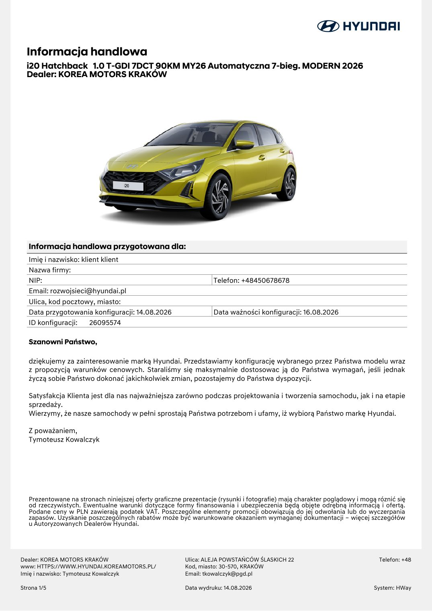

# Hyundai i20 — Modern + Comfort

> **Stan danych:** 2026-08-17. Dossier rozdziela dane konkretnej oferty od danych ogólnomodelowych i innych rynków. Pole `status` jest częścią danych i nie powinno być ignorowane przez kod.

## Konfiguracje z dokumentów

| Konfiguracja | Cena | Katalogowa | Rok prod./model | Kolor | Wnętrze | Koła | Identyfikatory | Źródło |
|---|---:|---:|---|---|---|---|---|---|
| i20 Modern 90 7DCT | 99900 zł | 99900 zł | 2026 / 2026 | Lucid Lime Metallic | Black | aluminiowe 16" | ID 26095574 | [11-ha0520260814124132-00000026095574.md](../offers/11-ha0520260814124132-00000026095574.md) |

## Napęd

| Pole | Wartość | Status / zakres | Źródła | Uwagi |
|---|---:|---|---|---|
| Paliwo | benzyna | `exact-offer` | LOCAL-11 |  |
| Typ napędu | ICE turbo | `exact-offer` | LOCAL-11 |  |
| Pojemność [cm³] | 998 | `model-level` | HYUNDAI_I20_FEATURES |  |
| Moc [KM] | 90 | `exact-offer` | LOCAL-11 |  |
| Moc [kW] | 66 | `derived/official-model` | LOCAL-11, HYUNDAI_I20_FEATURES |  |
| Moment [Nm] | 172 | `official-current-model-pl` | HYUNDAI_I20_FEATURES |  |
| Skrzynia | 7DCT | `exact-offer` | LOCAL-11 |  |
| Napęd | FWD | `official-model` | HYUNDAI_I20_FEATURES |  |

## Osiągi

| Pole | Wartość | Status / zakres | Źródła | Uwagi |
|---|---:|---|---|---|
| 0–100 km/h [s] | 12,80 | `official-current-model-pl` | HYUNDAI_I20_FEATURES |  |
| Prędkość maks. [km/h] | 179 | `official-current-model-pl` | HYUNDAI_I20_FEATURES |  |

## Zużycie, emisje i ładowanie

| Pole | Wartość | Status / zakres | Źródła | Uwagi |
|---|---:|---|---|---|
| WLTP mieszane [l/100 km] | 5.3–5.8 | `official-current-model-pl-range` | HYUNDAI_I20_FEATURES |  |
| CO₂ WLTP [g/km] | 126–139 | `official-current-model-pl-range` | HYUNDAI_I20_FEATURES |  |

## Wymiary, masy i praktyczność

| Pole | Wartość | Status / zakres | Źródła | Uwagi |
|---|---:|---|---|---|
| Długość [mm] | 4065 | `official-current-model` | HYUNDAI_I20_DESIGN |  |
| Szerokość bez lusterek [mm] | 1775 | `official-current-model` | HYUNDAI_I20_DESIGN |  |
| Szerokość z lusterkami [mm] | — | `not-found` | — |  |
| Wysokość [mm] | 1450 | `official-current-model` | HYUNDAI_I20_DESIGN |  |
| Rozstaw osi [mm] | 2570 | `official-current-model` | HYUNDAI_I20_DESIGN |  |
| Prześwit [mm] | 140 | `official-current-model` | HYUNDAI_I20_DESIGN |  |
| Średnica zawracania [m] | 10,40 | `official-current-model` | HYUNDAI_I20_DESIGN |  |
| Bagażnik [l] | 352 | `official-current-model` | HYUNDAI_I20_DESIGN |  |
| Bagażnik max [l] | 1165 | `official-current-model` | HYUNDAI_I20_DESIGN |  |
| Zbiornik [l] | — | `not-found-in-collected-sources` | — |  |
| Przyczepa hamowana [kg] | 1110 | `official-model-level` | HYUNDAI_I20_DESIGN |  |
| Przyczepa bez hamulca [kg] | — | `not-found` | — |  |
| Masa własna [kg] | — | `not-found-exact` | — |  |
| DMC [kg] | — | `not-found-exact` | — |  |

## Najważniejsze wyposażenie z oferty

Lucid Lime, automatyczna klimatyzacja, podgrzewane fotele i kierownica, 10,25" nawigacja/Bluelink, kamera cofania, felgi 16", Michelin, LFA/LKA/FCA.

## Gwarancja i serwis

- 5 lat gwarancji bez limitu kilometrów, 5 lat Assistance i 5 lat bezpłatnej kontroli stanu technicznego — zgodnie z ofertą; ograniczenia dla określonych zastosowań komercyjnych.

## Konflikty i rozbieżności

1. Niektóre ogólne podstrony Hyundai nadal zawierają wcześniejsze informacje o mocy 100 KM; dla oferty MY/PY2026 przyjęto tabelę 90 KM 7DCT z aktualnej podstrony wyposażenia oraz exact nazwę z PDF.

## Nadal brakujące dane

- masa konkretnej konfiguracji
- pojemność zbiornika w zebranych źródłach
- uciąg bez hamulca

## Lokalny podgląd dokumentów

## Oficjalne zdjęcia i galerie internetowe

- [zewnętrzny 1](https://s7g10.scene7.com/is/image/hyundaiautoever/hyundai-all-new-i20-0220-01%3AImage%20Video%20Collection%20Item%20Mobile?hei=441&wid=663) — `official-illustrative-older-media`; skrót: [`hyundai-i20-modern-90-7dct-01.url`](../../research/url_shortcuts/images/hyundai-i20-modern-90-7dct-01.url).
- [zewnętrzny 2](https://s7g10.scene7.com/is/image/hyundaiautoever/hyundai-all-new-i20-0220-02%3AImage%20Video%20Collection%20Item%20Mobile?hei=441&wid=663) — `official-illustrative-older-media`; skrót: [`hyundai-i20-modern-90-7dct-02.url`](../../research/url_shortcuts/images/hyundai-i20-modern-90-7dct-02.url).
- [wnętrze / detal](https://s7g10.scene7.com/is/image/hyundaiautoever/hyundai-all-new-i20-0220-03%3AImage%20Video%20Collection%20Item%20Mobile?hei=441&wid=663) — `official-illustrative-older-media`; skrót: [`hyundai-i20-modern-90-7dct-03.url`](../../research/url_shortcuts/images/hyundai-i20-modern-90-7dct-03.url).

Zdjęcia internetowe są **poglądowe**: mogą przedstawiać inny kolor, wyposażenie, rok modelowy lub rynek. Dokładny wygląd konfiguracji rozstrzygają lokalne rendery stron oraz umowa sprzedaży.

## Źródła lokalne

- **LOCAL-11** — [Hyundai i20 — konfiguracja 26095574](../offers/11-ha0520260814124132-00000026095574.md) — źródło konkretnej oferty/kalkulacji.

## Źródła internetowe

- **HYUNDAI_I20_FEATURES** — [Hyundai i20 — wyposażenie i osiągi MY/PY 2026](https://www.hyundai.com/pl/pl/modele/nowy-i20/wyposazenie.html) — `Hyundai:official-current-model-pl`. Dane 1.0 T-GDI 90 KM 7DCT dla rynku polskiego.
- **HYUNDAI_I20_DESIGN** — [Hyundai i20 — design i wymiary](https://www.hyundai.com/pl/pl/modele/nowy-i20/design.html) — `Hyundai:official-current-model-pl`. Wymiary i materiały poglądowe.
- **HYUNDAI_I20_MEDIA** — [Hyundai i20 — oficjalna galeria zdjęć](https://www.hyundai.news/pl/modele/osobowe/i20/zdjecia.html) — `Hyundai:official-media-gallery`. Zdjęcia poglądowe; część materiałów może pokazywać wcześniejszy rok modelowy.
