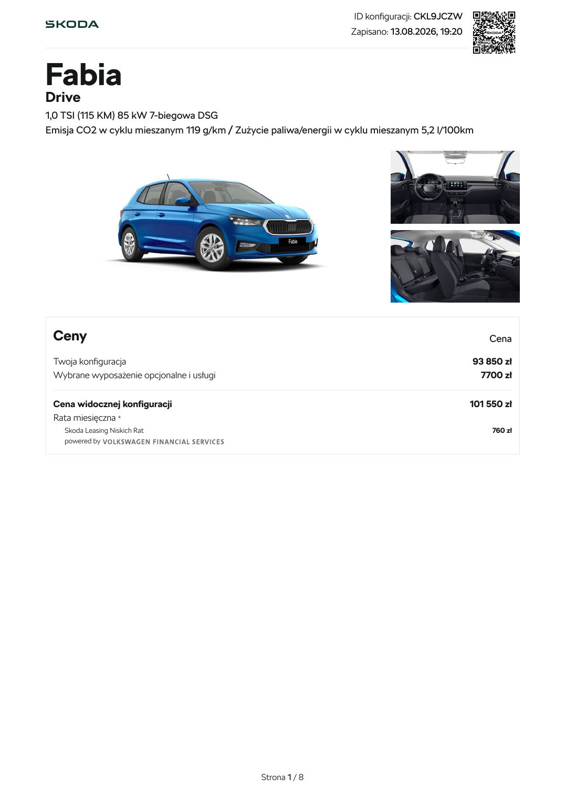
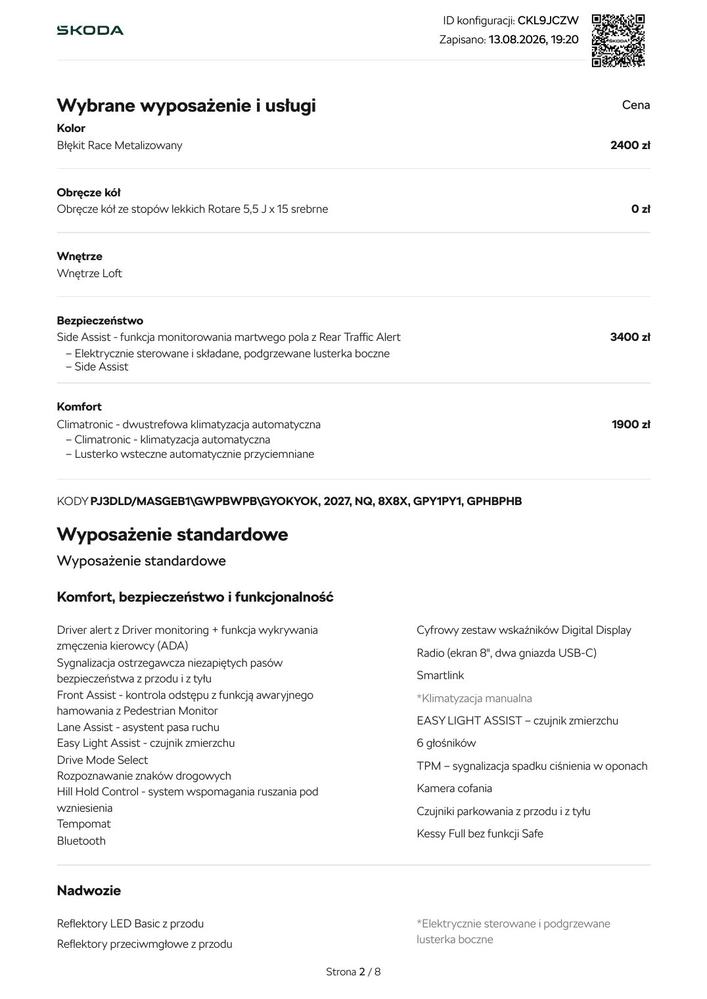

# Škoda Fabia — Drive

> **Stan danych:** 2026-08-17. Dossier rozdziela dane konkretnej oferty od danych ogólnomodelowych i innych rynków. Pole `status` jest częścią danych i nie powinno być ignorowane przez kod.

## Konfiguracje z dokumentów

| Konfiguracja | Cena | Katalogowa | Rok prod./model | Kolor | Wnętrze | Koła | Identyfikatory | Źródło |
|---|---:|---:|---|---|---|---|---|---|
| Drive — Zieleń Timiano | 91350 zł | 100150 zł | 2026 / 2026 | Zieleń Timiano niemetalizowany | Loft | Rotare 15" | ID TMBER6PJ5T4088196 | [12-skoda-fabia-poz-3.md](../offers/12-skoda-fabia-poz-3.md) |
| ↳ uwaga |  |  |  | Dodatki: pełnowymiarowe koło, podgrzewana kierownica, Winter Basic. |  |  |  |  |
| Drive — Błękit Race | 101550 zł | 101550 zł | 2027 / 2027 | Błękit Race metalizowany | Loft | Rotare 15" | ID CKL9JCZW | [14-skoda-fabia-92-700-poz-2.md](../offers/14-skoda-fabia-92-700-poz-2.md) |
| ↳ uwaga |  |  |  | Dodatki: Side Assist i Climatronic. |  |  |  |  |

## Napęd

| Pole | Wartość | Status / zakres | Źródła | Uwagi |
|---|---:|---|---|---|
| Paliwo | benzyna | `exact-offer` | LOCAL-12, LOCAL-14 |  |
| Typ napędu | ICE turbo | `exact-offer` | LOCAL-12, LOCAL-14 |  |
| Pojemność [cm³] | 999 | `exact-offer` | LOCAL-12, LOCAL-14 |  |
| Moc [KM] | 115 | `exact-offer` | LOCAL-12, LOCAL-14 |  |
| Moc [kW] | 85 | `exact-offer` | LOCAL-12, LOCAL-14 |  |
| Moment [Nm] | 200 | `exact-offer` | LOCAL-12, LOCAL-14 |  |
| Skrzynia | 7-biegowa DSG | `exact-offer` | LOCAL-12, LOCAL-14 |  |
| Napęd | FWD | `model-level` | SKODA_FABIA_MODEL |  |

## Osiągi

| Pole | Wartość | Status / zakres | Źródła | Uwagi |
|---|---:|---|---|---|
| 0–100 km/h [s] | 9,70 | `exact-offer` | LOCAL-12, LOCAL-14 |  |
| Prędkość maks. [km/h] | 202 | `exact-offer` | LOCAL-12, LOCAL-14 |  |

## Zużycie, emisje i ładowanie

| Pole | Wartość | Status / zakres | Źródła | Uwagi |
|---|---:|---|---|---|
| WLTP mieszane [l/100 km] | 5,20 | `exact-offer` | LOCAL-12, LOCAL-14 |  |
| CO₂ WLTP [g/km] | 119 | `exact-offer` | LOCAL-12, LOCAL-14 |  |

## Wymiary, masy i praktyczność

| Pole | Wartość | Status / zakres | Źródła | Uwagi |
|---|---:|---|---|---|
| Długość [mm] | 4108 | `exact-offer` | LOCAL-12, LOCAL-14 |  |
| Szerokość bez lusterek [mm] | 1780 | `exact-offer` | LOCAL-12, LOCAL-14 |  |
| Szerokość z lusterkami [mm] | — | `not-found` | — |  |
| Wysokość [mm] | 1482 | `exact-offer` | LOCAL-12, LOCAL-14 |  |
| Rozstaw osi [mm] | 2552 | `exact-offer` | LOCAL-12, LOCAL-14 |  |
| Prześwit [mm] | — | `not-found` | — |  |
| Średnica zawracania [m] | 9,90 | `exact-offer` | LOCAL-12, LOCAL-14 |  |
| Bagażnik [l] | 380 | `exact-offer` | LOCAL-12, LOCAL-14 |  |
| Bagażnik max [l] | 1190 | `exact-offer` | LOCAL-12, LOCAL-14 |  |
| Zbiornik [l] | — | `not-found` | — |  |
| Przyczepa hamowana [kg] | 1100 | `exact-offer` | LOCAL-14 |  |
| Przyczepa bez hamulca [kg] | 590 | `exact-offer` | LOCAL-14 |  |
| Masa własna [kg] | 1150 | `exact-offer` | LOCAL-14 |  |
| DMC [kg] | 1650 | `exact-offer` | LOCAL-14 |  |

## Najważniejsze wyposażenie z oferty

kamera cofania, czujniki przód/tył, Kessy Full, LED Basic, SmartLink, Digital Display, Drive Mode Select.

## Gwarancja i serwis

- Dokumenty nie zawierają pełnych warunków gwarancji; przed decyzją pobrać aktualne warunki Škoda dla konkretnego roku produkcji.

## Konflikty i rozbieżności

1. Symulacja 6174608 używa ceny 92 700 zł, podczas gdy konfiguracja CKL9JCZW pokazuje 101 550 zł. To może być cena po rabacie, ale dokumenty nie zawierają jednoznacznego identyfikatora łączącego kalkulację z niebieską konfiguracją; relacja ma status likely, nie exact.

## Nadal brakujące dane

- prześwit
- szerokość z lusterkami
- pojemność zbiornika w zebranych materiałach
- pełne warunki gwarancji

## Lokalny podgląd dokumentów

## Oficjalne zdjęcia i galerie internetowe

- [zewnętrzny](https://www.skoda-storyboard.com/direct-download/2024/08/4.-generace-07_SKODA_FABIA_ML_Graphite_Grey_918733f4.jpg) — `official-illustrative`; skrót: [`skoda-fabia-drive-115-dsg-01.url`](../../research/url_shortcuts/images/skoda-fabia-drive-115-dsg-01.url).

Zdjęcia internetowe są **poglądowe**: mogą przedstawiać inny kolor, wyposażenie, rok modelowy lub rynek. Dokładny wygląd konfiguracji rozstrzygają lokalne rendery stron oraz umowa sprzedaży.

## Źródła lokalne

- **LOCAL-12** — [Škoda Fabia Drive — zielona](../offers/12-skoda-fabia-poz-3.md) — źródło konkretnej oferty/kalkulacji.
- **LOCAL-14** — [Škoda Fabia Drive — CKL9JCZW](../offers/14-skoda-fabia-92-700-poz-2.md) — źródło konkretnej oferty/kalkulacji.
- **LOCAL-15** — [Škoda — symulacja 6174608](../offers/15-simulation-6174608.md) — źródło konkretnej oferty/kalkulacji.
- **LOCAL-17** — [Škoda — symulacja 6174634](../offers/17-simulation-6174634.md) — źródło konkretnej oferty/kalkulacji.

## Źródła internetowe

- **SKODA_FABIA_MODEL** — [Škoda Fabia — oficjalna strona modelu](https://www.skoda.pl/swiat-skody/fabia) — `Skoda:official-current-model-pl`. Opis modelu i dostęp do bieżącego cennika.
- **SKODA_FABIA_ENGINE** — [Škoda Fabia 115 DSG — dane układu napędowego](https://www.skoda.pl/modele/fabia/fabia-monte-carlo) — `Skoda:official-current-model-pl`. Dane gamy 1.0 TSI 115 DSG; dossier opiera wartości exact na załączonej konfiguracji.
- **SKODA_FABIA_MEDIA** — [Škoda Fabia IV — oficjalne zdjęcie prasowe](https://www.skoda-storyboard.com/cs/skoda-svet-cs/felicia-a-fabia-slavi-jubilea/attachment/4-generace-07_skoda_fabia_ml_graphite_grey_918733f4/) — `Skoda:official-media-gallery`. Zdjęcie poglądowe; inny kolor i możliwe wyposażenie.
