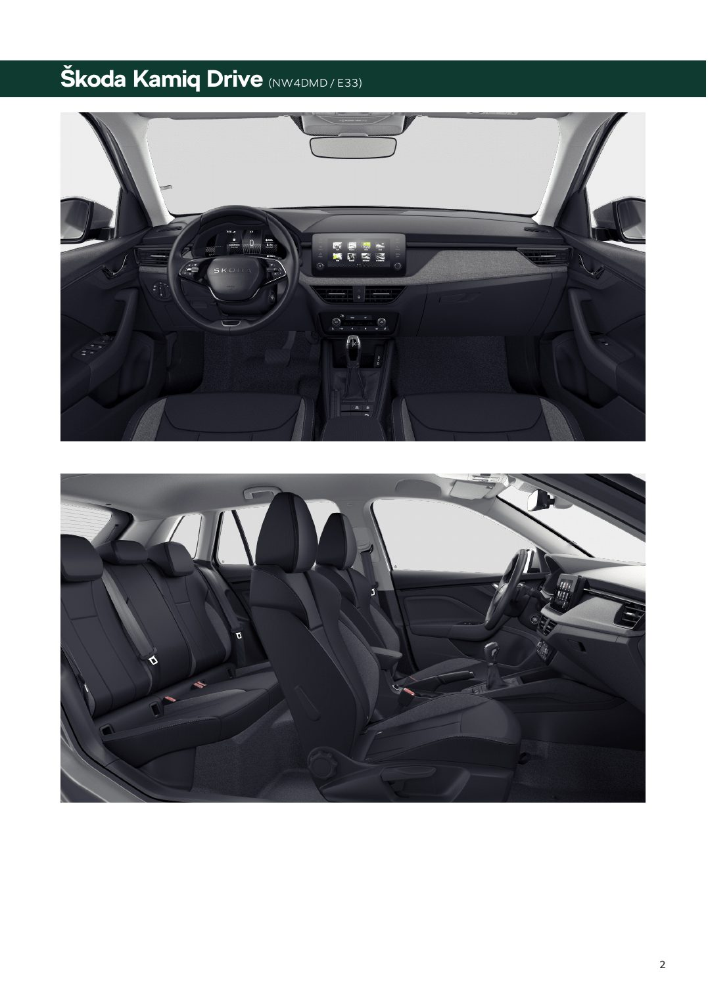

# Škoda Kamiq — Drive

> **Stan danych:** 2026-08-17. Dossier rozdziela dane konkretnej oferty od danych ogólnomodelowych i innych rynków. Pole `status` jest częścią danych i nie powinno być ignorowane przez kod.

## Konfiguracje z dokumentów

| Konfiguracja | Cena | Katalogowa | Rok prod./model | Kolor | Wnętrze | Koła | Identyfikatory | Źródło |
|---|---:|---:|---|---|---|---|---|---|
| Drive — Srebrny Smokey | 108800 zł | 121150 zł | 2026 / 2027 | Srebrny Smokey Diamond metalizowany | Loft z szarą podsufitką | Sargas Aero 16" | VIN TMBGR6NW7V3052025, ID GOC-26-376491 | [13-skoda-kamiq-poz-3.md](../offers/13-skoda-kamiq-poz-3.md) |

## Napęd

| Pole | Wartość | Status / zakres | Źródła | Uwagi |
|---|---:|---|---|---|
| Paliwo | benzyna | `exact-offer` | LOCAL-13 |  |
| Typ napędu | ICE turbo | `exact-offer` | LOCAL-13 |  |
| Pojemność [cm³] | 999 | `exact-offer` | LOCAL-13 |  |
| Moc [KM] | 115 | `exact-offer` | LOCAL-13 |  |
| Moc [kW] | 85 | `exact-offer` | LOCAL-13 |  |
| Moment [Nm] | 200 | `exact-offer` | LOCAL-13 |  |
| Skrzynia | 7-biegowa DSG | `exact-offer` | LOCAL-13 |  |
| Napęd | FWD | `model-level` | SKODA_KAMIQ_MODEL |  |

## Osiągi

| Pole | Wartość | Status / zakres | Źródła | Uwagi |
|---|---:|---|---|---|
| 0–100 km/h [s] | 10,20 | `exact-offer` | LOCAL-13 |  |
| Prędkość maks. [km/h] | 195 | `exact-offer` | LOCAL-13 |  |

## Zużycie, emisje i ładowanie

| Pole | Wartość | Status / zakres | Źródła | Uwagi |
|---|---:|---|---|---|
| WLTP mieszane [l/100 km] | 5,60 | `exact-offer` | LOCAL-13 |  |
| CO₂ WLTP [g/km] | 126 | `exact-offer` | LOCAL-13 |  |

## Wymiary, masy i praktyczność

| Pole | Wartość | Status / zakres | Źródła | Uwagi |
|---|---:|---|---|---|
| Długość [mm] | 4241 | `exact-offer` | LOCAL-13 |  |
| Szerokość bez lusterek [mm] | 1793 | `exact-offer` | LOCAL-13 |  |
| Szerokość z lusterkami [mm] | — | `not-found` | — |  |
| Wysokość [mm] | 1559 | `exact-offer` | LOCAL-13 |  |
| Rozstaw osi [mm] | 2639 | `exact-offer` | LOCAL-13 |  |
| Prześwit [mm] | — | `not-found` | — |  |
| Średnica zawracania [m] | 10,10 | `exact-offer` | LOCAL-13 |  |
| Bagażnik [l] | 400 | `exact-offer` | LOCAL-13 |  |
| Bagażnik max [l] | 1395 | `exact-offer` | LOCAL-13 |  |
| Zbiornik [l] | 50 | `exact-offer` | LOCAL-13 |  |
| Przyczepa hamowana [kg] | — | `not-found` | — |  |
| Przyczepa bez hamulca [kg] | — | `not-found` | — |  |
| Masa własna [kg] | — | `not-found` | — |  |
| DMC [kg] | — | `not-found` | — |  |

## Najważniejsze wyposażenie z oferty

Smokey Silver, Sargas Aero 16", Climatronic 2-strefowy, podgrzewane fotele, podgrzewana szyba przednia, Full LED, kamera cofania, Kessy, 4× USB-C 45 W.

## Gwarancja i serwis

- Dokument nie zawiera pełnych warunków gwarancji; pobrać aktualne warunki Škoda przed podpisaniem umowy.

## Konflikty i rozbieżności

_Nie wykryto istotnych konfliktów pomiędzy źródłami._

## Nadal brakujące dane

- masa/DMC
- uciąg
- prześwit
- pełne warunki gwarancji

## Lokalny podgląd dokumentów

## Oficjalne zdjęcia i galerie internetowe

- [zewnętrzny](https://www.skoda-storyboard.com/direct-download/2024/02/29_Skoda_Kamiq_d786b450.jpg) — `official-illustrative`; skrót: [`skoda-kamiq-drive-115-dsg-01.url`](../../research/url_shortcuts/images/skoda-kamiq-drive-115-dsg-01.url).

Zdjęcia internetowe są **poglądowe**: mogą przedstawiać inny kolor, wyposażenie, rok modelowy lub rynek. Dokładny wygląd konfiguracji rozstrzygają lokalne rendery stron oraz umowa sprzedaży.

## Źródła lokalne

- **LOCAL-13** — [Škoda Kamiq Drive](../offers/13-skoda-kamiq-poz-3.md) — źródło konkretnej oferty/kalkulacji.
- **LOCAL-16** — [Škoda — symulacja 6174620](../offers/16-simulation-6174620.md) — źródło konkretnej oferty/kalkulacji.

## Źródła internetowe

- **SKODA_KAMIQ_MODEL** — [Škoda Kamiq — oficjalna strona modelu](https://www.skoda.pl/modele/kamiq/kamiq) — `Skoda:official-current-model-pl`. Aktualne informacje modelowe.
- **SKODA_KAMIQ_ENGINE** — [Škoda Kamiq — porównywarka silników](https://www.skoda.pl/modele/kamiq/kamiq/nowa-skoda-kamiq-porownywarka-silnikow) — `Skoda:official-current-model-pl`. Dane jednostek napędowych.
- **SKODA_KAMIQ_MEDIA** — [Škoda Kamiq — oficjalne zdjęcie prasowe](https://www.skoda-storyboard.com/?attachment_id=354007) — `Skoda:official-media-gallery`. Zdjęcie poglądowe.
