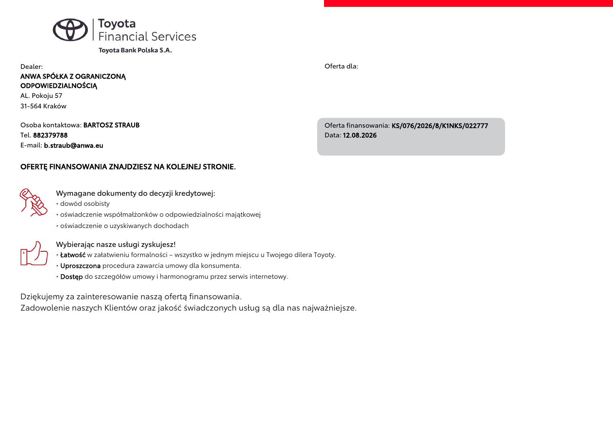

# Toyota Yaris — Style

> **Stan danych:** 2026-08-17. Dossier rozdziela dane konkretnej oferty od danych ogólnomodelowych i innych rynków. Pole `status` jest częścią danych i nie powinno być ignorowane przez kod.

## Konfiguracje z dokumentów

| Konfiguracja | Cena | Katalogowa | Rok prod./model | Kolor | Wnętrze | Koła | Identyfikatory | Źródło |
|---|---:|---:|---|---|---|---|---|---|
| Yaris Style Hybrid 116 — Forest Green | 107920 zł | 112900 zł | 2026 / 2026 | Forest Green (6X7) — nazwa z pliku, dostępność koloru potwierdzona w konfiguratorze | Style — brak pełnego kodu tapicerki w ofercie finansowej | brak danych w ofercie finansowej | ID 022777 | [18-toyota-yaris-forest-green-wersja-style.md](../offers/18-toyota-yaris-forest-green-wersja-style.md) |

## Napęd

| Pole | Wartość | Status / zakres | Źródła | Uwagi |
|---|---:|---|---|---|
| Paliwo | benzyna + pełna hybryda | `exact-offer` | LOCAL-18 |  |
| Typ napędu | HEV | `exact-offer` | LOCAL-18 |  |
| Pojemność [cm³] | 1490 | `official-current-configurator` | TOYOTA_YARIS_CONFIG |  |
| Moc [KM] | 116 | `exact-offer` | LOCAL-18 |  |
| Moc [kW] | 85 | `official-current-configurator` | TOYOTA_YARIS_CONFIG |  |
| Moment [Nm] | 120 | `official-current-configurator-engine` | TOYOTA_YARIS_CONFIG | Wartość dla silnika spalinowego; moment systemowy nie jest sumowany liniowo. |
| Skrzynia | e-CVT / bezstopniowa automatyczna | `exact-offer` | LOCAL-18 |  |
| Napęd | FWD | `model-level` | TOYOTA_YARIS_CONFIG |  |

## Osiągi

| Pole | Wartość | Status / zakres | Źródła | Uwagi |
|---|---:|---|---|---|
| 0–100 km/h [s] | 9,70 | `official-current-model-116` | TOYOTA_YARIS_MODEL |  |
| Prędkość maks. [km/h] | 175 | `official-current-configurator` | TOYOTA_YARIS_CONFIG |  |

## Zużycie, emisje i ładowanie

| Pole | Wartość | Status / zakres | Źródła | Uwagi |
|---|---:|---|---|---|
| WLTP mieszane [l/100 km] | 3.8–4.4 | `official-current-model-range` | TOYOTA_YARIS_MODEL |  |
| CO₂ WLTP [g/km] | 87–99 | `official-current-model-range` | TOYOTA_YARIS_MODEL |  |

## Wymiary, masy i praktyczność

| Pole | Wartość | Status / zakres | Źródła | Uwagi |
|---|---:|---|---|---|
| Długość [mm] | 3940 | `official-current-configurator` | TOYOTA_YARIS_CONFIG |  |
| Szerokość bez lusterek [mm] | 1745 | `official-current-configurator` | TOYOTA_YARIS_CONFIG |  |
| Szerokość z lusterkami [mm] | — | `not-found` | — |  |
| Wysokość [mm] | 1500 | `official-current-configurator` | TOYOTA_YARIS_CONFIG |  |
| Rozstaw osi [mm] | 2560 | `official-current-configurator` | TOYOTA_YARIS_CONFIG |  |
| Prześwit [mm] | 135 | `official-current-configurator` | TOYOTA_YARIS_CONFIG |  |
| Średnica zawracania [m] | 9,80 | `derived-diameter-from-radius` | TOYOTA_YARIS_CONFIG | Konfigurator podaje promień 4,9 m; średnica ≈ 9,8 m. |
| Bagażnik [l] | 286 lub 296 | `official-conflict` | TOYOTA_YARIS_BOOT_286, TOYOTA_YARIS_BOOT_296 | Dwie oficjalne publikacje Toyoty podają różne wartości. |
| Bagażnik max [l] | — | `not-found` | — |  |
| Zbiornik [l] | 36 | `official-current-configurator` | TOYOTA_YARIS_CONFIG |  |
| Przyczepa hamowana [kg] | — | `not-found` | — |  |
| Przyczepa bez hamulca [kg] | — | `not-found` | — |  |
| Masa własna [kg] | — | `not-found-exact` | — |  |
| DMC [kg] | 1615 | `official-current-configurator` | TOYOTA_YARIS_CONFIG |  |

## Najważniejsze wyposażenie z oferty

czujniki parkowania przód/tył, 6 głośników, cyfrowe zegary 7", przyciemniane tylne szyby, podgrzewana kierownica i fotele, oświetlenie ambient LED, Forest Green 6X7 dostępny w konfiguratorze.

## Gwarancja i serwis

- Gwarancja podstawowa: 3 lata / 100 000 km — zgodnie z bieżącymi warunkami Toyota.
- Elementy układu hybrydowego: 5 lat / 100 000 km.
- Toyota Relax: możliwa warunkowa ochrona do 10 lat / 185 000 km po spełnieniu warunków programu.
- Battery Care: warunkowo do 10 lat / 1 000 000 km dla akumulatora trakcyjnego po corocznych kontrolach — nie jest to bezwarunkowa gwarancja fabryczna na cały okres.

## Konflikty i rozbieżności

1. Dealerowa cena 107 920 zł jest niższa od komunikowanej ceny katalogowej Style od 112 900 zł dla MY2026; exact cena z dokumentu ma pierwszeństwo w analizie konkretnej oferty.
2. Dwie oficjalne publikacje Toyota podają bagażnik 286 l i 296 l. Bez świadectwa homologacji konkretnego VIN nie należy arbitralnie usuwać jednej wartości.
3. Forest Green wynika z nazwy załączonego pliku, nie z tekstu samej kalkulacji; kolor jest jednak dostępny w aktualnym konfiguratorze.

## Nadal brakujące dane

- masa własna konkretnej konfiguracji
- uciąg
- dokładna pojemność bagażnika dla konkretnego VIN
- pełny kod tapicerki i kół

## Lokalny podgląd dokumentów

## Oficjalne zdjęcia i galerie internetowe

- [Yaris — oficjalne zdjęcie poglądowe](https://client.presspage.com/download/20032c9c-e184-4a4c-9a43-a234dbd3a4d3/2024-yaris-dpl-ext-combo-high0010.jpg) — `official-illustrative`; skrót: [`toyota-yaris-style-hybrid-116-01.url`](../../research/url_shortcuts/images/toyota-yaris-style-hybrid-116-01.url).

Zdjęcia internetowe są **poglądowe**: mogą przedstawiać inny kolor, wyposażenie, rok modelowy lub rynek. Dokładny wygląd konfiguracji rozstrzygają lokalne rendery stron oraz umowa sprzedaży.

## Źródła lokalne

- **LOCAL-18** — [Toyota Yaris Style Hybrid 116 — finansowanie](../offers/18-toyota-yaris-forest-green-wersja-style.md) — źródło konkretnej oferty/kalkulacji.

## Źródła internetowe

- **TOYOTA_YARIS_2026** — [Toyota Yaris rok modelowy 2026 — wyposażenie i ceny](https://www.toyota.pl/swiat-toyoty/nowosci/toyota-yaris-z-roku-modelowego-2026-zyskuje-nowe-lakiery-odswiezone-wnetrze-i-bogatsze-wyposazenie) — `Toyota:official-current-model-pl`. Zmiany MY2026, wyposażenie Style i cena katalogowa.
- **TOYOTA_YARIS_CONFIG** — [Toyota Yaris — konfigurator](https://www.toyota.pl/nowe-samochody/nowy-yaris/konfigurator) — `Toyota:official-current-configurator-pl`. Wymiary, parametry napędu i dostępność lakieru Forest Green.
- **TOYOTA_YARIS_MODEL** — [Toyota Yaris — oficjalna strona modelu](https://www.toyota.pl/nowe-samochody/yaris) — `Toyota:official-current-model-pl`. Zakres WLTP i osiągi wersji 116 KM.
- **TOYOTA_YARIS_BOOT_286** — [Toyota Yaris — oferta specjalna, bagażnik 286 l](https://www.toyota.pl/swiat-toyoty/nowosci/toyota-yaris-z-2025-roku-produkcji-w-ofercie-specjalnej) — `Toyota:official-marketing-pl`. Jedna z oficjalnych publikacji podaje 286 l.
- **TOYOTA_YARIS_BOOT_296** — [Toyota Yaris — materiał flotowy, bagażnik 296 l](https://www.toyota.pl/swiat-toyoty/nowosci/100-hybrydowych-yarisow-dolaczylo-do-floty-uniqa) — `Toyota:official-marketing-pl`. Inna oficjalna publikacja podaje 296 l; rozbieżność zachowana.
- **TOYOTA_WARRANTY** — [Toyota — gwarancja akumulatora do 10 lat / 1 000 000 km](https://www.toyota.pl/swiat-toyoty/nowosci/spokoj-uzytkowania-przez-dlugie-lata-gwarancja-do-10-lat-lub-1-000-000-km-na-akumulatory-modeli-hybrydowych-i-elektrycznych-toyoty) — `Toyota:official-warranty-pl`. Warunkowy program Battery Care.
- **TOYOTA_RELAX** — [Toyota Relax — warunki dodatkowej ochrony](https://www.toyota.pl/serwis-i-akcesoria/gwarancja-toyota-relax) — `Toyota:official-warranty-pl`. Warunkowe odnawianie ochrony do limitu programu.
- **TOYOTA_MEDIA** — [Toyota Yaris — oficjalne zdjęcie prasowe](https://newsroom.toyota.eu/asset/20032c9c-e184-4a4c-9a43-a234dbd3a4d3/2024-yaris-dpl-ext-combo-high0010) — `Toyota:official-media-gallery`. Zdjęcie poglądowe, nie Forest Green i nie gwarancja wersji Style.
