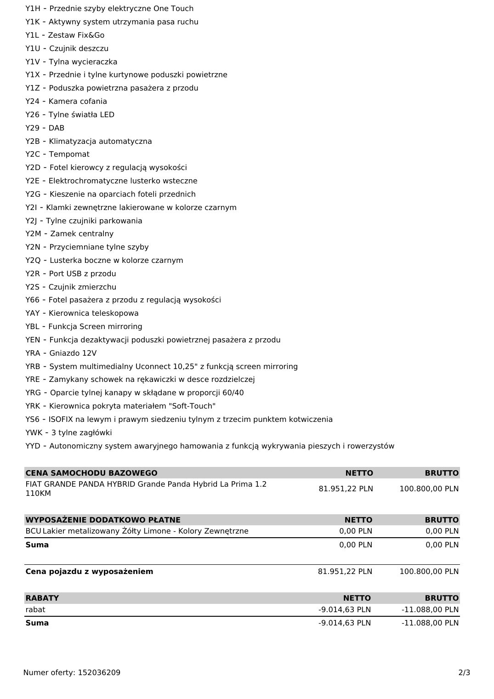
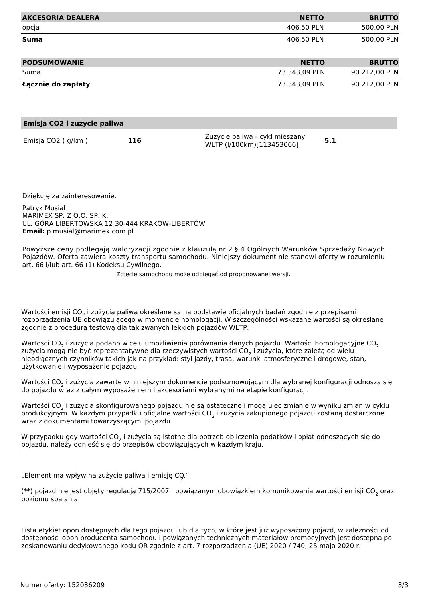
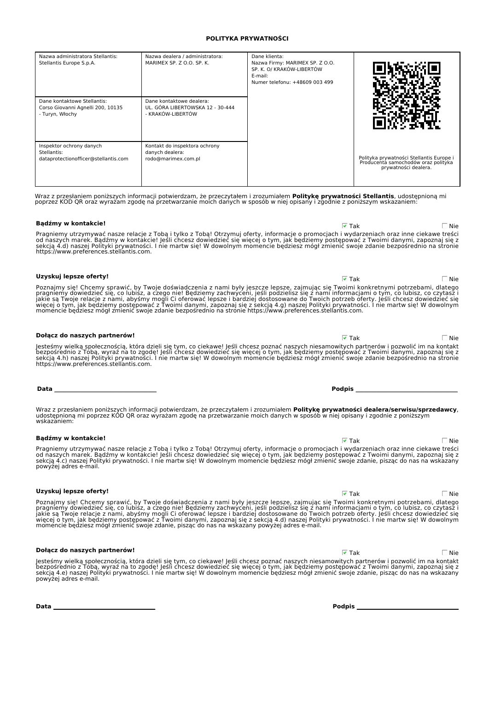

# Fiat Grande Panda Hybrid La Prima - oferta 152036209

| Pole | Wartość |
|---|---|
| Źródłowy PDF | `Grande Panda hybrid la prima.pdf` |
| Liczba stron | 4 |
| Ekstrakcja tekstu | `pdftotext -layout`, UTF-8 |
| Reprezentacja wizualna | render każdej strony, 130 DPI, JPEG |

> Treść pozostawiono w brzmieniu źródłowym. Nie poprawiano literówek, wartości, nazw ani niespójności występujących w PDF-ie.

## Spis stron

[Strona 1](#strona-1) · [Strona 2](#strona-2) · [Strona 3](#strona-3) · [Strona 4](#strona-4)

## Strona 1

[Otwórz obraz strony 1 w pełnej rozdzielczości](assets/01-grande-panda-hybrid-la-prima/page-001.jpg)

### Tekst z warstwy PDF

~~~~text
                                                                    MARIMEX SP. Z O.O. SP. K.
                                                                  UL. GÓRA LIBERTOWSKA 12
                                                                30-444 - KRAKÓW-LIBERTÓW
                                                             Email: p.musial@marimex.com.pl

                                               Numer oferty: 152036209

                                                                                                14 Sierpień 2026

MARIMEX SP. Z O.O. SP. K. O/ KRAKÓW-LIBERTÓW
SZANOWNY PAN PATRYK MUSIAŁ
Góra Libertowska 12
30444 - Libertów

Nr telefonu: +48609 003 499

FIAT GRANDE PANDA HYBRID Grande Panda
Hybrid La Prima 1.2 110KM
MVS: 325-1SK-1-000
Kolor zewnętrzny: Lakier metalizowany Żółty Limone
(507) - Metalizowany
Kolor wewnętrzny: Tapicerka materiałowa La Prima (192)                      Zdjęcie przykładowe

WYPOSAŻENIE STANDARDOWE
D6M - Felgi aluminiowe 17"
F36 - Deska rozdzielcza La Prima z włókanami bambusowymi
K1X - Relingi dachowe w kolorze czarnym
KJU - Tylny spoiler
KK8 - Przednie i tylne czujniki parkowania
KL3 - Przednie i tylne zderzaki Styl
KLG - Elektrycznie składane, podgrzewane lusterka boczne
Y00 - Asystent jazdy na wzniesieniu
Y03 - Port USB typ C dla pierwszego rzędu siedzeń
Y04 - Port USB typ C dla pierwszego i drugiego rzędu siedzeń
Y05 - Przednie podłokietniki w drzwiach pokryte materiałem
Y0H - Słupki B i C w kolorze lśniącej czerni
Y0K - Ładowarka bezprzewodowa
Y0L - Informacje o ograniczeniach prędkości
Y0M - System wykrywania zmęczenia kierowcy
Y0O - Osłony nadkoli
Y0P - Oświetlenie przestrzeni bagażowej
Y0R - Oświetlenia wnętrza LED
Y0T - Światła do jazdy dziennej LED
Y0U - Elektryczny hamulec postojowy
Y0V - Przełącznik E-Toggle
Y0X - Elektroniczny wyświetlacz zegarów i komputera pokładowego TFT 10"
Y11 - 2 tylne głośniki + 2 Tweetery
Y12 - Przyciski do sterowania radiem na kierownicy
Y1A - Połączenie alarmowe E-Call
Y1B - Połączenie alarmowe B-Call
Y1D - Podłokietnik przedni
Y1G - Reflektory "Eco" LED

Numer oferty: 152036209                                                                                        1/3
~~~~

## Strona 2

[Otwórz obraz strony 2 w pełnej rozdzielczości](assets/01-grande-panda-hybrid-la-prima/page-002.jpg)

### Tekst z warstwy PDF

~~~~text
Y1H - Przednie szyby elektryczne One Touch
Y1K - Aktywny system utrzymania pasa ruchu
Y1L - Zestaw Fix&Go
Y1U - Czujnik deszczu
Y1V - Tylna wycieraczka
Y1X - Przednie i tylne kurtynowe poduszki powietrzne
Y1Z - Poduszka powietrzna pasażera z przodu
Y24 - Kamera cofania
Y26 - Tylne światła LED
Y29 - DAB
Y2B - Klimatyzacja automatyczna
Y2C - Tempomat
Y2D - Fotel kierowcy z regulacją wysokości
Y2E - Elektrochromatyczne lusterko wsteczne
Y2G - Kieszenie na oparciach foteli przednich
Y2I - Klamki zewnętrzne lakierowane w kolorze czarnym
Y2J - Tylne czujniki parkowania
Y2M - Zamek centralny
Y2N - Przyciemniane tylne szyby
Y2Q - Lusterka boczne w kolorze czarnym
Y2R - Port USB z przodu
Y2S - Czujnik zmierzchu
Y66 - Fotel pasażera z przodu z regulacją wysokości
YAY - Kierownica teleskopowa
YBL - Funkcja Screen mirroring
YEN - Funkcja dezaktywacji poduszki powietrznej pasażera z przodu
YRA - Gniazdo 12V
YRB - System multimedialny Uconnect 10,25" z funkcją screen mirroring
YRE - Zamykany schowek na rękawiczki w desce rozdzielczej
YRG - Oparcie tylnej kanapy w skłądane w proporcji 60/40
YRK - Kierownica pokryta materiałem "Soft-Touch"
YS6 - ISOFIX na lewym i prawym siedzeniu tylnym z trzecim punktem kotwiczenia
YWK - 3 tylne zagłówki
YYD - Autonomiczny system awaryjnego hamowania z funkcją wykrywania pieszych i rowerzystów

CENA SAMOCHODU BAZOWEGO                                                          NETTO            BRUTTO
FIAT GRANDE PANDA HYBRID Grande Panda Hybrid La Prima 1.2
                                                                         81.951,22 PLN       100.800,00 PLN
110KM

WYPOSAŻENIE DODATKOWO PŁATNE                                                     NETTO            BRUTTO
BCU Lakier metalizowany Żółty Limone - Kolory Zewnętrzne                        0,00 PLN           0,00 PLN
Suma                                                                            0,00 PLN           0,00 PLN

Cena pojazdu z wyposażeniem                                              81.951,22 PLN       100.800,00 PLN

RABATY                                                                          NETTO             BRUTTO
rabat                                                                    -9.014,63 PLN       -11.088,00 PLN
Suma                                                                     -9.014,63 PLN       -11.088,00 PLN

Numer oferty: 152036209                                                                                   2/3
~~~~

## Strona 3

[Otwórz obraz strony 3 w pełnej rozdzielczości](assets/01-grande-panda-hybrid-la-prima/page-003.jpg)

### Tekst z warstwy PDF

~~~~text
AKCESORIA DEALERA                                                                     NETTO              BRUTTO
opcja                                                                            406,50 PLN           500,00 PLN
Suma                                                                             406,50 PLN           500,00 PLN

PODSUMOWANIE                                                                          NETTO              BRUTTO
Suma                                                                          73.343,09 PLN         90.212,00 PLN
Łącznie do zapłaty                                                            73.343,09 PLN         90.212,00 PLN

Emisja CO2 i zużycie paliwa

                                                       Zuzycie paliwa - cykl mieszany
Emisja CO2 ( g/km )             116                                                           5.1
                                                       WLTP (l/100km)[113453066]

Dziękuję za zainteresowanie.
Patryk Musial
MARIMEX SP. Z O.O. SP. K.
UL. GÓRA LIBERTOWSKA 12 30-444 KRAKÓW-LIBERTÓW
Email: p.musial@marimex.com.pl

Powyższe ceny podlegają waloryzacji zgodnie z klauzulą nr 2 § 4 Ogólnych Warunków Sprzedaży Nowych
Pojazdów. Oferta zawiera koszty transportu samochodu. Niniejszy dokument nie stanowi oferty w rozumieniu
art. 66 i/lub art. 66 (1) Kodeksu Cywilnego.
                            Zdjęcie samochodu może odbiegać od proponowanej wersji.

Wartości emisji CO2 i zużycia paliwa określane są na podstawie oficjalnych badań zgodnie z przepisami
rozporządzenia UE obowiązującego w momencie homologacji. W szczególności wskazane wartości są określane
zgodnie z procedurą testową dla tak zwanych lekkich pojazdów WLTP.

Wartości CO2 i zużycia podano w celu umożliwienia porównania danych pojazdu. Wartości homologacyjne CO2 i
zużycia mogą nie być reprezentatywne dla rzeczywistych wartości CO2 i zużycia, które zależą od wielu
nieodłącznych czynników takich jak na przykład: styl jazdy, trasa, warunki atmosferyczne i drogowe, stan,
użytkowanie i wyposażenie pojazdu.

Wartości CO2 i zużycia zawarte w niniejszym dokumencie podsumowującym dla wybranej konfiguracji odnoszą się
do pojazdu wraz z całym wyposażeniem i akcesoriami wybranymi na etapie konfiguracji.

Wartości CO2 i zużycia skonfigurowanego pojazdu nie są ostateczne i mogą ulec zmianie w wyniku zmian w cyklu
produkcyjnym. W każdym przypadku oficjalne wartości CO2 i zużycia zakupionego pojazdu zostaną dostarczone
wraz z dokumentami towarzyszącymi pojazdu.

W przypadku gdy wartości CO2 i zużycia są istotne dla potrzeb obliczenia podatków i opłat odnoszących się do
pojazdu, należy odnieść się do przepisów obowiązujących w każdym kraju.

„Element ma wpływ na zużycie paliwa i emisję CO
                                              2.”

(**) pojazd nie jest objęty regulacją 715/2007 i powiązanym obowiązkiem komunikowania wartości emisji CO2 oraz
poziomu spalania

Lista etykiet opon dostępnych dla tego pojazdu lub dla tych, w które jest już wyposażony pojazd, w zależności od
dostępności opon producenta samochodu i powiązanych technicznych materiałów promocyjnych jest dostępna po
zeskanowaniu dedykowanego kodu QR zgodnie z art. 7 rozporządzenia (UE) 2020 / 740, 25 maja 2020 r.

Numer oferty: 152036209                                                                                            3/3
~~~~

## Strona 4

[Otwórz obraz strony 4 w pełnej rozdzielczości](assets/01-grande-panda-hybrid-la-prima/page-004.jpg)

### Tekst z warstwy PDF

~~~~text
                                                                POLITYKA PRYWATNOŚCI

 Nazwa administratora Stellantis:       Nazwa dealera / administratora:    Dane klienta:
 Stellantis Europe S.p.A.               MARIMEX SP. Z O.O. SP. K.          Nazwa Firmy: MARIMEX SP. Z O.O.
                                                                           SP. K. O/ KRAKÓW-LIBERTÓW
                                                                           E-mail:
                                                                           Numer telefonu: +48609 003 499

 Dane kontaktowe Stellantis:            Dane kontaktowe dealera:
 Corso Giovanni Agnelli 200, 10135      UL. GÓRA LIBERTOWSKA 12 - 30-444
 - Turyn, Włochy                        - KRAKÓW-LIBERTÓW

 Inspektor ochrony danych               Kontakt do inspektora ochrony
 Stellantis:                            danych dealera:
 dataprotectionofficer@stellantis.com   rodo@marimex.com.pl                                                      Polityka prywatności Stellantis Europe i
                                                                                                                 Producenta samochodów oraz polityka
                                                                                                                           prywatności dealera.

Wraz z przesłaniem poniższych informacji potwierdzam, że przeczytałem i zrozumiałem Politykę prywatności Stellantis, udostępnioną mi
poprzez KOD QR oraz wyrażam zgodę na przetwarzanie moich danych w sposób w niej opisany i zgodnie z poniższym wskazaniem:

Bądźmy w kontakcie!                                                                                   Tak                              Nie
Pragniemy utrzymywać nasze relacje z Tobą i tylko z Tobą! Otrzymuj oferty, informacje o promocjach i wydarzeniach oraz inne ciekawe treści
od naszych marek. Bądźmy w kontakcie! Jeśli chcesz dowiedzieć się więcej o tym, jak będziemy postępować z Twoimi danymi, zapoznaj się z
sekcją 4.d) naszej Polityki prywatności. I nie martw się! W dowolnym momencie będziesz mógł zmienić swoje zdanie bezpośrednio na stronie
https://www.preferences.stellantis.com.

Uzyskuj lepsze oferty!                                                                                   Tak                              Nie
Poznajmy się! Chcemy sprawić, by Twoje doświadczenia z nami były jeszcze lepsze, zajmując się Twoimi konkretnymi potrzebami, dlatego
pragniemy dowiedzieć się, co lubisz, a czego nie! Będziemy zachwyceni, jeśli podzielisz się z nami informacjami o tym, co lubisz, co czytasz i
jakie są Twoje relacje z nami, abyśmy mogli Ci oferować lepsze i bardziej dostosowane do Twoich potrzeb oferty. Jeśli chcesz dowiedzieć się
więcej o tym, jak będziemy postępować z Twoimi danymi, zapoznaj się z sekcją 4.g) naszej Polityki prywatności. I nie martw się! W dowolnym
momencie będziesz mógł zmienić swoje zdanie bezpośrednio na stronie https://www.preferences.stellantis.com.

Dołącz do naszych partnerów!                                                                             Tak                              Nie
Jesteśmy wielką społecznością, która dzieli się tym, co ciekawe! Jeśli chcesz poznać naszych niesamowitych partnerów i pozwolić im na kontakt
bezpośrednio z Tobą, wyraź na to zgodę! Jeśli chcesz dowiedzieć się więcej o tym, jak będziemy postępować z Twoimi danymi, zapoznaj się z
sekcją 4.h) naszej Polityki prywatności. I nie martw się! W dowolnym momencie będziesz mógł zmienić swoje zdanie bezpośrednio na stronie
https://www.preferences.stellantis.com.

Data ___________________________________                                                                Podpis ___________________________________

Wraz z przesłaniem poniższych informacji potwierdzam, że przeczytałem i zrozumiałem Politykę prywatności dealera/serwisu/sprzedawcy,
udostępnioną mi poprzez KOD QR oraz wyrażam zgodę na przetwarzanie moich danych w sposób w niej opisany i zgodnie z poniższym
wskazaniem:

Bądźmy w kontakcie!                                                                                    Tak                              Nie
Pragniemy utrzymywać nasze relacje z Tobą i tylko z Tobą! Otrzymuj oferty, informacje o promocjach i wydarzeniach oraz inne ciekawe treści
od naszych marek. Bądźmy w kontakcie! Jeśli chcesz dowiedzieć się więcej o tym, jak będziemy postępować z Twoimi danymi, zapoznaj się z
sekcją 4.c) naszej Polityki prywatności. I nie martw się! W dowolnym momencie będziesz mógł zmienić swoje zdanie, pisząc do nas na wskazany
powyżej adres e-mail.

Uzyskuj lepsze oferty!                                                                                   Tak                              Nie
Poznajmy się! Chcemy sprawić, by Twoje doświadczenia z nami były jeszcze lepsze, zajmując się Twoimi konkretnymi potrzebami, dlatego
pragniemy dowiedzieć się, co lubisz, a czego nie! Będziemy zachwyceni, jeśli podzielisz się z nami informacjami o tym, co lubisz, co czytasz i
jakie są Twoje relacje z nami, abyśmy mogli Ci oferować lepsze i bardziej dostosowane do Twoich potrzeb oferty. Jeśli chcesz dowiedzieć się
więcej o tym, jak będziemy postępować z Twoimi danymi, zapoznaj się z sekcją 4.d) naszej Polityki prywatności. I nie martw się! W dowolnym
momencie będziesz mógł zmienić swoje zdanie, pisząc do nas na wskazany powyżej adres e-mail.

Dołącz do naszych partnerów!                                                                             Tak                              Nie
Jesteśmy wielką społecznością, która dzieli się tym, co ciekawe! Jeśli chcesz poznać naszych niesamowitych partnerów i pozwolić im na kontakt
bezpośrednio z Tobą, wyraź na to zgodę! Jeśli chcesz dowiedzieć się więcej o tym, jak będziemy postępować z Twoimi danymi, zapoznaj się z
sekcją 4.e) naszej Polityki prywatności. I nie martw się! W dowolnym momencie będziesz mógł zmienić swoje zdanie, pisząc do nas na wskazany
powyżej adres e-mail.

Data ___________________________________                                                                 Podpis ___________________________________
~~~~
