# Volkswagen T-Cross Life Plus - informacja handlowa GOV-26-286981

| Pole | Wartość |
|---|---|
| Źródłowy PDF | `GOV-26-286981.pdf` |
| Liczba stron | 12 |
| Ekstrakcja tekstu | `pdftotext -layout`, UTF-8 |
| Reprezentacja wizualna | render każdej strony, 130 DPI, JPEG |

> Treść pozostawiono w brzmieniu źródłowym. Nie poprawiano literówek, wartości, nazw ani niespójności występujących w PDF-ie.

## Spis stron

[Strona 1](#strona-1) · [Strona 2](#strona-2) · [Strona 3](#strona-3) · [Strona 4](#strona-4) · [Strona 5](#strona-5) · [Strona 6](#strona-6) · [Strona 7](#strona-7) · [Strona 8](#strona-8) · [Strona 9](#strona-9) · [Strona 10](#strona-10) · [Strona 11](#strona-11) · [Strona 12](#strona-12)

## Strona 1

[Otwórz obraz strony 1 w pełnej rozdzielczości](assets/02-gov-26-286981/page-001.jpg)

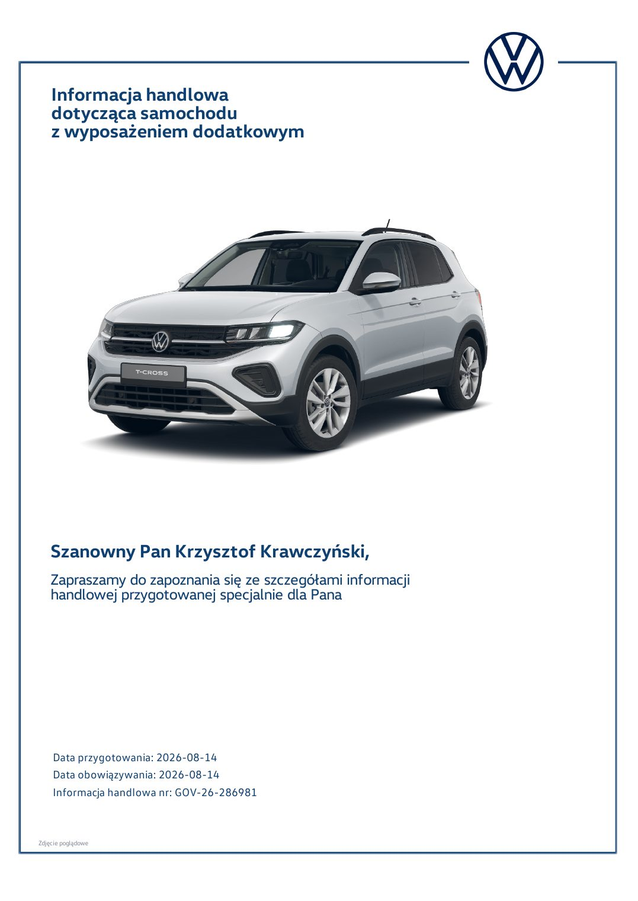

### Tekst z warstwy PDF

~~~~text
    Informacja handlowa
    dotycząca samochodu
    z wyposażeniem dodatkowym

    Szanowny Pan Krzysztof Krawczyński,
    Zapraszamy do zapoznania się ze szczegółami informacji
    handlowej przygotowanej specjalnie dla Pana

    Data przygotowania: 2026-08-14
    Data obowiązywania: 2026-08-14
    Informacja handlowa nr: GOV-26-286981

Zdjęcie poglądowe
~~~~

## Strona 2

[Otwórz obraz strony 2 w pełnej rozdzielczości](assets/02-gov-26-286981/page-002.jpg)

### Tekst z warstwy PDF

~~~~text
    Dziękujemy za zainteresowanie
    marką Volkswagen

Zdjęcie poglądowe
~~~~

## Strona 3

[Otwórz obraz strony 3 w pełnej rozdzielczości](assets/02-gov-26-286981/page-003.jpg)

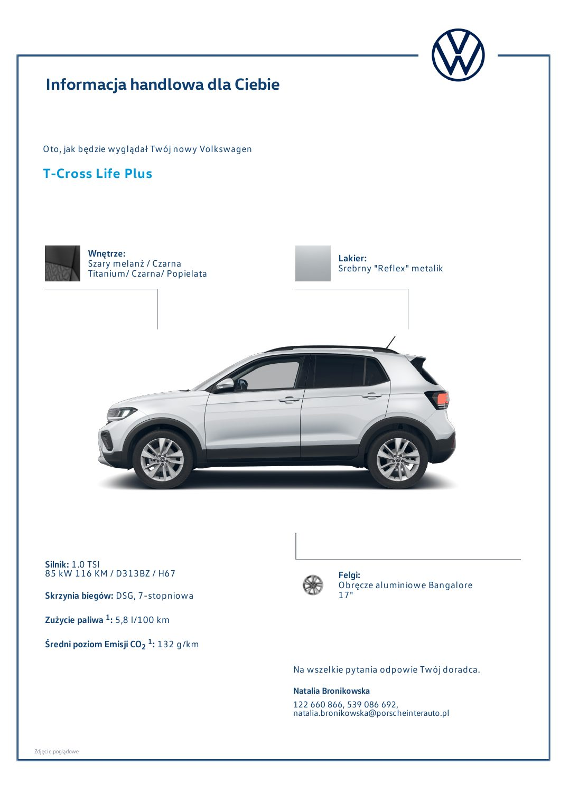

### Tekst z warstwy PDF

~~~~text
    Informacja handlowa dla Ciebie

   Oto, jak będzie wyglądał Twój nowy Volkswagen

   T-Cross Life Plus

                    Wnętrze:                                  Lakier:
                    Szary melanż / Czarna                     Srebrny "Reflex" metalik
                    Titanium/ Czarna/ Popielata

    Silnik: 1.0 TSI
    85 kW 116 KM / D313BZ / H67                               Felgi:
                                                              Obręcze aluminiowe Bangalore
    Skrzynia biegów: DSG, 7-stopniowa                         17"

    Zużycie paliwa 1: 5,8 l/100 km

    Średni poziom Emisji CO2 1: 132 g/km

                                                   Na wszelkie pytania odpowie Twój doradca.
                                                   Natalia Bronikowska
                                                   122 660 866, 539 086 692,
                                                   natalia.bronikowska@porscheinterauto.pl

Zdjęcie poglądowe
~~~~

## Strona 4

[Otwórz obraz strony 4 w pełnej rozdzielczości](assets/02-gov-26-286981/page-004.jpg)

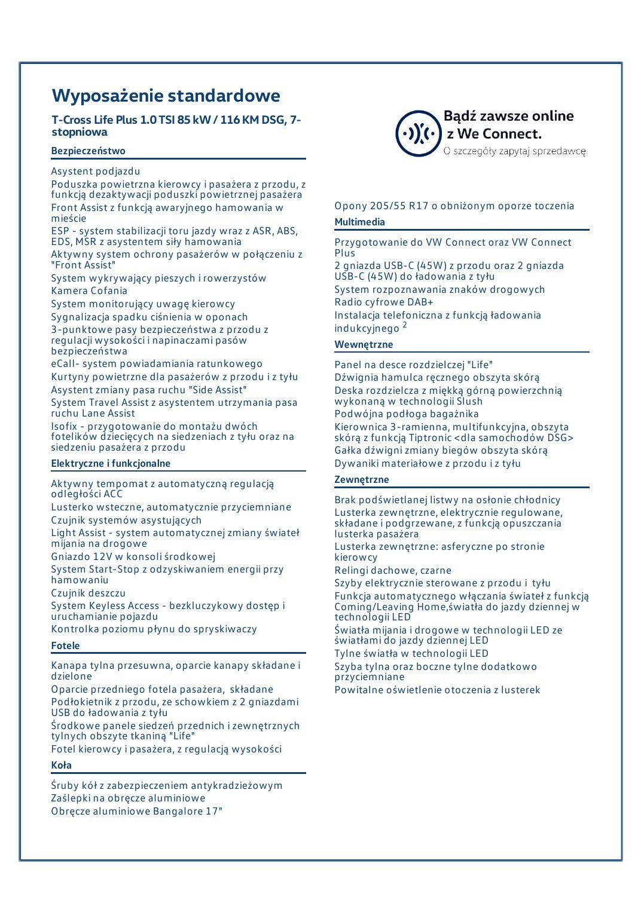

### Tekst z warstwy PDF

~~~~text
Wyposażenie standardowe
T-Cross Life Plus 1.0 TSI 85 kW / 116 KM DSG, 7-
stopniowa
Bezpieczeństwo
Asystent podjazdu
Poduszka powietrzna kierowcy i pasażera z przodu, z
funkcją dezaktywacji poduszki powietrznej pasażera
Front Assist z funkcją awaryjnego hamowania w           Opony 205/55 R17 o obniżonym oporze toczenia
mieście                                                 Multimedia
ESP - system stabilizacji toru jazdy wraz z ASR, ABS,
EDS, MSR z asystentem siły hamowania                    Przygotowanie do VW Connect oraz VW Connect
Aktywny system ochrony pasażerów w połączeniu z         Plus
"Front Assist"                                          2 gniazda USB-C (45W) z przodu oraz 2 gniazda
System wykrywający pieszych i rowerzystów               USB-C (45W) do ładowania z tyłu
Kamera Cofania                                          System rozpoznawania znaków drogowych
System monitorujący uwagę kierowcy                      Radio cyfrowe DAB+
Sygnalizacja spadku ciśnienia w oponach                 Instalacja telefoniczna z funkcją ładowania
3-punktowe pasy bezpieczeństwa z przodu z               indukcyjnego 2
regulacji wysokości i napinaczami pasów                 Wewnętrzne
bezpieczeństwa
eCall- system powiadamiania ratunkowego                 Panel na desce rozdzielczej "Life"
Kurtyny powietrzne dla pasażerów z przodu i z tyłu      Dźwignia hamulca ręcznego obszyta skórą
Asystent zmiany pasa ruchu "Side Assist"                Deska rozdzielcza z miękką górną powierzchnią
System Travel Assist z asystentem utrzymania pasa       wykonaną w technologii Slush
ruchu Lane Assist                                       Podwójna podłoga bagażnika
Isofix - przygotowanie do montażu dwóch                 Kierownica 3-ramienna, multifunkcyjna, obszyta
fotelików dziecięcych na siedzeniach z tyłu oraz na     skórą z funkcją Tiptronic <dla samochodów DSG>
siedzeniu pasażera z przodu                             Gałka dźwigni zmiany biegów obszyta skórą
Elektryczne i funkcjonalne                              Dywaniki materiałowe z przodu i z tyłu
Aktywny tempomat z automatyczną regulacją               Zewnętrzne
odległości ACC                                          Brak podświetlanej listwy na osłonie chłodnicy
Lusterko wsteczne, automatycznie przyciemniane          Lusterka zewnętrzne, elektrycznie regulowane,
Czujnik systemów asystujących                           składane i podgrzewane, z funkcją opuszczania
Light Assist - system automatycznej zmiany świateł      lusterka pasażera
mijania na drogowe                                      Lusterka zewnętrzne: asferyczne po stronie
Gniazdo 12V w konsoli środkowej                         kierowcy
System Start-Stop z odzyskiwaniem energii przy          Relingi dachowe, czarne
hamowaniu                                               Szyby elektrycznie sterowane z przodu i tyłu
Czujnik deszczu                                         Funkcja automatycznego włączania świateł z funkcją
System Keyless Access - bezkluczykowy dostęp i          Coming/Leaving Home,światła do jazdy dziennej w
uruchamianie pojazdu                                    technologii LED
Kontrolka poziomu płynu do spryskiwaczy                 Światła mijania i drogowe w technologii LED ze
Fotele                                                  światłami do jazdy dziennej LED
                                                        Tylne światła w technologii LED
Kanapa tylna przesuwna, oparcie kanapy składane i       Szyba tylna oraz boczne tylne dodatkowo
dzielone                                                przyciemniane
Oparcie przedniego fotela pasażera, składane            Powitalne oświetlenie otoczenia z lusterek
Podłokietnik z przodu, ze schowkiem z 2 gniazdami
USB do ładowania z tyłu
Środkowe panele siedzeń przednich i zewnętrznych
tylnych obszyte tkaniną "Life"
Fotel kierowcy i pasażera, z regulacją wysokości
Koła
Śruby kół z zabezpieczeniem antykradzieżowym
Zaślepki na obręcze aluminiowe
Obręcze aluminiowe Bangalore 17"
~~~~

## Strona 5

[Otwórz obraz strony 5 w pełnej rozdzielczości](assets/02-gov-26-286981/page-005.jpg)

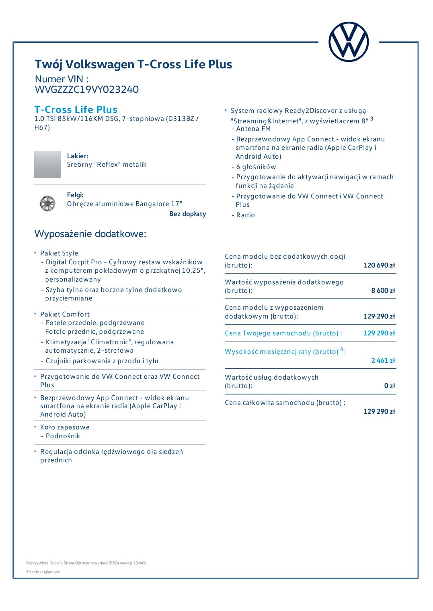

### Tekst z warstwy PDF

~~~~text
    Twój Volkswagen T-Cross Life Plus
    Numer VIN :
    WVGZZZC19VY023240
    T-Cross Life Plus                                           System radiowy Ready2Discover z usługą
    1.0 TSI 85kW/116KM DSG, 7-stopniowa (D313BZ /               "Streaming&Internet", z wyświetlaczem 8" 3
    H67)                                                        - Antena FM
                                                                - Bezprzewodowy App Connect - widok ekranu
                                                                  smartfona na ekranie radia (Apple CarPlay i
                    Lakier:                                       Android Auto)
                    Srebrny "Reflex" metalik                    - 6 głośników
                                                                - Przygotowanie do aktywacji nawigacji w ramach
                                                                  funkcji na żądanie
                    Felgi:                                      - Przygotowanie do VW Connect i VW Connect
                    Obręcze aluminiowe Bangalore 17"              Plus
                                                Bez dopłaty     - Radio

    Wyposażenie dodatkowe:
       Pakiet Style                                            Cena modelu bez dodatkowych opcji
       - Digital Cocpit Pro - Cyfrowy zestaw wskaźników        (brutto):                                120 690 zł
         z komputerem pokładowym o przekątnej 10,25",
         personalizowany                                       Wartość wyposażenia dodatkowego
       - Szyba tylna oraz boczne tylne dodatkowo               (brutto):                                  8 600 zł
         przyciemniane
                                                               Cena modelu z wyposażeniem
       Pakiet Comfort                                          dodatkowym (brutto):                     129 290 zł
       - Fotele przednie, podgrzewane
         Fotele przednie, podgrzewane                          Cena Twojego samochodu (brutto) :        129 290 zł
       - Klimatyzacja "Climatronic", regulowana
         automatycznie, 2-strefowa                             Wysokość miesięcznej raty (brutto) 4 :
       - Czujniki parkowania z przodu i tyłu                                                              2 461 zł
       Przygotowanie do VW Connect oraz VW Connect             Wartość usług dodatkowych
       Plus                                                    (brutto):                                      0 zł
       Bezprzewodowy App Connect - widok ekranu
       smartfona na ekranie radia (Apple CarPlay i             Cena całkowita samochodu (brutto) :
       Android Auto)                                                                                    129 290 zł
       Koło zapasowe
       - Podnośnik
       Regulacja odcinka lędźwiowego dla siedzeń
       przednich

Rzeczywista Roczna Stopa Oprocentowania (RRSO) wynosi 13,64%
Zdjęcie poglądowe
~~~~

## Strona 6

[Otwórz obraz strony 6 w pełnej rozdzielczości](assets/02-gov-26-286981/page-006.jpg)

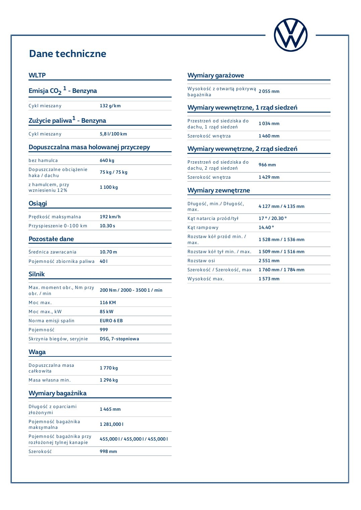

### Tekst z warstwy PDF

~~~~text
Dane techniczne
WLTP                                                             Wymiary garażowe
Emisja CO2 1 - Benzyna                                           W ysokość z otwartą pokrywą 2 055 mm
                                                                 bagażnika
Cykl mieszany                132 g/km                            Wymiary wewnętrzne, 1 rząd siedzeń
Zużycie paliwa1 - Benzyna                                        Przestrzeń od siedziska do    1 034 mm
                                                                 dachu, 1 rząd siedzeń
Cykl mieszany                5,8 l/100 km                        Szerokość wnętrza             1 460 mm
Dopuszczalna masa holowanej przyczepy                            Wymiary wewnętrzne, 2 rząd siedzeń
bez hamulca                  640 kg                              Przestrzeń od siedziska do    966 mm
Dopuszczalne obciążenie                                          dachu, 2 rząd siedzeń
                             75 kg / 75 kg
haka / dachu                                                     Szerokość wnętrza             1 429 mm
z hamulcem, przy             1 100 kg
wzniesieniu 12%                                                  Wymiary zewnętrzne
Osiągi                                                           Długość, min./ Długość,       4 127 mm / 4 135 mm
                                                                 max.
Prędkość maksymalna          192 km/h                            Kąt natarcia przód/tył        17 ° / 20.30 °
Przyspieszenie 0-100 km      10.30 s                             Kąt rampowy                   14.40 °
Pozostałe dane                                                   Rozstaw kół przód min. /      1 528 mm / 1 536 mm
                                                                 max.
Średnica zawracania          10.70 m                             Rozstaw kół tył min. / max.   1 509 mm / 1 516 mm
Pojemność zbiornika paliwa 40 l                                  Rozstaw osi                   2 551 mm
                                                                 Szerokość / Szerokość, max    1 760 mm / 1 784 mm
Silnik                                                           W ysokość max.                1 573 mm
M ax. moment obr., Nm przy 200 Nm / 2000 - 3500 1 / min
obr. / min
M oc max.                    116 KM
M oc max., kW                85 kW
Norma emisji spalin          EURO 6 EB
Pojemność                    999
Skrzynia biegów, seryjnie    DSG, 7-stopniowa

Waga
Dopuszczalna masa            1 770 kg
całkowita
M asa własna min.            1 296 kg

Wymiary bagażnika
Długość z oparciami          1 465 mm
złożonymi
Pojemność bagażnika          1 281,000 l
maksymalna
Pojemność bagażnika przy     455,000 l / 455,000 l / 455,000 l
rozłożonej tylnej kanapie
Szerokość                    998 mm
~~~~

## Strona 7

[Otwórz obraz strony 7 w pełnej rozdzielczości](assets/02-gov-26-286981/page-007.jpg)

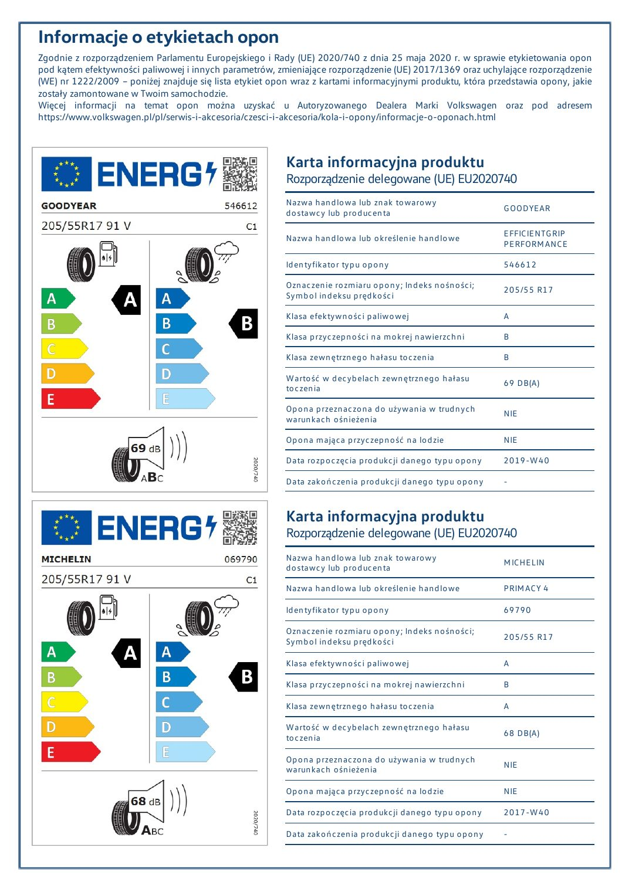

### Tekst z warstwy PDF

~~~~text
Informacje o etykietach opon
Zgodnie z rozporządzeniem Parlamentu Europejskiego i Rady (UE) 2020/740 z dnia 25 maja 2020 r. w sprawie etykietowania opon
pod kątem efektywności paliwowej i innych parametrów, zmieniające rozporządzenie (UE) 2017/1369 oraz uchylające rozporządzenie
(WE) nr 1222/2009 – poniżej znajduje się lista etykiet opon wraz z kartami informacyjnymi produktu, która przedstawia opony, jakie
zostały zamontowane w Twoim samochodzie.
Więcej informacji na temat opon można uzyskać u Autoryzowanego Dealera Marki Volkswagen oraz pod adresem
https://www.volkswagen.pl/pl/serwis-i-akcesoria/czesci-i-akcesoria/kola-i-opony/informacje-o-oponach.html

                                                          Karta informacyjna produktu
                                                          Rozporządzenie delegowane (UE) EU2020740
                                                          Nazwa handlowa lub znak towarowy
                                                          dostawcy lub producenta                            G OODYEAR

                                                          Nazwa handlowa lub określenie handlowe             EFFICIENTG RIP
                                                                                                             PERFORM ANCE
                                                          Identyfikator typu opony                           546612
                                                          Oznaczenie rozmiaru opony; Indeks nośności;        205/55 R17
                                                          Symbol indeksu prędkości
                                                          Klasa efektywności paliwowej                       A
                                                          Klasa przyczepności na mokrej nawierzchni          B
                                                          Klasa zewnętrznego hałasu toczenia                 B
                                                          W artość w decybelach zewnętrznego hałasu          69 DB(A)
                                                          toczenia
                                                          Opona przeznaczona do używania w trudnych          NIE
                                                          warunkach ośnieżenia
                                                          Opona mająca przyczepność na lodzie                NIE
                                                          Data rozpoczęcia produkcji danego typu opony       2019-W 40
                                                          Data zakończenia produkcji danego typu opony       -

                                                          Karta informacyjna produktu
                                                          Rozporządzenie delegowane (UE) EU2020740
                                                          Nazwa handlowa lub znak towarowy                   M ICHELIN
                                                          dostawcy lub producenta
                                                          Nazwa handlowa lub określenie handlowe             PRIM ACY 4

                                                          Identyfikator typu opony                           69790

                                                          Oznaczenie rozmiaru opony; Indeks nośności;
                                                          Symbol indeksu prędkości                           205/55 R17

                                                          Klasa efektywności paliwowej                       A

                                                          Klasa przyczepności na mokrej nawierzchni          B

                                                          Klasa zewnętrznego hałasu toczenia                 A

                                                          W artość w decybelach zewnętrznego hałasu
                                                          toczenia                                           68 DB(A)

                                                          Opona przeznaczona do używania w trudnych
                                                          warunkach ośnieżenia                               NIE

                                                          Opona mająca przyczepność na lodzie                NIE

                                                          Data rozpoczęcia produkcji danego typu opony       2017-W 40

                                                          Data zakończenia produkcji danego typu opony       -
~~~~

## Strona 8

[Otwórz obraz strony 8 w pełnej rozdzielczości](assets/02-gov-26-286981/page-008.jpg)

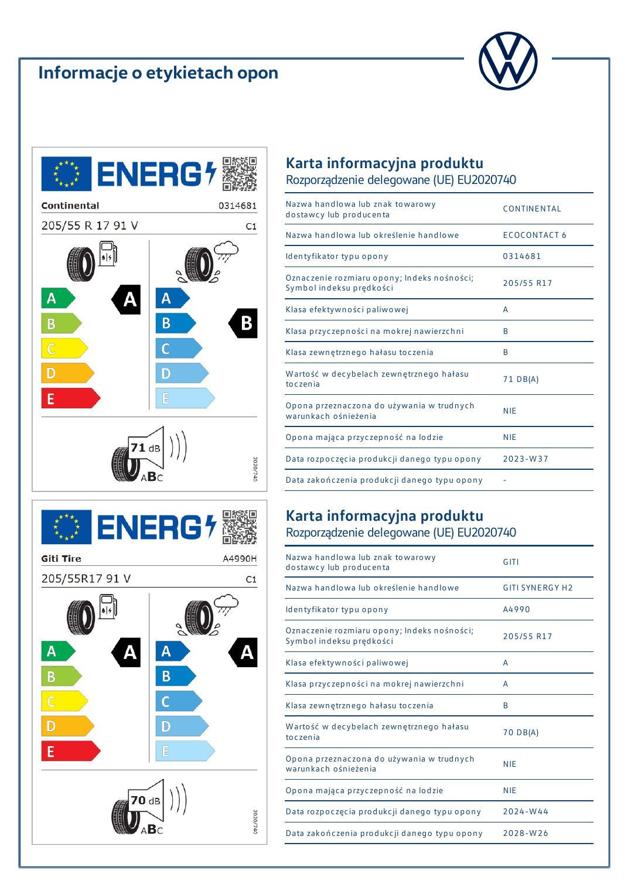

### Tekst z warstwy PDF

~~~~text
Informacje o etykietach opon

                               Karta informacyjna produktu
                               Rozporządzenie delegowane (UE) EU2020740
                               Nazwa handlowa lub znak towarowy               CONTINENTAL
                               dostawcy lub producenta
                               Nazwa handlowa lub określenie handlowe         ECOCONTACT 6

                               Identyfikator typu opony                       0314681

                               Oznaczenie rozmiaru opony; Indeks nośności;
                               Symbol indeksu prędkości                       205/55 R17

                               Klasa efektywności paliwowej                   A

                               Klasa przyczepności na mokrej nawierzchni      B

                               Klasa zewnętrznego hałasu toczenia             B

                               W artość w decybelach zewnętrznego hałasu
                               toczenia                                       71 DB(A)

                               Opona przeznaczona do używania w trudnych
                               warunkach ośnieżenia                           NIE

                               Opona mająca przyczepność na lodzie            NIE

                               Data rozpoczęcia produkcji danego typu opony   2023-W 37

                               Data zakończenia produkcji danego typu opony   -

                               Karta informacyjna produktu
                               Rozporządzenie delegowane (UE) EU2020740
                               Nazwa handlowa lub znak towarowy               G ITI
                               dostawcy lub producenta
                               Nazwa handlowa lub określenie handlowe         G ITI SYNERG Y H2

                               Identyfikator typu opony                       A4990

                               Oznaczenie rozmiaru opony; Indeks nośności;
                               Symbol indeksu prędkości                       205/55 R17

                               Klasa efektywności paliwowej                   A

                               Klasa przyczepności na mokrej nawierzchni      A

                               Klasa zewnętrznego hałasu toczenia             B

                               W artość w decybelach zewnętrznego hałasu
                               toczenia                                       70 DB(A)

                               Opona przeznaczona do używania w trudnych
                               warunkach ośnieżenia                           NIE

                               Opona mająca przyczepność na lodzie            NIE

                               Data rozpoczęcia produkcji danego typu opony   2024-W 44

                               Data zakończenia produkcji danego typu opony   2028-W 26
~~~~

## Strona 9

[Otwórz obraz strony 9 w pełnej rozdzielczości](assets/02-gov-26-286981/page-009.jpg)

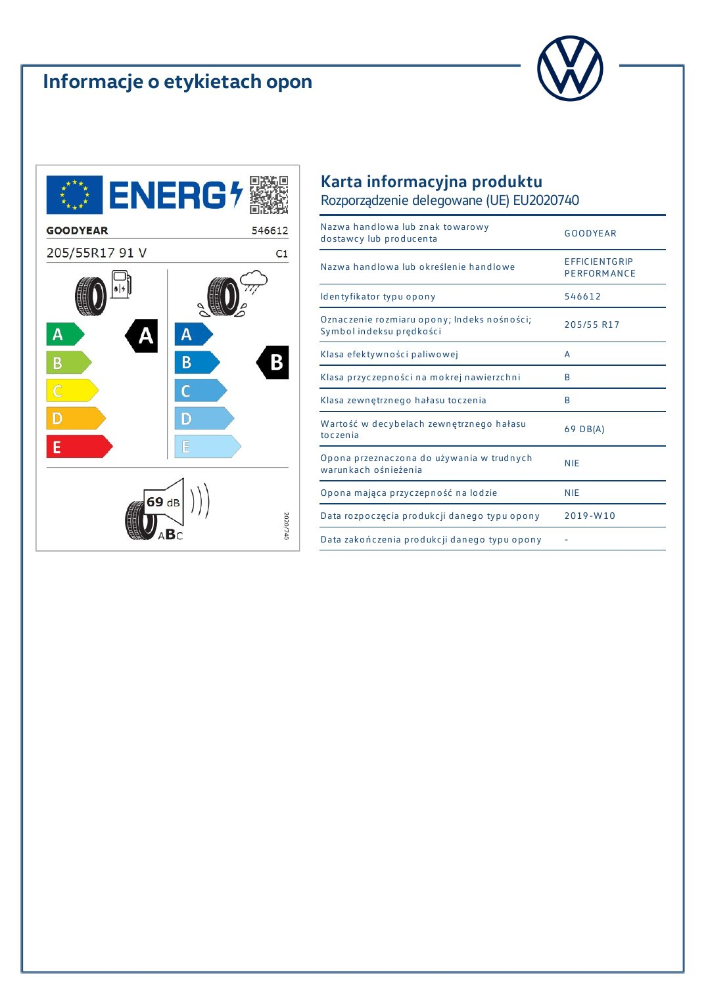

### Tekst z warstwy PDF

~~~~text
Informacje o etykietach opon

                               Karta informacyjna produktu
                               Rozporządzenie delegowane (UE) EU2020740
                               Nazwa handlowa lub znak towarowy
                               dostawcy lub producenta                        G OODYEAR

                               Nazwa handlowa lub określenie handlowe         EFFICIENTG RIP
                                                                              PERFORM ANCE
                               Identyfikator typu opony                       546612
                               Oznaczenie rozmiaru opony; Indeks nośności;    205/55 R17
                               Symbol indeksu prędkości
                               Klasa efektywności paliwowej                   A
                               Klasa przyczepności na mokrej nawierzchni      B
                               Klasa zewnętrznego hałasu toczenia             B
                               W artość w decybelach zewnętrznego hałasu      69 DB(A)
                               toczenia
                               Opona przeznaczona do używania w trudnych      NIE
                               warunkach ośnieżenia
                               Opona mająca przyczepność na lodzie            NIE
                               Data rozpoczęcia produkcji danego typu opony   2019-W 10
                               Data zakończenia produkcji danego typu opony   -
~~~~

## Strona 10

[Otwórz obraz strony 10 w pełnej rozdzielczości](assets/02-gov-26-286981/page-010.jpg)

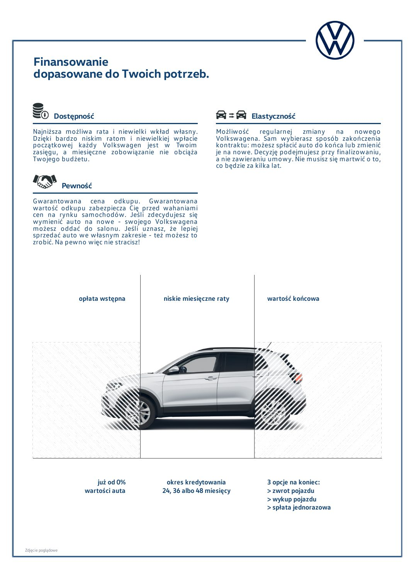

### Tekst z warstwy PDF

~~~~text
    Finansowanie
    dopasowane do Twoich potrzeb.

               Dostępność                                              Elastyczność
    Najniższa możliwa rata i niewielki wkład własny.        Możliwość regularnej zmiany na nowego
    Dzięki bardzo niskim ratom i niewielkiej wpłacie        Volkswagena. Sam wybierasz sposób zakończenia
    początkowej każdy Volkswagen jest w Twoim               kontraktu: możesz spłacić auto do końca lub zmienić
    zasięgu, a miesięczne zobowiązanie nie obciąża          je na nowe. Decyzję podejmujesz przy finalizowaniu,
    Twojego budżetu.                                        a nie zawieraniu umowy. Nie musisz się martwić o to,
                                                            co będzie za kilka lat.

                    Pewność
    Gwarantowana cena odkupu. Gwarantowana
    wartość odkupu zabezpiecza Cię przed wahaniami
    cen na rynku samochodów. Jeśli zdecydujesz się
    wymienić auto na nowe - swojego Volkswagena
    możesz oddać do salonu. Jeśli uznasz, że lepiej
    sprzedać auto we własnym zakresie - też możesz to
    zrobić. Na pewno więc nie stracisz!

                       opłata wstępna     niskie miesięczne raty            wartość końcowa

                             już od 0%     okres kredytowania               3 opcje na koniec:
                         wartości auta    24, 36 albo 48 miesięcy           > zwrot pojazdu
                                                                            > wykup pojazdu
                                                                            > spłata jednorazowa

Zdjęcie poglądowe
~~~~

## Strona 11

[Otwórz obraz strony 11 w pełnej rozdzielczości](assets/02-gov-26-286981/page-011.jpg)

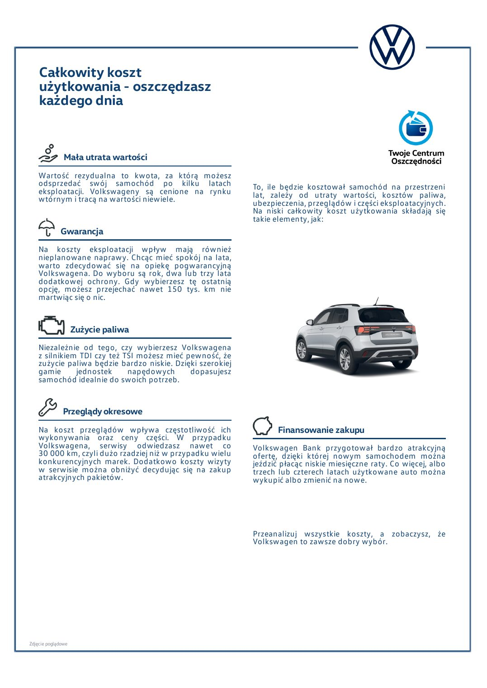

### Tekst z warstwy PDF

~~~~text
    Całkowity koszt
    użytkowania - oszczędzasz
    każdego dnia

               Mała utrata wartości
    Wartość rezydualna to kwota, za którą możesz
    odsprzedać swój samochód po kilku latach                To, ile będzie kosztował samochód na przestrzeni
    eksploatacji. Volkswageny są cenione na rynku           lat, zależy od utraty wartości, kosztów paliwa,
    wtórnym i tracą na wartości niewiele.                   ubezpieczenia, przeglądów i części eksploatacyjnych.
                                                            Na niski całkowity koszt użytkowania składają się
                                                            takie elementy, jak:
             Gwarancja
    Na koszty eksploatacji wpływ mają również
    nieplanowane naprawy. Chcąc mieć spokój na lata,
    warto zdecydować się na opiekę pogwarancyjną
    Volkswagena. Do wyboru są rok, dwa lub trzy lata
    dodatkowej ochrony. Gdy wybierzesz tę ostatnią
    opcję, możesz przejechać nawet 150 tys. km nie
    martwiąc się o nic.

                    Zużycie paliwa
    Niezależnie od tego, czy wybierzesz Volkswagena
    z silnikiem TDI czy też TSI możesz mieć pewność, że
    zużycie paliwa będzie bardzo niskie. Dzięki szerokiej
    gamie      jednostek     napędowych      dopasujesz
    samochód idealnie do swoich potrzeb.

               Przeglądy okresowe
    Na koszt przeglądów wpływa częstotliwość ich                   Finansowanie zakupu
    wykonywania oraz ceny części. W przypadku
    Volkswagena, serwisy odwiedzasz nawet co                Volkswagen Bank przygotował bardzo atrakcyjną
    30 000 km, czyli dużo rzadziej niż w przypadku wielu    ofertę, dzięki której nowym samochodem można
    konkurencyjnych marek. Dodatkowo koszty wizyty          jeździć płacąc niskie miesięczne raty. Co więcej, albo
    w serwisie można obniżyć decydując się na zakup         trzech lub czterech latach użytkowane auto można
    atrakcyjnych pakietów.                                  wykupić albo zmienić na nowe.

                                                            Przeanalizuj wszystkie koszty, a zobaczysz, że
                                                            Volkswagen to zawsze dobry wybór.

Zdjęcie poglądowe
~~~~

## Strona 12

[Otwórz obraz strony 12 w pełnej rozdzielczości](assets/02-gov-26-286981/page-012.jpg)

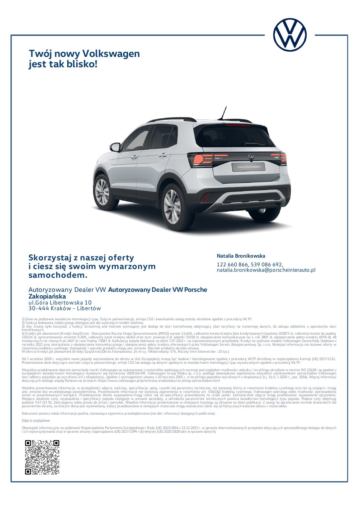

### Tekst z warstwy PDF

~~~~text
    Twój nowy Volkswagen
    jest tak blisko!

    Skorzystaj z naszej oferty                                                                                                  Natalia Bronikowska
    i ciesz się swoim wymarzonym                                                                                                122 660 866, 539 086 692,
                                                                                                                                natalia.bronikowska@porscheinterauto.pl
    samochodem.
    Autoryzowany Dealer VW Autoryzowany Dealer VW Porsche
    Zakopiańska
    ul.Góra Libertowska 10
    30-444 Kraków - Libertów
1) Dane na podstawie świadectw homologacji typu. Zużycie paliwa/energii, emisja CO2 i ewentualnie zasięg zostały określone zgodnie z procedurą WLTP.
2) Funkcja ładowania indukcyjnego dostępna jest dla wybranych modeli telefonu.
3) Aby można było korzystać z funkcji Streaming and internet wymagany jest dostęp do sieci komórkowej obejmujący plan taryfowy na transmisję danych, do zakupu oddzielnie u operatorów sieci
komórkowych.
4) Kredyt jak abonament (Kredyt EasyDrive) - Rzeczywista Roczna Stopa Oprocentowania (RRSO) wynosi 13,64%, całkowita kwota kredytu (bez kredytowanych kosztów) 103873 zł, całkowita kwota do zapłaty
150216 zł, oprocentowanie zmienne 9,30%, całkowity koszt kredytu 46343 zł (w tym: prowizja 0 zł, odsetki 35558 zł, ubezpieczenie komunikacyjne na 1. rok 3807 zł, ubezpieczenie spłaty kredytu 6978 zł), 48
miesięcznych rat równych po 1607 zł; rata finalna 73087 zł. Kalkulacja została dokonana na dzień 7.07.2022 r. na reprezentatywnym przykładzie. Kredyt na wybrane modele Volkswagen Samochody Osobowe z
rocznika 2022 przy skorzystaniu z ubezpieczenia komunikacyjnego i ubezpieczenia spłaty kredytu oferowanych przez Volkswagen Serwis Ubezpieczeniowy Sp. z o.o. Niniejsza informacja nie stanowi oferty w
rozumieniu kodeksu cywilnego. Dostępność i warunki produktu mogą ulec zmianie. Warunki produktu określa umowa.
W ofercie Kredyt jak abonament (Kredyt EasyDrive) (Okres finansowania: 24 m-cy, Wkład własny: 0 %, Roczny limit kilometrów : 10 tys.)
Od 1 września 2018 r. wszystkie nowe pojazdy wprowadzane do obrotu w Unii Europejskiej muszą być badane i homologowane zgodnie z procedurą WLTP określoną w rozporządzeniu Komisji (UE) 2017/1151.
Prezentowane dane dotyczące wartości zużycia paliwa/energii, emisji CO2 lub zasięgu są danymi zgodnymi ze świadectwem homologacji typu wyznaczonymi zgodnie z procedurą WLTP.
Wszystkie produkowane obecnie samochody marki Volkswagen są wykonywane z materiałów spełniających wymogi pod względem możliwości odzysku i recyklingu określone w normie ISO 22628 i są zgodnie z
europejskimi świadectwami homologacji wydanymi wg Dyrektywy 2005/64/WE. Volkswagen Group Polska sp. z o.o. podlega obowiązkowi zapewnienia wszystkim użytkownikom samochodów Volkswagen
sieci odbioru pojazdów po wycofaniu ich z eksploatacji, zgodnie z wymaganiami ustawy z 20 stycznia 2005 r. o recyklingu pojazdów wycofanych z eksploatacji (t.j. Dz.U. z 2020 r., poz. 2056). Więcej informacji
dotyczących ekologii znajdą Państwo na stronach: https://www.volkswagen.pl/pl/ochrona-srodowiska/recykling-samochodow.html
Wszelkie prezentowane informacje, w szczególności zdjęcia, wykresy, specyfikacje, opisy, rysunki lub parametry techniczne, nie stanowią oferty w rozumieniu Kodeksu cywilnego oraz nie są wiążące i mogą
ulec zmianie bez wcześniejszego powiadomienia. Prezentowane informacje nie stanowią zapewnienia w rozumieniu art. 556(1)§2 Kodeksu cywilnego. Volkswagen zastrzega sobie możliwość wprowadzenia
zmian w prezentowanych wersjach. Przedstawione detale wyposażenia mogą różnić się od specyfikacji przewidzianej na rynek polski. Zamieszczone zdjęcia mogą przedstawiać wyposażenie opcjonalne.
Wiążące ustalenie ceny, wyposażenia i specyfikacji pojazdu następuje w umowie sprzedaży, a określenie parametrów technicznych zawiera świadectwo homologacji typu pojazdu. Podane ceny obejmują
podatek VAT (23 %). Zastrzegamy sobie prawo do zmian i pomyłek. Wszelkie informacje prezentowane w niniejszym katalogu są aktualne na dzień publikacji. Z uwagi na ograniczenia technik drukarskich lub
parametrów ekranu, na którym obraz jest wyświetlany, kolory przedstawione w niniejszym materiale mogą nieznacznie różnić się od faktycznych kolorów lakieru i materiałów.
Dokument zawiera także informacje poufne, stanowiące tajemnice przedsiębiorstwa (nie dot. informacji dostępnych publicznie).
Zdjęcie poglądowe
Obowiązek informacyjny na podstawie Rozporządzenia Parlamentu Europejskiego i Rady (UE) 2023/2854 z 13.12.2023 r. w sprawie zharmonizowanych przepisów dotyczących sprawiedliwego dostępu do danych
i ich wykorzystywania oraz w sprawie zmiany rozporządzenia (UE) 2017/2394 i dyrektywy (UE) 2020/1828 (akt w sprawie danych).
~~~~
