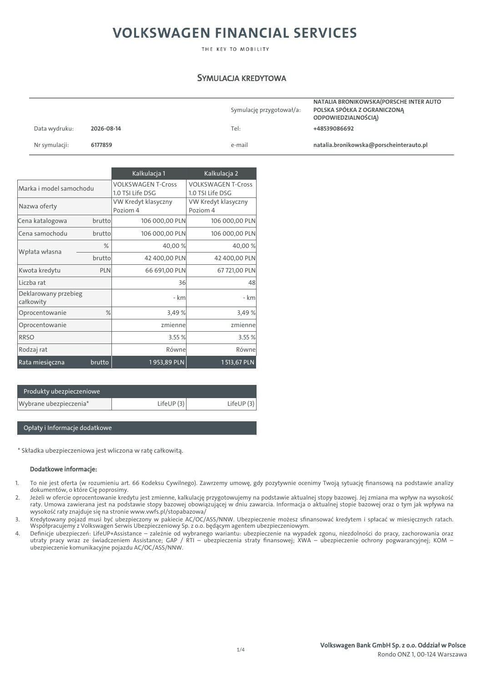
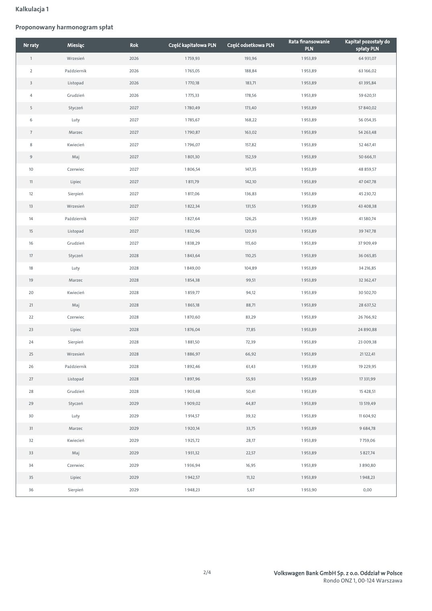
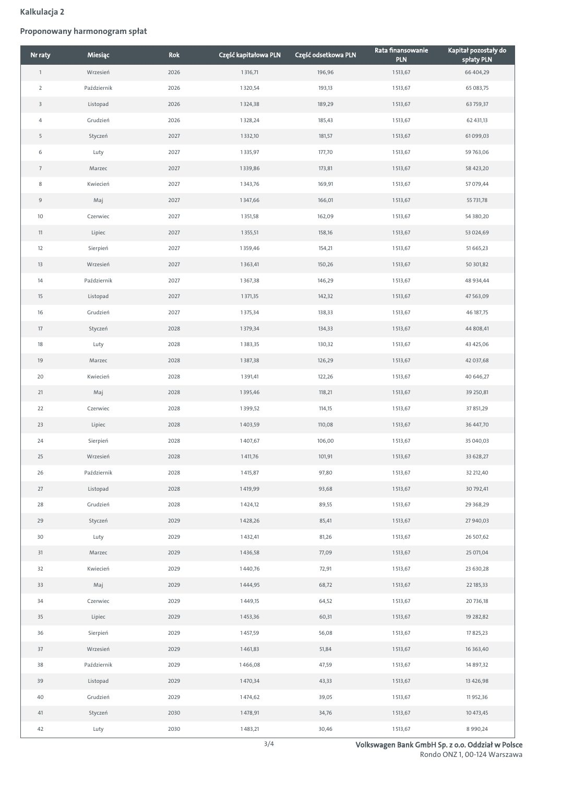
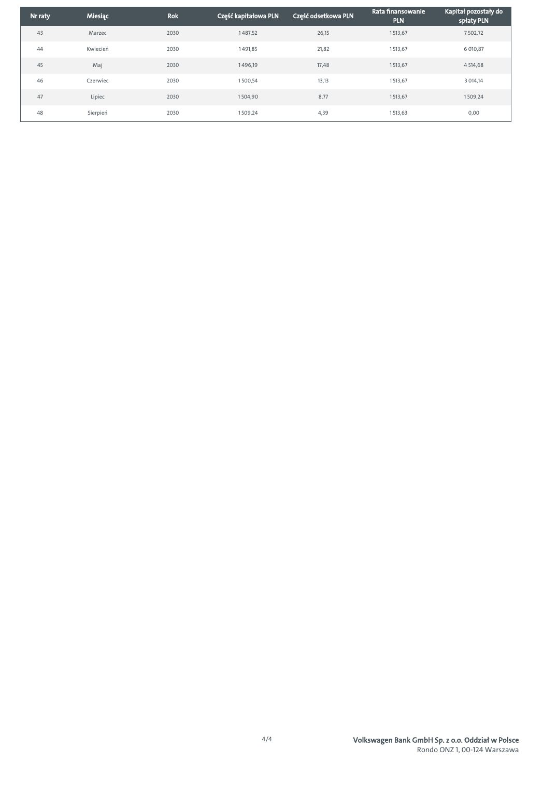
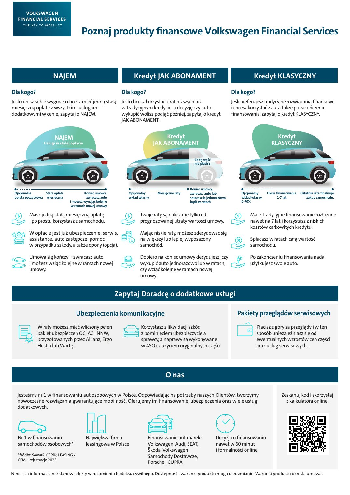

# Volkswagen T-Cross - symulacja kredytowa 6177859

| Pole | Wartość |
|---|---|
| Źródłowy PDF | `simulation-6177859.pdf` |
| Liczba stron | 5 |
| Ekstrakcja tekstu | `pdftotext -layout`, UTF-8 |
| Reprezentacja wizualna | render każdej strony, 130 DPI, JPEG |

> Treść pozostawiono w brzmieniu źródłowym. Nie poprawiano literówek, wartości, nazw ani niespójności występujących w PDF-ie.

## Spis stron

[Strona 1](#strona-1) · [Strona 2](#strona-2) · [Strona 3](#strona-3) · [Strona 4](#strona-4) · [Strona 5](#strona-5)

## Strona 1

[Otwórz obraz strony 1 w pełnej rozdzielczości](assets/03-simulation-6177859/page-001.jpg)

### Tekst z warstwy PDF

~~~~text
                                                                     SYMULACJA KREDYTOWA

                                                                                                           NATALIA BRONIKOWSKA(PORSCHE INTER AUTO
                                                                                Symulację przygotował/a:   POLSKA SPÓŁKA Z OGRANICZONĄ
                                                                                                           ODPOWIEDZIALNOŚCIĄ)
        Data wydruku:       2026-08-14                                          Tel:                       +48539086692

        Nr symulacji:       6177859                                             e-mail                     natalia.bronikowska@porscheinterauto.pl

                                           Kalkulacja 1                Kalkulacja 2
                                      VOLKSWAGEN T-Cross           VOLKSWAGEN T-Cross
 Marka i model samochodu
                                      1.0 TSI Life DSG             1.0 TSI Life DSG
                                      VW Kredyt klasyczny          VW Kredyt klasyczny
 Nazwa oferty
                                      Poziom 4                     Poziom 4
 Cena katalogowa            brutto            106 000,00 PLN             106 000,00 PLN
 Cena samochodu              brutto           106 000,00 PLN             106 000,00 PLN
                                %                     40,00 %                    40,00 %
 Wpłata własna
                             brutto            42 400,00 PLN              42 400,00 PLN
 Kwota kredytu                 PLN             66 691,00 PLN               67 721,00 PLN
 Liczba rat                                                  36                          48
 Deklarowany przebieg
                                                           - km                        - km
 całkowity
 Oprocentowanie                  %                        3,49 %                  3,49 %
 Oprocentowanie                                      zmienne                    zmienne
 RRSO                                                     3.55 %                      3.55 %
 Rodzaj rat                                               Równe                   Równe
 Rata miesięczna            brutto               1 953,89 PLN                1 513,67 PLN

     Produkty ubezpieczeniowe
 Wybrane ubezpieczenia*                             LifeUP (3)                 LifeUP (3)

     Opłaty i Informacje dodatkowe

 * Składka ubezpieczeniowa jest wliczona w ratę całkowitą.

       Dodatkowe informacje:

1.     To nie jest oferta (w rozumieniu art. 66 Kodeksu Cywilnego). Zawrzemy umowę, gdy pozytywnie ocenimy Twoją sytuację finansową na podstawie analizy
       dokumentów, o które Cię poprosimy.
2.     Jeżeli w ofercie oprocentowanie kredytu jest zmienne, kalkulację przygotowujemy na podstawie aktualnej stopy bazowej. Jej zmiana ma wpływ na wysokość
       raty. Umowa zawierana jest na podstawie stopy bazowej obowiązującej w dniu zawarcia. Informacja o aktualnej stopie bazowej oraz o tym jak wpływa na
       wysokość raty znajduje się na stronie www.vwfs.pl/stopabazowa/
3.     Kredytowany pojazd musi być ubezpieczony w pakiecie AC/OC/ASS/NNW. Ubezpieczenie możesz sfinansować kredytem i spłacać w miesięcznych ratach.
       Współpracujemy z Volkswagen Serwis Ubezpieczeniowy Sp. z o.o. będącym agentem ubezpieczeniowym.
4.     Definicje ubezpieczeń: LifeUP+Assistance – zależnie od wybranego wariantu: ubezpieczenie na wypadek zgonu, niezdolności do pracy, zachorowania oraz
       utraty pracy wraz ze świadczeniem Assistance; GAP / RTI – ubezpieczenia straty finansowej; XWA – ubezpieczenie ochrony pogwarancyjnej; KOM –
       ubezpieczenie komunikacyjne pojazdu AC/OC/ASS/NNW.

                                                                                                             Volkswagen Bank GmbH Sp. z o.o. Oddział w Polsce
                                                                                  1/4
                                                                                                                              Rondo ONZ 1, 00-124 Warszawa
~~~~

## Strona 2

[Otwórz obraz strony 2 w pełnej rozdzielczości](assets/03-simulation-6177859/page-002.jpg)

### Tekst z warstwy PDF

~~~~text
Kalkulacja 1

Proponowany harmonogram spłat

                                                                                      Rata finansowanie    Kapitał pozostały do
  Nr raty       Miesiąc         Rok    Część kapitałowa PLN    Część odsetkowa PLN
                                                                                              PLN               spłaty PLN
     1          Wrzesień        2026         1 759,93                 193,96               1 953,89              64 931,07

     2         Październik      2026         1 765,05                 188,84               1 953,89              63 166,02

     3          Listopad        2026          1 770,18                183,71               1 953,89              61 395,84

     4          Grudzień        2026          1 775,33                178,56               1 953,89              59 620,51

     5          Styczeń         2027         1 780,49                 173,40               1 953,89             57 840,02

     6            Luty          2027         1 785,67                 168,22               1 953,89              56 054,35

     7           Marzec         2027         1 790,87                 163,02               1 953,89              54 263,48

     8          Kwiecień        2027         1 796,07                 157,82               1 953,89              52 467,41

     9            Maj           2027         1 801,30                 152,59               1 953,89              50 666,11

    10          Czerwiec        2027         1 806,54                 147,35               1 953,89              48 859,57

     11          Lipiec         2027          1 811,79                142,10               1 953,89              47 047,78

    12          Sierpień        2027         1 817,06                 136,83               1 953,89              45 230,72

    13          Wrzesień        2027         1 822,34                 131,55               1 953,89             43 408,38

    14         Październik      2027         1 827,64                 126,25               1 953,89              41 580,74

     15         Listopad        2027         1 832,96                 120,93               1 953,89              39 747,78

    16          Grudzień        2027         1 838,29                 115,60               1 953,89             37 909,49

     17         Styczeń         2028         1 843,64                 110,25               1 953,89             36 065,85

    18            Luty          2028         1 849,00                 104,89               1 953,89              34 216,85

    19           Marzec         2028         1 854,38                 99,51                1 953,89              32 362,47

    20          Kwiecień        2028         1 859,77                 94,12                1 953,89              30 502,70

    21            Maj           2028         1 865,18                 88,71                1 953,89              28 637,52

    22          Czerwiec        2028         1 870,60                 83,29                1 953,89             26 766,92

    23           Lipiec         2028         1 876,04                 77,85                1 953,89             24 890,88

    24          Sierpień        2028         1 881,50                 72,39                1 953,89             23 009,38

    25          Wrzesień        2028         1 886,97                 66,92                1 953,89              21 122,41

    26         Październik      2028         1 892,46                 61,43                1 953,89              19 229,95

    27          Listopad        2028         1 897,96                 55,93                1 953,89              17 331,99

    28          Grudzień        2028         1 903,48                 50,41                1 953,89              15 428,51

    29          Styczeń         2029         1 909,02                 44,87                1 953,89              13 519,49

    30            Luty          2029          1 914,57                39,32                1 953,89              11 604,92

    31           Marzec         2029         1 920,14                 33,75                1 953,89              9 684,78

    32          Kwiecień        2029         1 925,72                 28,17                1 953,89              7 759,06

    33            Maj           2029          1 931,32                22,57                1 953,89              5 827,74

    34          Czerwiec        2029         1 936,94                 16,95                1 953,89              3 890,80

    35           Lipiec         2029         1 942,57                 11,32                1 953,89              1 948,23

    36          Sierpień        2029         1 948,23                  5,67                1 953,90                0,00

                                                         2/4                     Volkswagen Bank GmbH Sp. z o.o. Oddział w Polsce
                                                                                                  Rondo ONZ 1, 00-124 Warszawa
~~~~

## Strona 3

[Otwórz obraz strony 3 w pełnej rozdzielczości](assets/03-simulation-6177859/page-003.jpg)

### Tekst z warstwy PDF

~~~~text
Kalkulacja 2

Proponowany harmonogram spłat

                                                                                      Rata finansowanie    Kapitał pozostały do
  Nr raty       Miesiąc         Rok    Część kapitałowa PLN    Część odsetkowa PLN
                                                                                              PLN               spłaty PLN
     1          Wrzesień        2026          1 316,71               196,96                1 513,67             66 404,29

     2         Październik      2026         1 320,54                 193,13               1 513,67              65 083,75

     3          Listopad        2026         1 324,38                 189,29               1 513,67              63 759,37

     4          Grudzień        2026         1 328,24                 185,43               1 513,67              62 431,13

     5          Styczeń         2027          1 332,10                181,57               1 513,67             61 099,03

     6            Luty          2027          1 335,97                177,70               1 513,67             59 763,06

     7           Marzec         2027         1 339,86                 173,81               1 513,67              58 423,20

     8          Kwiecień        2027         1 343,76                 169,91               1 513,67              57 079,44

     9            Maj           2027         1 347,66                 166,01               1 513,67              55 731,78

    10          Czerwiec        2027          1 351,58                162,09               1 513,67             54 380,20

    11           Lipiec         2027          1 355,51                158,16               1 513,67             53 024,69

    12          Sierpień        2027         1 359,46                 154,21               1 513,67              51 665,23

    13          Wrzesień        2027          1 363,41                150,26               1 513,67              50 301,82

    14         Październik      2027         1 367,38                 146,29               1 513,67             48 934,44

    15          Listopad        2027          1 371,35                142,32               1 513,67             47 563,09

    16          Grudzień        2027          1 375,34                138,33               1 513,67              46 187,75

    17          Styczeń         2028         1 379,34                 134,33               1 513,67              44 808,41

    18            Luty          2028          1 383,35                130,32               1 513,67             43 425,06

    19           Marzec         2028         1 387,38                 126,29               1 513,67             42 037,68

    20          Kwiecień        2028          1 391,41                122,26               1 513,67             40 646,27

    21            Maj           2028         1 395,46                 118,21               1 513,67              39 250,81

    22          Czerwiec        2028         1 399,52                 114,15               1 513,67              37 851,29

    23           Lipiec         2028         1 403,59                 110,08               1 513,67              36 447,70

    24          Sierpień        2028         1 407,67                106,00                1 513,67             35 040,03

    25          Wrzesień        2028          1 411,76                101,91               1 513,67              33 628,27

    26         Październik      2028          1 415,87                97,80                1 513,67              32 212,40

    27          Listopad        2028         1 419,99                 93,68                1 513,67              30 792,41

    28          Grudzień        2028          1 424,12                89,55                1 513,67             29 368,29

    29          Styczeń         2029         1 428,26                 85,41                1 513,67             27 940,03

    30            Luty          2029          1 432,41                81,26                1 513,67              26 507,62

    31           Marzec         2029         1 436,58                 77,09                1 513,67              25 071,04

    32          Kwiecień        2029         1 440,76                 72,91                1 513,67             23 630,28

    33            Maj           2029         1 444,95                 68,72                1 513,67              22 185,33

    34          Czerwiec        2029          1 449,15                64,52                1 513,67              20 736,18

    35           Lipiec         2029         1 453,36                 60,31                1 513,67              19 282,82

    36          Sierpień        2029         1 457,59                 56,08                1 513,67              17 825,23

    37          Wrzesień        2029         1 461,83                 51,84                1 513,67              16 363,40

    38         Październik      2029         1 466,08                 47,59                1 513,67              14 897,32

    39          Listopad        2029         1 470,34                 43,33                1 513,67              13 426,98

    40          Grudzień        2029         1 474,62                 39,05                1 513,67              11 952,36

    41          Styczeń         2030          1 478,91                34,76                1 513,67              10 473,45

    42            Luty          2030          1 483,21                30,46                1 513,67              8 990,24

                                                         3/4                     Volkswagen Bank GmbH Sp. z o.o. Oddział w Polsce
                                                                                                  Rondo ONZ 1, 00-124 Warszawa
~~~~

## Strona 4

[Otwórz obraz strony 4 w pełnej rozdzielczości](assets/03-simulation-6177859/page-004.jpg)

### Tekst z warstwy PDF

~~~~text
                                                                          Rata finansowanie    Kapitał pozostały do
Nr raty   Miesiąc    Rok    Część kapitałowa PLN   Część odsetkowa PLN
                                                                                  PLN               spłaty PLN
  43      Marzec     2030         1 487,52                26,15                1 513,67              7 502,72

  44      Kwiecień   2030         1 491,85                21,82                1 513,67              6 010,87

  45        Maj      2030         1 496,19                17,48                1 513,67              4 514,68

  46      Czerwiec   2030         1 500,54                13,13                1 513,67              3 014,14

  47       Lipiec    2030         1 504,90                 8,77                1 513,67              1 509,24

  48      Sierpień   2030         1 509,24                4,39                 1 513,63                0,00

                                             4/4                     Volkswagen Bank GmbH Sp. z o.o. Oddział w Polsce
                                                                                      Rondo ONZ 1, 00-124 Warszawa
~~~~

## Strona 5

[Otwórz obraz strony 5 w pełnej rozdzielczości](assets/03-simulation-6177859/page-005.jpg)

### Tekst z warstwy PDF

~~~~text
                                         Poznaj produkty finansowe Volkswagen Financial Services

                        NAJEM                                        Kredyt JAK ABONAMENT                                                Kredyt KLASYCZNY

Dla kogo?                                                      Dla kogo?                                                      Dla kogo?
Jeśli cenisz sobie wygodę i chcesz mieć jedną stałą            Jeśli chcesz korzystać z rat niższych niż                      Jeśli preferujesz tradycyjne rozwiązania finansowe
miesięczną opłatę z wszystkimi usługami                        w tradycyjnym kredycie, a decyzję czy auto                     i chcesz korzystać z auta także po zakończeniu
dodatkowymi w cenie, zapytaj o NAJEM.                          wykupić wolisz podjąć później, zapytaj o kredyt                finansowania, zapytaj o kredyt KLASYCZNY.
                                                               JAK ABONAMENT.

                         NAJEM                                                        Kredyt                                                         Kredyt
                  Usługi w stałej opłacie                                        JAK ABONAMENT                                                     KLASYCZNY

                                                                                                      Za tę część
                                                                                                      nie płacisz

                                                                                                    Koniec umowy:
 Opcjonalna        Stała opłata            Koniec umowy:          Opcjonalny      Miesięczne raty   zwracasz auto lub             Opcjonalny     Okres finansowania   Ostatnia rata finalizuje
 opłata początkowa miesięczna               zwracasz auto         wkład własny                      spłacasz je jednorazowo       wkład własny          1-7 lat           zakup samochodu.
                                  i możesz wynająć kolejne                                          bądź w ratach                 0-70%
                                   w ramach nowej umowy

         Masz jedną stałą miesięczną opłatę                             Twoje raty są naliczane tylko od                               Masz tradycyjne finansowanie rozłożone
         i po prostu korzystasz z samochodu.                            prognozowanej utraty wartości umowy.                           nawet na 7 lat i korzystasz z niskich
                                                                                                                                       kosztów całkowitych kredytu.
         W opłacie jest już ubezpieczenie, serwis,                      Mając niskie raty, możesz zdecydować się
         assistance, auto zastępcze, pomoc                              na większy lub lepiej wyposażony                               Spłacasz w ratach całą wartość
         w przypadku szkody, a także opony (opcja).                     samochód.                                                      samochodu.

         Umowa się kończy – zwracasz auto                               Dopiero na koniec umowy decydujesz, czy                        Po zakończeniu finansowania nadal
         i możesz wziąć kolejne w ramach nowej                          wykupić auto jednorazowo lub w ratach,                         użytkujesz swoje auto.
         umowy.                                                         czy wziąć kolejne w ramach nowej
                                                                        umowy.

                                                             Zapytaj Doradcę o dodatkowe usługi

                                      Ubezpieczenia komunikacyjne                                                               Pakiety przeglądów serwisowych
              W raty możesz mieć wliczony pełen                          Korzystasz z likwidacji szkód                                    Płacisz z góry za przeglądy i w ten
              pakiet ubezpieczeń OC, AC i NNW,                           z pominięciem ubezpieczyciela                                    sposób uniezależniasz się od
              przygotowanych przez Allianz, Ergo                         sprawcy, a naprawy są wykonywane                                 ewentualnych wzrostów cen części
              Hestia lub Wartę.                                          w ASO i z użyciem oryginalnych części.                           oraz usług serwisowych.

                                                                                       O nas

   Jesteśmy nr 1 w finansowaniu aut osobowych w Polsce. Odpowiadając na potrzeby naszych Klientów, tworzymy                                              Zeskanuj kod i skorzystaj
   nowoczesne rozwiązania gwarantujące mobilność. Oferujemy im finansowanie, ubezpieczenia oraz wiele usług                                                z kalkulatora online.
   dodatkowych.

   Nr 1 w finansowaniu                      Największa firma                 Finansowanie aut marek:                Decyzja o finansowaniu
   samochodów osobowych*                    leasingowa w Polsce              Volkswagen, Audi, SEAT,                nawet w 60 minut
                                                                             Škoda, Volkswagen                      i formalności online
   *źródło: SAMAR, CEPiK; LEASING /                                          Samochody Dostawcze,
   CFM – rejestracje 2023
                                                                             Porsche i CUPRA

Niniejsza informacja nie stanowi oferty w rozumieniu Kodeksu cywilnego. Dostępność i warunki produktu mogą ulec zmianie. Warunki produktu określa umowa.
~~~~
