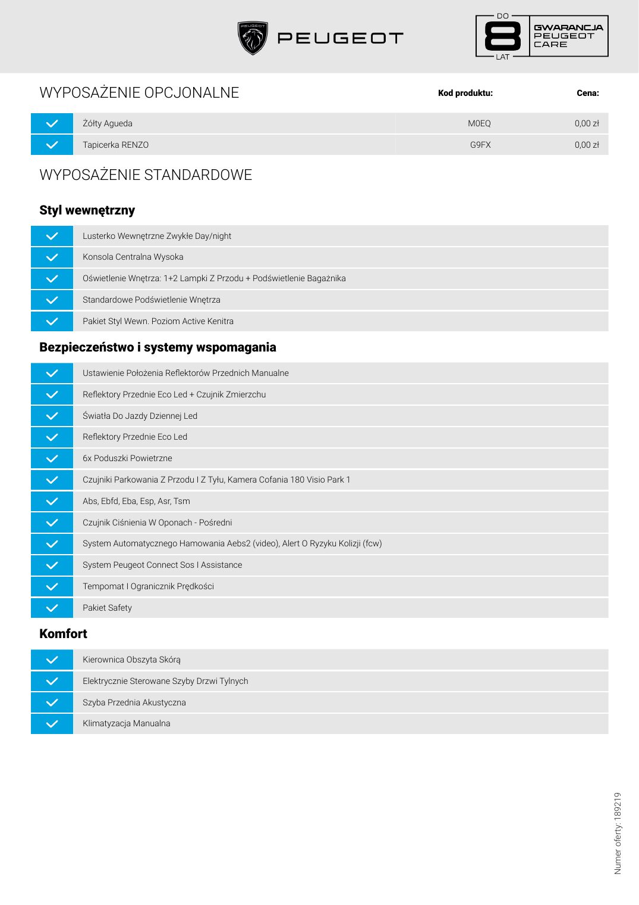
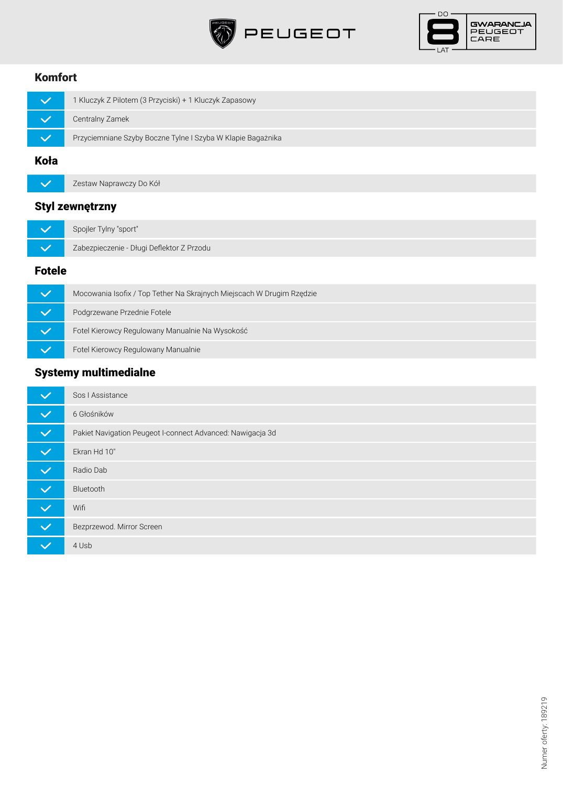
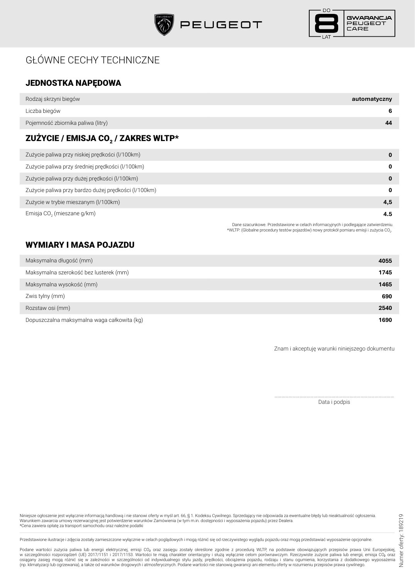
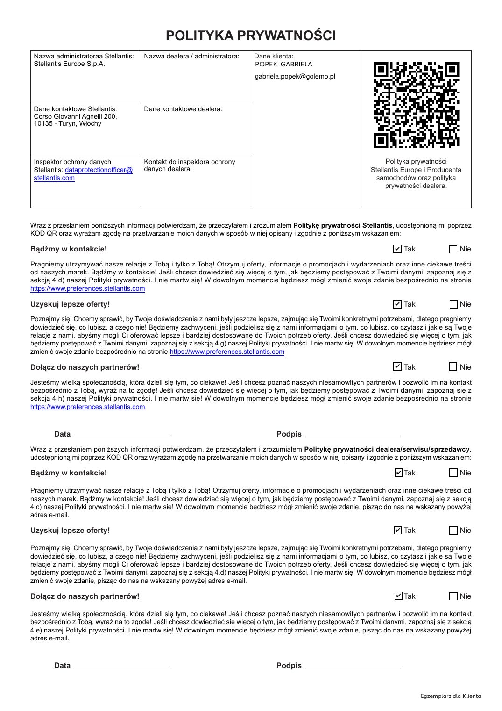

# Peugeot 208 Business Hybrid 110 - oferta 189219

| Pole | Wartość |
|---|---|
| Źródłowy PDF | `Oferta 208 Pan Krzysztof Krawczyński.pdf` |
| Liczba stron | 6 |
| Ekstrakcja tekstu | `pdftotext -layout`, UTF-8 |
| Reprezentacja wizualna | render każdej strony, 130 DPI, JPEG |

> Treść pozostawiono w brzmieniu źródłowym. Nie poprawiano literówek, wartości, nazw ani niespójności występujących w PDF-ie.

## Spis stron

[Strona 1](#strona-1) · [Strona 2](#strona-2) · [Strona 3](#strona-3) · [Strona 4](#strona-4) · [Strona 5](#strona-5) · [Strona 6](#strona-6)

## Strona 1

[Otwórz obraz strony 1 w pełnej rozdzielczości](assets/05-oferta-208-pan-krzysztof-krawczynski/page-001.jpg)

### Tekst z warstwy PDF

~~~~text
Twój Peugeot

208
Business HYBRID 1.2 110KM e-DCS6

Rok produkcji                                                       Rodzaj paliwa

2026                                                                benzyna                                                                           Cena katalogowa
                                                                                                                                                      97 100,00 zł brutto
                                                                                                                                                      Rabat
Moc silnika

Hybrid 110 KM
                                                                    Emisja CO2 WLTP* (gr/km)

                                                                    102
                                                                                                                                                      9 600,00 zł brutto
                                                                                                                                                      Cena specjalna*

                                                                                                                                                      87 500,00 zł brutto
Kolor lakieru                                                       Tapicerka:

Żółty Agueda                                                        Tapicerka RENZO
                                                                                                                                                      Na cenę katalogową składają się:
                                                                                                                                                      Cena samochodu:                                        97 100,00 zł

                                                                                                                                                      Cena opcji:                                                     0,00 zł

            Dane klienta / Dane osoby kontaktowej
                                                                                                                                                      Auto Centrum GOLEMO
            POPEK GABRIELA                                                                                                                            ul. Grota Roweckiego 6
                                                                                                                                                      30-348 Kraków

           Numer oferty: 189219
                                                                                                                                                      Gabriela Popek
           Kod modelu: 1PP2A5HJGWC0BUH2
                                                                                                                                                      Telefon: 798977477
           Data wystawienia oferty: 2026-08-14 | Ważna przez 17 dni
                                                                                                                                                      E-mail: gabriela.popek@golemo.pl

Jeśli dobrowolnie zdecydujesz się na wykonanie przeglądu okresowego przewidzianego w planie przeglądów okresowych swojego pojazdu Peugeot w autoryzowanej sieci Peugeot, uzyskasz możliwość skorzystania z bezpłatnej specjalnej
gwarancji obejmującej główne elementy mechaniczne pojazdu. Niniejsza specjalna gwarancja obowiązuje do daty następnego okresowego przeglądu, maksymalnie do 8 lat (uwzględniono okres obowiązywania standardowej gwarancji
producenta)
lub do 160 000 km (w zależności od tego, co nastąpi wcześniej) od daty pierwszej rejestracji pojazdu. Niniejsza specjalna gwarancja nie ma wpływu na standardową gwarancję producenta, która obowiązuje niezależnie od miejsca wykonywania
regularnych przeglądów pojazdu. Szczegółowe informacje na temat niniejszej specjalnej gwarancji, w tym dotyczące zakresu, jej ograniczeń i warunków można znaleźć w Ogólnych Warunkach dostępnych na stronie internetowej Peugeot.
~~~~

## Strona 2

[Otwórz obraz strony 2 w pełnej rozdzielczości](assets/05-oferta-208-pan-krzysztof-krawczynski/page-002.jpg)

### Tekst z warstwy PDF

~~~~text
WYPOSAŻENIE OPCJONALNE                                                              Kod produktu:   Cena:

      Żółty Agueda                                                                         M0EQ     0,00 zł

      Tapicerka RENZO                                                                      G9FX     0,00 zł

WYPOSAŻENIE STANDARDOWE

Styl wewnętrzny
      Lusterko Wewnętrzne Zwykłe Day/night

      Konsola Centralna Wysoka

      Oświetlenie Wnętrza: 1+2 Lampki Z Przodu + Podświetlenie Bagażnika

      Standardowe Podświetlenie Wnętrza

      Pakiet Styl Wewn. Poziom Active Kenitra

Bezpieczeństwo i systemy wspomagania
      Ustawienie Położenia Reflektorów Przednich Manualne

      Reflektory Przednie Eco Led + Czujnik Zmierzchu

      Światła Do Jazdy Dziennej Led

      Reflektory Przednie Eco Led

      6x Poduszki Powietrzne

      Czujniki Parkowania Z Przodu I Z Tyłu, Kamera Cofania 180 Visio Park 1

      Abs, Ebfd, Eba, Esp, Asr, Tsm

      Czujnik Ciśnienia W Oponach - Pośredni

      System Automatycznego Hamowania Aebs2 (video), Alert O Ryzyku Kolizji (fcw)

      System Peugeot Connect Sos I Assistance

      Tempomat I Ogranicznik Prędkości

      Pakiet Safety

Komfort
      Kierownica Obszyta Skórą

      Elektrycznie Sterowane Szyby Drzwi Tylnych

      Szyba Przednia Akustyczna

      Klimatyzacja Manualna
                                                                                                              Numer oferty: 189219
~~~~

## Strona 3

[Otwórz obraz strony 3 w pełnej rozdzielczości](assets/05-oferta-208-pan-krzysztof-krawczynski/page-003.jpg)

### Tekst z warstwy PDF

~~~~text
Komfort
         1 Kluczyk Z Pilotem (3 Przyciski) + 1 Kluczyk Zapasowy

         Centralny Zamek

         Przyciemniane Szyby Boczne Tylne I Szyba W Klapie Bagażnika

Koła
         Zestaw Naprawczy Do Kół

Styl zewnętrzny
         Spojler Tylny "sport"

         Zabezpieczenie - Długi Deflektor Z Przodu

Fotele
         Mocowania Isofix / Top Tether Na Skrajnych Miejscach W Drugim Rzędzie

         Podgrzewane Przednie Fotele

         Fotel Kierowcy Regulowany Manualnie Na Wysokość

         Fotel Kierowcy Regulowany Manualnie

Systemy multimedialne
         Sos I Assistance

         6 Głośników

         Pakiet Navigation Peugeot I-connect Advanced: Nawigacja 3d

         Ekran Hd 10"

         Radio Dab

         Bluetooth

         Wifi

         Bezprzewod. Mirror Screen

         4 Usb                                                                   Numer oferty: 189219
~~~~

## Strona 4

[Otwórz obraz strony 4 w pełnej rozdzielczości](assets/05-oferta-208-pan-krzysztof-krawczynski/page-004.jpg)

### Tekst z warstwy PDF

~~~~text
   GŁÓWNE CECHY TECHNICZNE

   JEDNOSTKA NAPĘDOWA
   Rodzaj skrzyni biegów                                                                                                                                                          automatyczny
   Liczba biegów                                                                                                                                                                                     6
   Pojemność zbiornika paliwa (litry)                                                                                                                                                                44

   ZUŻYCIE / EMISJA CO2 / ZAKRES WLTP*
   Zużycie paliwa przy niskiej prędkości (l/100km)                                                                                                                                                   0
   Zużycie paliwa przy średniej prędkości (l/100km)                                                                                                                                                  0
   Zużycie paliwa przy dużej prędkości (l/100km)                                                                                                                                                     0
   Zużycie paliwa przy bardzo dużej prędkości (l/100km)                                                                                                                                              0
   Zużycie w trybie mieszanym (l/100km)                                                                                                                                                             4,5
   Emisja CO2 (mieszane g/km)                                                                                                                                                                       4.5
                                                                                                                 Dane szacunkowe. Przedstawione w celach informacyjnych i podlegające zatwierdzeniu.
                                                                                                               *WLTP: (Globalne procedury testów pojazdów) nowy protokół pomiaru emisji i zużycia CO2.

   WYMIARY I MASA POJAZDU
   Maksymalna długość (mm)                                                                                                                                                                         4055
   Maksymalna szerokość bez lusterek (mm)                                                                                                                                                          1745
   Maksymalna wysokość (mm)                                                                                                                                                                        1465
   Zwis tylny (mm)                                                                                                                                                                                 690
   Rozstaw osi (mm)                                                                                                                                                                                2540
   Dopuszczalna maksymalna waga całkowita (kg)                                                                                                                                                     1690

                                                                                                                                         Znam i akceptuję warunki niniejszego dokumentu

                                                                                                                                         ……………………………………………………………………………….………
                                                                                                                                                     Data i podpis

Niniejsze ogłoszenie jest wyłącznie informacją handlową i nie stanowi oferty w myśl art. 66, § 1. Kodeksu Cywilnego. Sprzedający nie odpowiada za ewentualne błędy lub nieaktualność ogłoszenia.
                                                                                                                                                                                                          Numer oferty: 189219

Warunkiem zawarcia umowy rezerwacyjnej jest potwierdzenie warunków Zamówienia (w tym m.in. dostępności i wyposażenia pojazdu) przez Dealera.
*Cena zawiera opłatę za transport samochodu oraz należne podatki

Przedstawione ilustracje i zdjęcia zostały zamieszczone wyłącznie w celach poglądowych i mogą różnić się od rzeczywistego wyglądu pojazdu oraz mogą przedstawiać wyposażenie opcjonalne.

Podane wartości zużycia paliwa lub energii elektrycznej, emisji CO₂ oraz zasięgu zostały określone zgodnie z procedurą WLTP, na podstawie obowiązujących przepisów prawa Unii Europejskiej,
w szczególności rozporządzeń (UE) 2017/1151 i 2017/1153. Wartości te mają charakter orientacyjny i służą wyłącznie celom porównawczym. Rzeczywiste zużycie paliwa lub energii, emisja CO₂ oraz
osiągany zasięg mogą różnić się w zależności w szczególności od indywidualnego stylu jazdy, prędkości, obciążenia pojazdu, rodzaju i stanu ogumienia, korzystania z dodatkowego wyposażenia
(np. klimatyzacji lub ogrzewania), a także od warunków drogowych i atmosferycznych. Podane wartości nie stanowią gwarancji ani elementu oferty w rozumieniu przepisów prawa cywilnego.
~~~~

## Strona 5

[Otwórz obraz strony 5 w pełnej rozdzielczości](assets/05-oferta-208-pan-krzysztof-krawczynski/page-005.jpg)

### Tekst z warstwy PDF

~~~~text
                       GALERIA

Numer oferty: 189219
~~~~

## Strona 6

[Otwórz obraz strony 6 w pełnej rozdzielczości](assets/05-oferta-208-pan-krzysztof-krawczynski/page-006.jpg)

### Tekst z warstwy PDF

~~~~text
                                                                                POLITYKA PRYWATNOŚCI
                                    Nazwa administratoraa Stellantis:   Nazwa dealera / administratora:      Dane klienta:
                                    Stellantis Europe S.p.A.                                                 POPEK GABRIELA
                                                                                                             gabriela.popek@golemo.pl

                                    Dane kontaktowe Stellantis:         Dane kontaktowe dealera:
                                    Corso Giovanni Agnelli 200,
                                    10135 - Turyn, Włochy

                                    Inspektor ochrony danych            Kontakt do inspektora ochrony                                                    Polityka prywatności
                                    Stellantis: dataprotectionofÏcer@   danych dealera:                                                             Stellantis Europe i Producenta
                                    stellantis.com                                                                                                    samochodów oraz polityka
                                                                                                                                                         prywatności dealera.

                                   Wraz z przesłaniem poniższych informacji potwierdzam, że przeczytałem i zrozumiałem Politykę prywatności Stellantis, udostępnioną mi poprzez
                                   KOD QR oraz wyrażam zgodę na przetwarzanie moich danych w sposób w niej opisany i zgodnie z poniższym wskazaniem:

                                   Bądźmy w kontakcie!                                                                                                      ✔   Tak                 Nie
                                   Pragniemy utrzymywać nasze relacje z Tobą i tylko z Tobą! Otrzymuj oferty, informacje o promocjach i wydarzeniach oraz inne ciekawe treści
                                   od naszych marek. Bądźmy w kontakcie! Jeśli chcesz dowiedzieć się więcej o tym, jak będziemy postępować z Twoimi danymi, zapoznaj się z
                                   sekcją 4.d) naszej Polityki prywatności. I nie martw się! W dowolnym momencie będziesz mógł zmienić swoje zdanie bezpośrednio na stronie
                                   https://www.preferences.stellantis.com

                                   Uzyskuj lepsze oferty!                                                                                                   ✔   Tak                 Nie
                                   Poznajmy się! Chcemy sprawić, by Twoje doświadczenia z nami były jeszcze lepsze, zajmując się Twoimi konkretnymi potrzebami, dlatego pragniemy
                                   dowiedzieć się, co lubisz, a czego nie! Będziemy zachwyceni, jeśli podzielisz się z nami informacjami o tym, co lubisz, co czytasz i jakie są Twoje
                                   relacje z nami, abyśmy mogli Ci oferować lepsze i bardziej dostosowane do Twoich potrzeb oferty. Jeśli chcesz dowiedzieć się więcej o tym, jak
                                   będziemy postępować z Twoimi danymi, zapoznaj się z sekcją 4.g) naszej Polityki prywatności. I nie martw się! W dowolnym momencie będziesz mógł
                                   zmienić swoje zdanie bezpośrednio na stronie https://www.preferences.stellantis.com

                                   Dołącz do naszych partnerów!                                                                                             ✔   Tak                 Nie
                                   Jesteśmy wielką społecznością, która dzieli się tym, co ciekawe! Jeśli chcesz poznać naszych niesamowitych partnerów i pozwolić im na kontakt
                                   bezpośrednio z Tobą, wyraź na to zgodę! Jeśli chcesz dowiedzieć się więcej o tym, jak będziemy postępować z Twoimi danymi, zapoznaj się z
                                   sekcją 4.h) naszej Polityki prywatności. I nie martw się! W dowolnym momencie będziesz mógł zmienić swoje zdanie bezpośrednio na stronie
                                   https://www.preferences.stellantis.com

                                          Data                                                                      Podpis
                                   Wraz z przesłaniem poniższych informacji potwierdzam, że przeczytałem i zrozumiałem Politykę prywatności dealera/serwisu/sprzedawcy,
                                   udostępnioną mi poprzez KOD QR oraz wyrażam zgodę na przetwarzanie moich danych w sposób w niej opisany i zgodnie z poniższym wskazaniem:

                                   Bądźmy w kontakcie!                                                                                                      ✔ Tak                   Nie

                                   Pragniemy utrzymywać nasze relacje z Tobą i tylko z Tobą! Otrzymuj oferty, informacje o promocjach i wydarzeniach oraz inne ciekawe treści od
                                   naszych marek. Bądźmy w kontakcie! Jeśli chcesz dowiedzieć się więcej o tym, jak będziemy postępować z Twoimi danymi, zapoznaj się z sekcją
                                   4.c) naszej Polityki prywatności. I nie martw się! W dowolnym momencie będziesz mógł zmienić swoje zdanie, pisząc do nas na wskazany powyżej
                                   adres e-mail.

                                   Uzyskuj lepsze oferty!                                                                                                   ✔ Tak                   Nie

                                   Poznajmy się! Chcemy sprawić, by Twoje doświadczenia z nami były jeszcze lepsze, zajmując się Twoimi konkretnymi potrzebami, dlatego pragniemy
                                   dowiedzieć się, co lubisz, a czego nie! Będziemy zachwyceni, jeśli podzielisz się z nami informacjami o tym, co lubisz, co czytasz i jakie są Twoje
                                   relacje z nami, abyśmy mogli Ci oferować lepsze i bardziej dostosowane do Twoich potrzeb oferty. Jeśli chcesz dowiedzieć się więcej o tym, jak
                                   będziemy postępować z Twoimi danymi, zapoznaj się z sekcją 4.d) naszej Polityki prywatności. I nie martw się! W dowolnym momencie będziesz mógł
                                   zmienić swoje zdanie, pisząc do nas na wskazany powyżej adres e-mail.

                                   Dołącz do naszych partnerów!                                                                                             ✔ Tak                   Nie

                                   Jesteśmy wielką społecznością, która dzieli się tym, co ciekawe! Jeśli chcesz poznać naszych niesamowitych partnerów i pozwolić im na kontakt
                                   bezpośrednio z Tobą, wyraź na to zgodę! Jeśli chcesz dowiedzieć się więcej o tym, jak będziemy postępować z Twoimi danymi, zapoznaj się z sekcją
                                   4.e) naszej Polityki prywatności. I nie martw się! W dowolnym momencie będziesz mógł zmienić swoje zdanie, pisząc do nas na wskazany powyżej
                                   adres e-mail.

                                          Data                                                                      Podpis

                                                                                                                                                                      Egzemplarz dla Klienta
Powered by TCPDF (www.tcpdf.org)
~~~~
