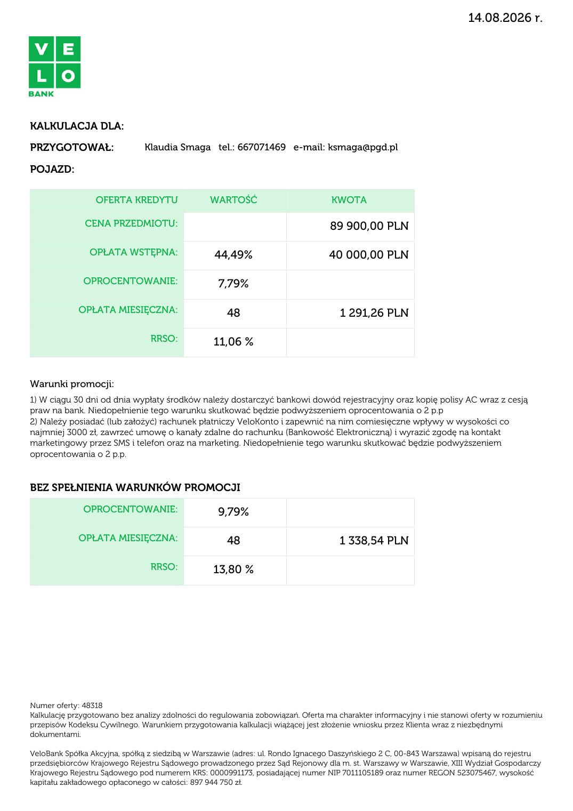

# VeloBank - kalkulacja kredytowa, opcja 3

| Pole | Wartość |
|---|---|
| Źródłowy PDF | `kalkulacja48318 (2).pdf.3opcja..pdf` |
| Liczba stron | 1 |
| Ekstrakcja tekstu | `pdftotext -layout`, UTF-8 |
| Reprezentacja wizualna | render każdej strony, 130 DPI, JPEG |

> Treść pozostawiono w brzmieniu źródłowym. Nie poprawiano literówek, wartości, nazw ani niespójności występujących w PDF-ie.

## Spis stron

[Strona 1](#strona-1)

## Strona 1

[Otwórz obraz strony 1 w pełnej rozdzielczości](assets/06-kalkulacja48318-2-pdf-3opcja/page-001.jpg)

### Tekst z warstwy PDF

~~~~text
                                                                                                                                                         14.08.2026 r.

                                   KALKULACJA DLA:

                                   PRZYGOTOWAŁ:                   Klaudia Smaga tel.: 667071469 e-mail: ksmaga@pgd.pl

                                   POJAZD:

                                                    OFERTA KREDYTU                 WARTOŚĆ                          KWOTA

                                                 CENA PRZEDMIOTU:                                                   89 900,00 PLN

                                                   OPŁATA WSTĘPNA:                   44,49%                         40 000,00 PLN

                                                 OPROCENTOWANIE:                      7,79%

                                                OPŁATA MIESIĘCZNA:                      48                             1 291,26 PLN

                                                                   RRSO:            11,06 %

                                   Warunki promocji:
                                   1) W ciągu 30 dni od dnia wypłaty środków należy dostarczyć bankowi dowód rejestracyjny oraz kopię polisy AC wraz z cesją
                                   praw na bank. Niedopełnienie tego warunku skutkować będzie podwyższeniem oprocentowania o 2 p.p
                                   2) Należy posiadać (lub założyć) rachunek płatniczy VeloKonto i zapewnić na nim comiesięczne wpływy w wysokości co
                                   najmniej 3000 zł, zawrzeć umowę o kanały zdalne do rachunku (Bankowość Elektroniczną) i wyrazić zgodę na kontakt
                                   marketingowy przez SMS i telefon oraz na marketing. Niedopełnienie tego warunku skutkować będzie podwyższeniem
                                   oprocentowania o 2 p.p.

                                   BEZ SPEŁNIENIA WARUNKÓW PROMOCJI
                                                 OPROCENTOWANIE:                      9,79%

                                                OPŁATA MIESIĘCZNA:                      48                            1 338,54 PLN

                                                                   RRSO:            13,80 %

                                   Numer oferty: 48318
                                   Kalkulację przygotowano bez analizy zdolności do regulowania zobowiązań. Oferta ma charakter informacyjny i nie stanowi oferty w rozumieniu
                                   przepisów Kodeksu Cywilnego. Warunkiem przygotowania kalkulacji wiążącej jest złożenie wniosku przez Klienta wraz z niezbędnymi
                                   dokumentami.

                                   VeloBank Spółka Akcyjna, spółką z siedzibą w Warszawie (adres: ul. Rondo Ignacego Daszyńskiego 2 C, 00-843 Warszawa) wpisaną do rejestru
                                   przedsiębiorców Krajowego Rejestru Sądowego prowadzonego przez Sąd Rejonowy dla m. st. Warszawy w Warszawie, XIII Wydział Gospodarczy
                                   Krajowego Rejestru Sądowego pod numerem KRS: 0000991173, posiadającej numer NIP 7011105189 oraz numer REGON 523075467, wysokość
                                   kapitału zakładowego opłaconego w całości: 897 944 750 zł.

Powered by TCPDF (www.tcpdf.org)
~~~~
