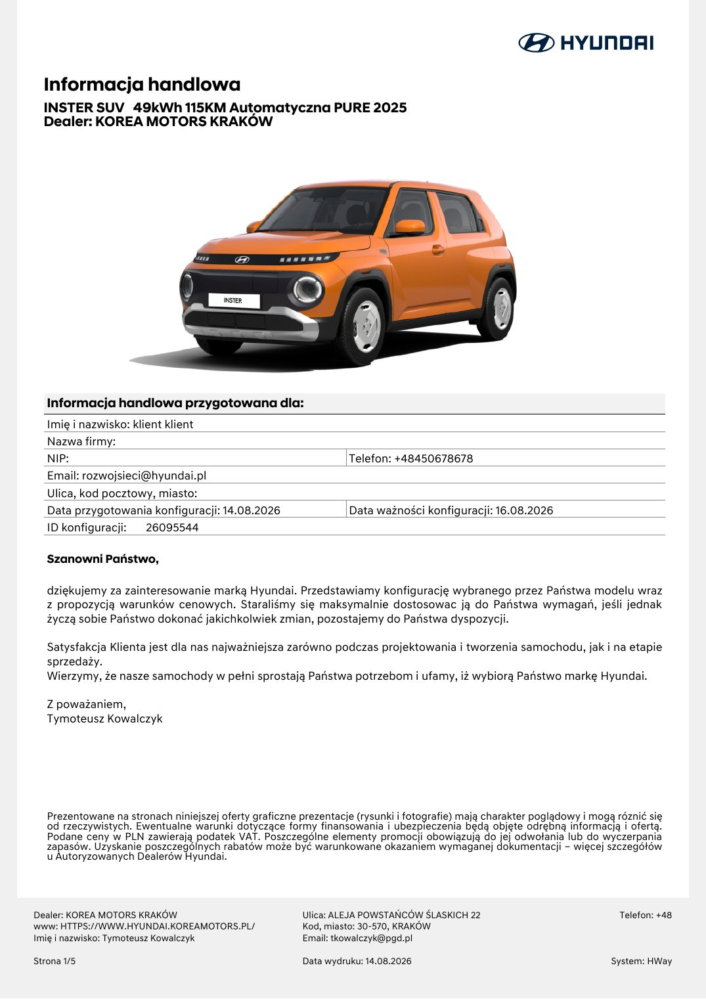
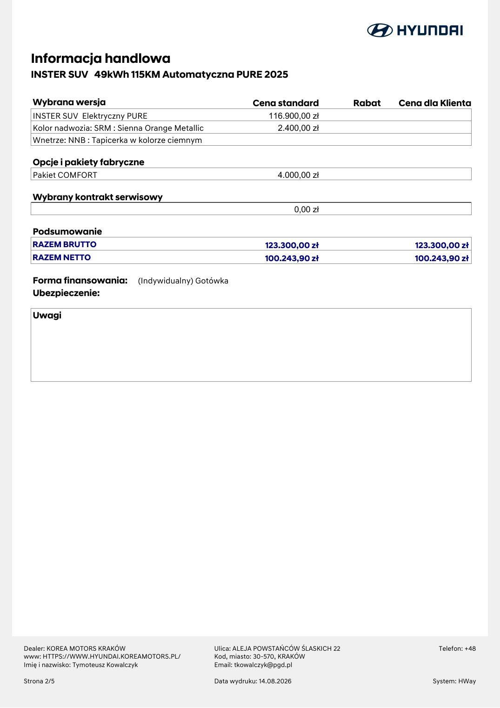
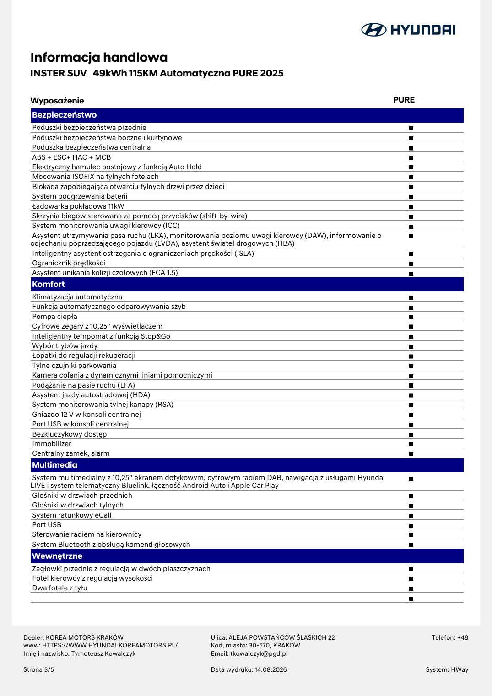
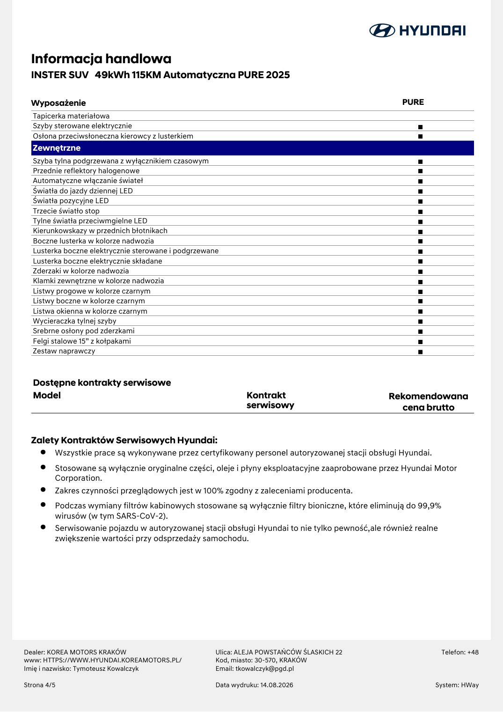
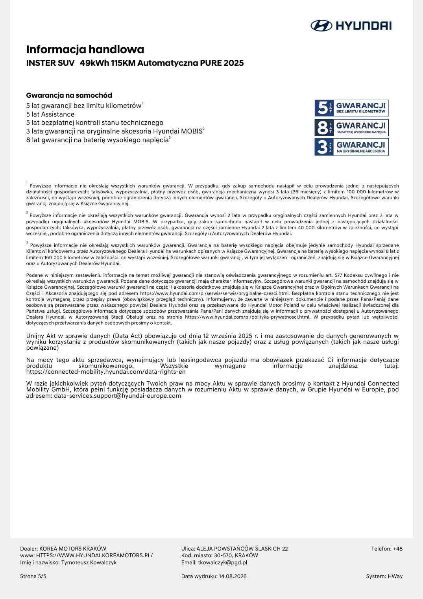

# Hyundai Inster 49 kWh Pure - informacja handlowa 26095544

| Pole | Wartość |
|---|---|
| Źródłowy PDF | `HA0520260814121921_00000026095544 (1).pdf` |
| Liczba stron | 5 |
| Ekstrakcja tekstu | `pdftotext -layout`, UTF-8 |
| Reprezentacja wizualna | render każdej strony, 130 DPI, JPEG |

> Treść pozostawiono w brzmieniu źródłowym. Nie poprawiano literówek, wartości, nazw ani niespójności występujących w PDF-ie.

## Spis stron

[Strona 1](#strona-1) · [Strona 2](#strona-2) · [Strona 3](#strona-3) · [Strona 4](#strona-4) · [Strona 5](#strona-5)

## Strona 1

[Otwórz obraz strony 1 w pełnej rozdzielczości](assets/09-ha0520260814121921-00000026095544-1/page-001.jpg)

### Tekst z warstwy PDF

~~~~text
  Informacja handlowa
  INSTER SUV 49kWh 115KM Automatyczna PURE 2025
  Dealer: KOREA MOTORS KRAKÓW

   Informacja handlowa przygotowana dla:
   Imię i nazwisko: klient klient
   Nazwa firmy:
   NIP:                                                           Telefon: +48450678678
   Email: rozwojsieci@hyundai.pl
   Ulica, kod pocztowy, miasto:
   Data przygotowania konfiguracji: 14.08.2026                    Data ważności konfiguracji: 16.08.2026
   ID konfiguracji:    26095544

   Szanowni Państwo,

   dziękujemy za zainteresowanie marką Hyundai. Przedstawiamy konfigurację wybranego przez Państwa modelu wraz
   z propozycją warunków cenowych. Staraliśmy się maksymalnie dostosowac ją do Państwa wymagań, jeśli jednak
   życzą sobie Państwo dokonać jakichkolwiek zmian, pozostajemy do Państwa dyspozycji.

   Satysfakcja Klienta jest dla nas najważniejsza zarówno podczas projektowania i tworzenia samochodu, jak i na etapie
   sprzedaży.
   Wierzymy, że nasze samochody w pełni sprostają Państwa potrzebom i ufamy, iż wybiorą Państwo markę Hyundai.

   Z poważaniem,
   Tymoteusz Kowalczyk

   Prezentowane na stronach niniejszej oferty graficzne prezentacje (rysunki i fotografie) mają charakter poglądowy i mogą róznić się
   od rzeczywistych. Ewentualne warunki dotyczące formy finansowania i ubezpieczenia będą objęte odrębną informacją i ofertą.
   Podane ceny w PLN zawierają podatek VAT. Poszczególne elementy promocji obowiązują do jej odwołania lub do wyczerpania
   zapasów. Uzyskanie poszczególnych rabatów może być warunkowane okazaniem wymaganej dokumentacji – więcej szczegółów
   u Autoryzowanych Dealerów Hyundai.

Dealer: KOREA MOTORS KRAKÓW                             Ulica: ALEJA POWSTAŃCÓW ŚLASKICH 22                                Telefon: +48
www: HTTPS://WWW.HYUNDAI.KOREAMOTORS.PL/                Kod, miasto: 30-570, KRAKÓW
Imię i nazwisko: Tymoteusz Kowalczyk                    Email: tkowalczyk@pgd.pl

Strona 1/5                                              Data wydruku: 14.08.2026                                          System: HWay
~~~~

## Strona 2

[Otwórz obraz strony 2 w pełnej rozdzielczości](assets/09-ha0520260814121921-00000026095544-1/page-002.jpg)

### Tekst z warstwy PDF

~~~~text
  Informacja handlowa
  INSTER SUV 49kWh 115KM Automatyczna PURE 2025

  Wybrana wersja                                            Cena standard              Rabat   Cena dla Klienta
  INSTER SUV Elektryczny PURE                                    116.900,00 zł
  Kolor nadwozia: SRM : Sienna Orange Metallic                     2.400,00 zł
  Wnetrze: NNB : Tapicerka w kolorze ciemnym

  Opcje i pakiety fabryczne
  Pakiet COMFORT                                                    4.000,00 zł

  Wybrany kontrakt serwisowy
                                                                            0,00 zł

  Podsumowanie
  RAZEM BRUTTO                                                  123.300,00 zł                     123.300,00 zł
  RAZEM NETTO                                                   100.243,90 zł                     100.243,90 zł

  Forma finansowania:        (Indywidualny) Gotówka
  Ubezpieczenie:

  Uwagi

Dealer: KOREA MOTORS KRAKÓW                      Ulica: ALEJA POWSTAŃCÓW ŚLASKICH 22                   Telefon: +48
www: HTTPS://WWW.HYUNDAI.KOREAMOTORS.PL/         Kod, miasto: 30-570, KRAKÓW
Imię i nazwisko: Tymoteusz Kowalczyk             Email: tkowalczyk@pgd.pl

Strona 2/5                                       Data wydruku: 14.08.2026                             System: HWay
~~~~

## Strona 3

[Otwórz obraz strony 3 w pełnej rozdzielczości](assets/09-ha0520260814121921-00000026095544-1/page-003.jpg)

### Tekst z warstwy PDF

~~~~text
  Informacja handlowa
  INSTER SUV 49kWh 115KM Automatyczna PURE 2025

  Wyposażenie                                                                                          PURE
  Bezpieczeństwo
  Poduszki bezpieczeństwa przednie
  Poduszki bezpieczeństwa boczne i kurtynowe
  Poduszka bezpieczeństwa centralna
  ABS + ESC+ HAC + MCB
  Elektryczny hamulec postojowy z funkcją Auto Hold
  Mocowania ISOFIX na tylnych fotelach
  Blokada zapobiegająca otwarciu tylnych drzwi przez dzieci
  System podgrzewania baterii
  Ładowarka pokładowa 11kW
  Skrzynia biegów sterowana za pomocą przycisków (shift-by-wire)
  System monitorowania uwagi kierowcy (ICC)
  Asystent utrzymywania pasa ruchu (LKA), monitorowania poziomu uwagi kierowcy (DAW), informowanie o
  odjechaniu poprzedzającego pojazdu (LVDA), asystent świateł drogowych (HBA)
  Inteligentny asystent ostrzegania o ograniczeniach prędkości (ISLA)
  Ogranicznik prędkości
  Asystent unikania kolizji czołowych (FCA 1.5)
  Komfort
  Klimatyzacja automatyczna
  Funkcja automatycznego odparowywania szyb
  Pompa ciepła
  Cyfrowe zegary z 10,25” wyświetlaczem
  Inteligentny tempomat z funkcją Stop&Go
  Wybór trybów jazdy
  Łopatki do regulacji rekuperacji
  Tylne czujniki parkowania
  Kamera cofania z dynamicznymi liniami pomocniczymi
  Podążanie na pasie ruchu (LFA)
  Asystent jazdy autostradowej (HDA)
  System monitorowania tylnej kanapy (RSA)
  Gniazdo 12 V w konsoli centralnej
  Port USB w konsoli centralnej
  Bezkluczykowy dostęp
  Immobilizer
  Centralny zamek, alarm
  Multimedia
  System multimedialny z 10,25” ekranem dotykowym, cyfrowym radiem DAB, nawigacja z usługami Hyundai
  LIVE i system telematyczny Bluelink, łączność Android Auto i Apple Car Play
  Głośniki w drzwiach przednich
  Głośniki w drzwiach tylnych
  System ratunkowy eCall
  Port USB
  Sterowanie radiem na kierownicy
  System Bluetooth z obsługą komend głosowych
  Wewnętrzne
  Zagłówki przednie z regulacją w dwóch płaszczyznach
  Fotel kierowcy z regulacją wysokości
  Dwa fotele z tyłu

Dealer: KOREA MOTORS KRAKÓW                             Ulica: ALEJA POWSTAŃCÓW ŚLASKICH 22                    Telefon: +48
www: HTTPS://WWW.HYUNDAI.KOREAMOTORS.PL/                Kod, miasto: 30-570, KRAKÓW
Imię i nazwisko: Tymoteusz Kowalczyk                    Email: tkowalczyk@pgd.pl

Strona 3/5                                              Data wydruku: 14.08.2026                              System: HWay
~~~~

## Strona 4

[Otwórz obraz strony 4 w pełnej rozdzielczości](assets/09-ha0520260814121921-00000026095544-1/page-004.jpg)

### Tekst z warstwy PDF

~~~~text
  Informacja handlowa
  INSTER SUV 49kWh 115KM Automatyczna PURE 2025

  Wyposażenie                                                                                   PURE
  Tapicerka materiałowa
  Szyby sterowane elektrycznie
  Osłona przeciwsłoneczna kierowcy z lusterkiem
  Zewnętrzne
  Szyba tylna podgrzewana z wyłącznikiem czasowym
  Przednie reflektory halogenowe
  Automatyczne włączanie świateł
  Światła do jazdy dziennej LED
  Światła pozycyjne LED
  Trzecie światło stop
  Tylne światła przeciwmgielne LED
  Kierunkowskazy w przednich błotnikach
  Boczne lusterka w kolorze nadwozia
  Lusterka boczne elektrycznie sterowane i podgrzewane
  Lusterka boczne elektrycznie składane
  Zderzaki w kolorze nadwozia
  Klamki zewnętrzne w kolorze nadwozia
  Listwy progowe w kolorze czarnym
  Listwy boczne w kolorze czarnym
  Listwa okienna w kolorze czarnym
  Wycieraczka tylnej szyby
  Srebrne osłony pod zderzkami
  Felgi stalowe 15” z kołpakami
  Zestaw naprawczy

  Dostępne kontrakty serwisowe
  Model                                                       Kontrakt                      Rekomendowana
                                                              serwisowy                       cena brutto

  Zalety Kontraktów Serwisowych Hyundai:
     • Wszystkie prace są wykonywane przez certyfikowany personel autoryzowanej stacji obsługi Hyundai.
     • Stosowane są wyłącznie oryginalne części, oleje i płyny eksploatacyjne zaaprobowane przez Hyundai Motor
       Corporation.
     • Zakres czynności przeglądowych jest w 100% zgodny z zaleceniami producenta.
     • Podczas wymiany filtrów kabinowych stosowane są wyłącznie filtry bioniczne, które eliminują do 99,9%
       wirusów (w tym SARS-CoV-2).
     • Serwisowanie pojazdu w autoryzowanej stacji obsługi Hyundai to nie tylko pewność,ale również realne
         zwiększenie wartości przy odsprzedaży samochodu.

Dealer: KOREA MOTORS KRAKÓW                          Ulica: ALEJA POWSTAŃCÓW ŚLASKICH 22                  Telefon: +48
www: HTTPS://WWW.HYUNDAI.KOREAMOTORS.PL/             Kod, miasto: 30-570, KRAKÓW
Imię i nazwisko: Tymoteusz Kowalczyk                 Email: tkowalczyk@pgd.pl

Strona 4/5                                           Data wydruku: 14.08.2026                           System: HWay
~~~~

## Strona 5

[Otwórz obraz strony 5 w pełnej rozdzielczości](assets/09-ha0520260814121921-00000026095544-1/page-005.jpg)

### Tekst z warstwy PDF

~~~~text
  Informacja handlowa
  INSTER SUV 49kWh 115KM Automatyczna PURE 2025

  Gwarancja na samochód
  5 lat gwarancji bez limitu kilometrów1
  5 lat Assistance
  5 lat bezpłatnej kontroli stanu technicznego
  3 lata gwarancji na oryginalne akcesoria Hyundai MOBIS2
  8 lat gwarancji na baterię wysokiego napięcia3

  1
   Powyższe informacje nie określają wszystkich warunków gwarancji. W przypadku, gdy zakup samochodu nastąpił w celu prowadzenia jednej z nastepujących
  działalności gospodarczych: taksówka, wypożyczalnia, płatny przewóz osób, gwarancja mechaniczna wynosi 3 lata (36 miesięcy) z limitem 100 000 kilometrów w
  zależności, co wystąpi wcześniej, podobne ograniczenia dotyczą innych elementów gwarancji. Szczegóły u Autoryzowanych Dealerów Hyundai. Szczegółowe warunki
  gwarancji znajdują się w Ksiązce Gwarancyjnej.
  2
   Powyższe informacje nie określają wszystkich warunków gwarancji. Gwarancja wynosi 2 lata w przypadku oryginalnych części zamiennych Hyundai oraz 3 lata w
  przypadku oryginalnych akcesoriów Hyundai MOBIS. W przypadku, gdy zakup samochodu nastapił w celu prowadzenia jednej z następujących działalności
  gospodarczych: taksówka, wypożyczalnia, płatny przewóz osób, gwarancja na części zamienne Hyundai 2 lata z limitem 40 000 kilometrów w zależności, co wystąpi
  wcześniej, podobne ograniczenia dotyczą innych elementów gwarancji. Szczegóły u Autoryzowanych Dealerów Hyundai.
  3
    Powyższe informacje nie określają wszystkich warunków gwarancji. Gwarancja na baterię wysokiego napięcia obejmuje jedynie samochody Hyundai sprzedane
  Klientowi końcowemu przez Autoryzowanego Dealera Hyundai na warunkach opisanych w Ksiązce Gwarancyjnej. Gwarancja na baterię wysokiego napięcia wynosi 8 lat z
  limitem 160 000 kilometrów w zależności, co wystąpi wcześniej. Szczegółowe warunki gwarancji, w tym jej wyłączeń i ograniczeń, znajdują się w Książce Gwarancyjnej
  oraz u Autoryzowanych Dealerów Hyundai.

  Podane w niniejszym zestawieniu informacje na temat możliwej gwarancji nie stanowią oświadczenia gwarancyjnego w rozumieniu art. 577 Kodeksu cywilnego i nie
  określają wszystkich warunków gwarancji. Podane dane dotyczące gwarancji mają charakter informacyjny. Szczegółowe warunki gwarancji na samochód znajdują się w
  Książce Gwarancyjnej. Szczegółowe warunki gwarancji na części i akcesoria dodatkowe znajdują się w Ksiązce Gwarancyjnej oraz w Ogólnych Warunkach Gwarancji na
  Części i Akcesoria znajdującego się pod adresem https://www.hyundai.com/pl/serwis/serwis/oryginalne-czesci.html. Bezpłatna kontrola stanu technicznego nie jest
  kontrola wymaganą przez przepisy prawa (obowiązkowy przegląd techniczny). Informujemy, że zawarte w niniejszym dokumencie i podane przez Pana/Panią dane
  osobowe są przetwarzane przez wskazanego powyżej Dealera Hyundai oraz są przekazywane do Hyundai Motor Poland w celu właściwej realizacji świadczonej dla
  Państwa usługi. Szczegółowe informacje dotyczące sposobów przetwarzania Pana/Pani danych znajdują się w informacji o prywatności dostępnej u Autoryzowanego
  Dealera Hyundai, w Autoryzowanej Stacji Obsługi oraz na stronie https://www.hyundai.com/pl/polityka-prywatnosci.html. W przypadku pytań lub wątpliwości
  dotyczących przetwarzania danych osobowych prosimy o kontakt.

  Unijny Akt w sprawie danych (Data Act) obowiązuje od dnia 12 września 2025 r. i ma zastosowanie do danych generowanych w
  wyniku korzystania z produktów skomunikowanych (takich jak nasze pojazdy) oraz z usług powiązanych (takich jak nasze usługi
  powiązane)
  Na mocy tego aktu sprzedawca, wynajmujący lub leasingodawca pojazdu ma obowiązek przekazać Ci informacje dotyczące
  produktu         skomunikowanego.           Wszystkie    wymagane         informacje       znajdziesz        tutaj:
  https://connected-mobility.hyundai.com/data-rights-en
  W razie jakichkolwiek pytań dotyczących Twoich praw na mocy Aktu w sprawie danych prosimy o kontakt z Hyundai Connected
  Mobility GmbH, która pełni funkcję posiadacza danych w rozumieniu Aktu w sprawie danych, w Grupie Hyundai w Europie, pod
  adresem: data-services.support@hyundai-europe.com

Dealer: KOREA MOTORS KRAKÓW                                          Ulica: ALEJA POWSTAŃCÓW ŚLASKICH 22                                               Telefon: +48
www: HTTPS://WWW.HYUNDAI.KOREAMOTORS.PL/                             Kod, miasto: 30-570, KRAKÓW
Imię i nazwisko: Tymoteusz Kowalczyk                                 Email: tkowalczyk@pgd.pl

Strona 5/5                                                           Data wydruku: 14.08.2026                                                        System: HWay
~~~~
