# Škoda Fabia Drive - informacja handlowa

| Pole | Wartość |
|---|---|
| Źródłowy PDF | `Skoda Fabia poz 3.pdf` |
| Liczba stron | 11 |
| Ekstrakcja tekstu | `pdftotext -layout`, UTF-8 |
| Reprezentacja wizualna | render każdej strony, 130 DPI, JPEG |

> Treść pozostawiono w brzmieniu źródłowym. Nie poprawiano literówek, wartości, nazw ani niespójności występujących w PDF-ie.

## Spis stron

[Strona 1](#strona-1) · [Strona 2](#strona-2) · [Strona 3](#strona-3) · [Strona 4](#strona-4) · [Strona 5](#strona-5) · [Strona 6](#strona-6) · [Strona 7](#strona-7) · [Strona 8](#strona-8) · [Strona 9](#strona-9) · [Strona 10](#strona-10) · [Strona 11](#strona-11)

## Strona 1

[Otwórz obraz strony 1 w pełnej rozdzielczości](assets/12-skoda-fabia-poz-3/page-001.jpg)

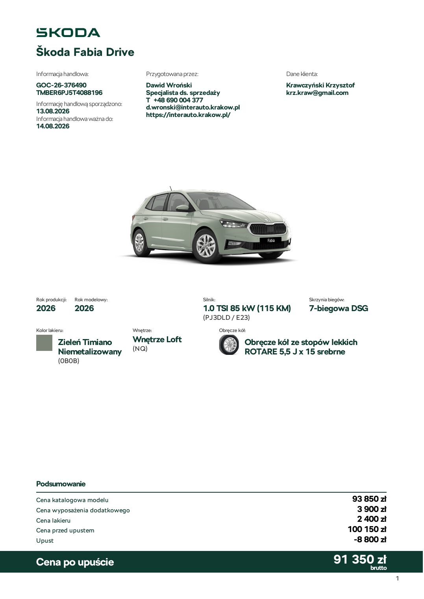

### Tekst z warstwy PDF

~~~~text
Škoda Fabia Drive
Informacja handlowa:                    Przygotowana przez:                                  Dane klienta:
GOC-26-376490                           Dawid Wroński                                        Krawczyński Krzysztof
TMBER6PJ5T4088196                       Specjalista ds. sprzedaży                            krz.kraw@gmail.com
Informację handlową sporządzono:        T +48 690 004 377
13.08.2026                              d.wronski@interauto.krakow.pl
Informacja handlowa ważna do:           https://interauto.krakow.pl/
14.08.2026

Rok produkcji:   Rok modelowy:                                Silnik:                                 Skrzynia biegów:
2026             2026                                         1.0 TSI 85 kW (115 KM)                  7-biegowa DSG
                                                              (PJ3DLD / E23)
Kolor lakieru:                     Wnętrze:                             Obręcze kół:

           Zieleń Timiano          Wnętrze Loft                                    Obręcze kół ze stopów lekkich
           Niemetalizowany         (NQ)                                            ROTARE 5,5 J x 15 srebrne
           (0B0B)

Podsumowanie
Cena katalogowa modelu                                                                                                    93 850 zł
Cena wyposażenia dodatkowego                                                                                               3 900 zł
Cena lakieru                                                                                                               2 400 zł
Cena przed upustem                                                                                                       100 150 zł
Upust                                                                                                                     -8 800 zł

Cena po upuście                                                                                                  91 350brutto
                                                                                                                          zł
                                                                                                                                      1
~~~~

## Strona 2

[Otwórz obraz strony 2 w pełnej rozdzielczości](assets/12-skoda-fabia-poz-3/page-002.jpg)

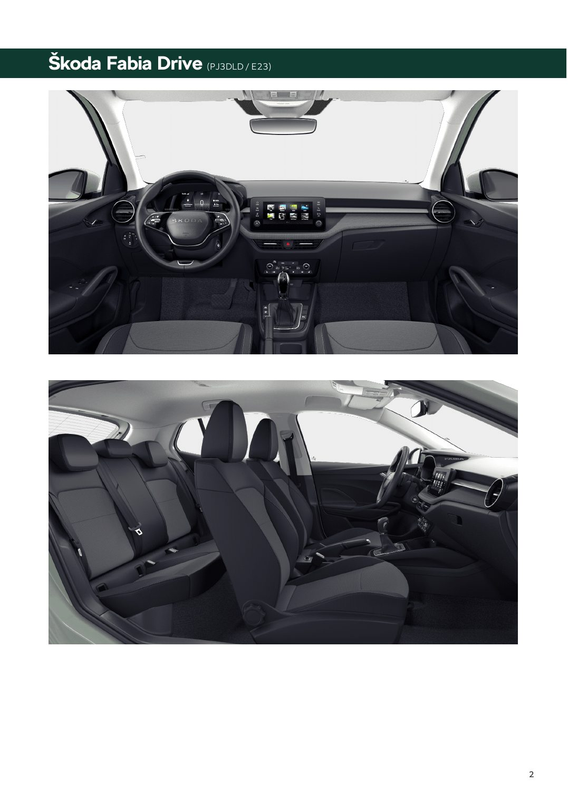

### Tekst z warstwy PDF

~~~~text
Škoda Fabia Drive (PJ3DLD / E23)

                                   2
~~~~

## Strona 3

[Otwórz obraz strony 3 w pełnej rozdzielczości](assets/12-skoda-fabia-poz-3/page-003.jpg)

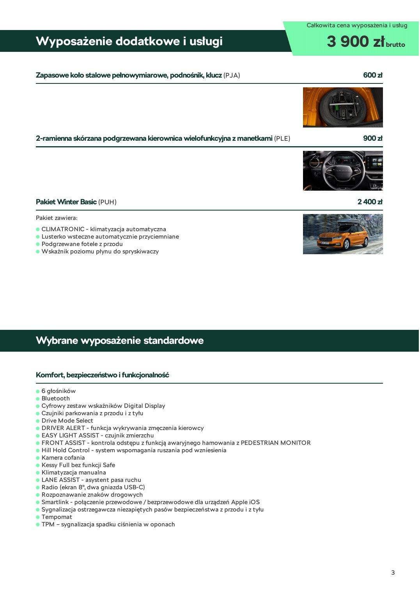

### Tekst z warstwy PDF

~~~~text
                                                                                  Całkowita cena wyposażenia i usług

Wyposażenie dodatkowe i usługi                                                          3 900 zł brutto
Zapasowe koło stalowe pełnowymiarowe, podnośnik, klucz (PJA)                                         600 zł

2-ramienna skórzana podgrzewana kierownica wielofunkcyjna z manetkami (PLE)                          900 zł

Pakiet Winter Basic (PUH)                                                                          2 400 zł
Pakiet zawiera:
  CLIMATRONIC - klimatyzacja automatyczna
  Lusterko wsteczne automatycznie przyciemniane
  Podgrzewane fotele z przodu
  Wskaźnik poziomu płynu do spryskiwaczy

Wybrane wyposażenie standardowe

Komfort, bezpieczeństwo i funkcjonalność
 6 głośników
 Bluetooth
 Cyfrowy zestaw wskaźników Digital Display
 Czujniki parkowania z przodu i z tyłu
 Drive Mode Select
 DRIVER ALERT - funkcja wykrywania zmęczenia kierowcy
 EASY LIGHT ASSIST - czujnik zmierzchu
 FRONT ASSIST - kontrola odstępu z funkcją awaryjnego hamowania z PEDESTRIAN MONITOR
 Hill Hold Control - system wspomagania ruszania pod wzniesienia
 Kamera cofania
 Kessy Full bez funkcji Safe
 Klimatyzacja manualna
 LANE ASSIST - asystent pasa ruchu
 Radio (ekran 8", dwa gniazda USB-C)
 Rozpoznawanie znaków drogowych
 Smartlink - połączenie przewodowe / bezprzewodowe dla urządzeń Apple iOS
 Sygnalizacja ostrzegawcza niezapiętych pasów bezpieczeństwa z przodu i z tyłu
 Tempomat
 TPM – sygnalizacja spadku ciśnienia w oponach

                                                                                                              3
~~~~

## Strona 4

[Otwórz obraz strony 4 w pełnej rozdzielczości](assets/12-skoda-fabia-poz-3/page-004.jpg)

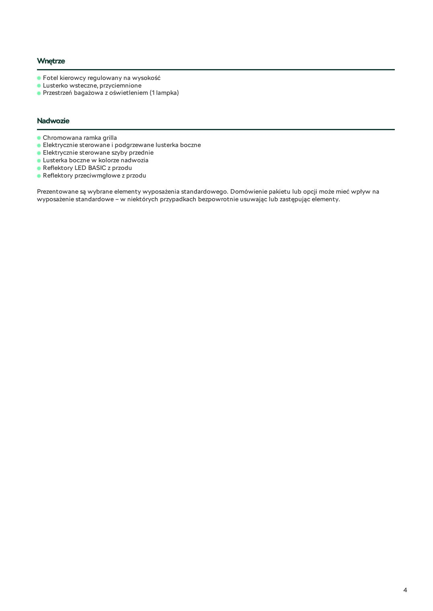

### Tekst z warstwy PDF

~~~~text
Wnętrze
 Fotel kierowcy regulowany na wysokość
 Lusterko wsteczne, przyciemnione
 Przestrzeń bagażowa z oświetleniem (1 lampka)

Nadwozie
 Chromowana ramka grilla
 Elektrycznie sterowane i podgrzewane lusterka boczne
 Elektrycznie sterowane szyby przednie
 Lusterka boczne w kolorze nadwozia
 Reflektory LED BASIC z przodu
 Reflektory przeciwmgłowe z przodu

Prezentowane są wybrane elementy wyposażenia standardowego. Domówienie pakietu lub opcji może mieć wpływ na
wyposażenie standardowe – w niektórych przypadkach bezpowrotnie usuwając lub zastępując elementy.

                                                                                                              4
~~~~

## Strona 5

[Otwórz obraz strony 5 w pełnej rozdzielczości](assets/12-skoda-fabia-poz-3/page-005.jpg)

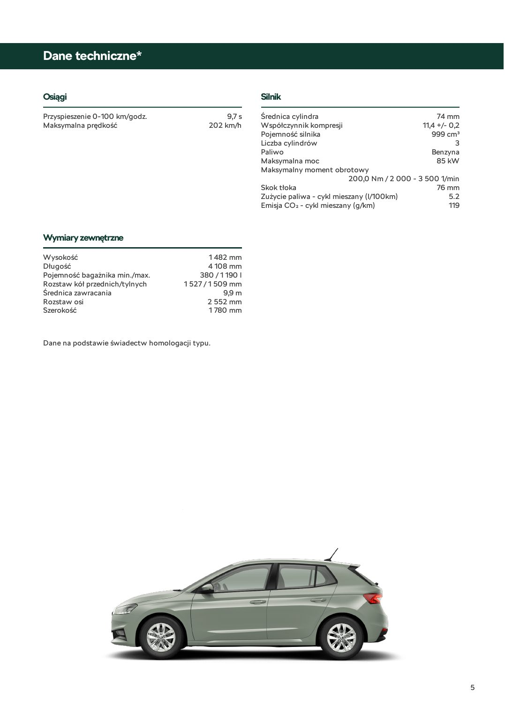

### Tekst z warstwy PDF

~~~~text
Dane techniczne*

Osiągi                                                   Silnik
Przyspieszenie 0-100 km/godz.                    9,7 s   Średnica cylindra                                  74 mm
Maksymalna prędkość                         202 km/h     Współczynnik kompresji                        11,4 +/- 0,2
                                                         Pojemność silnika                                999 cm³
                                                         Liczba cylindrów                                         3
                                                         Paliwo                                           Benzyna
                                                         Maksymalna moc                                     85 kW
                                                         Maksymalny moment obrotowy
                                                                                   200,0 Nm / 2 000 - 3 500 1/min
                                                         Skok tłoka                                         76 mm
                                                         Zużycie paliwa - cykl mieszany (l/100km)               5.2
                                                         Emisja CO₂ - cykl mieszany (g/km)                      119

Wymiary zewnętrzne
Wysokość                                     1 482 mm
Długość                                      4 108 mm
Pojemność bagażnika min./max.            380 / 1 190 l
Rozstaw kół przednich/tylnych        1 527 / 1 509 mm
Średnica zawracania                              9,9 m
Rozstaw osi                                  2 552 mm
Szerokość                                    1 780 mm

Dane na podstawie świadectw homologacji typu.

                                                                                                                      5
~~~~

## Strona 6

[Otwórz obraz strony 6 w pełnej rozdzielczości](assets/12-skoda-fabia-poz-3/page-006.jpg)

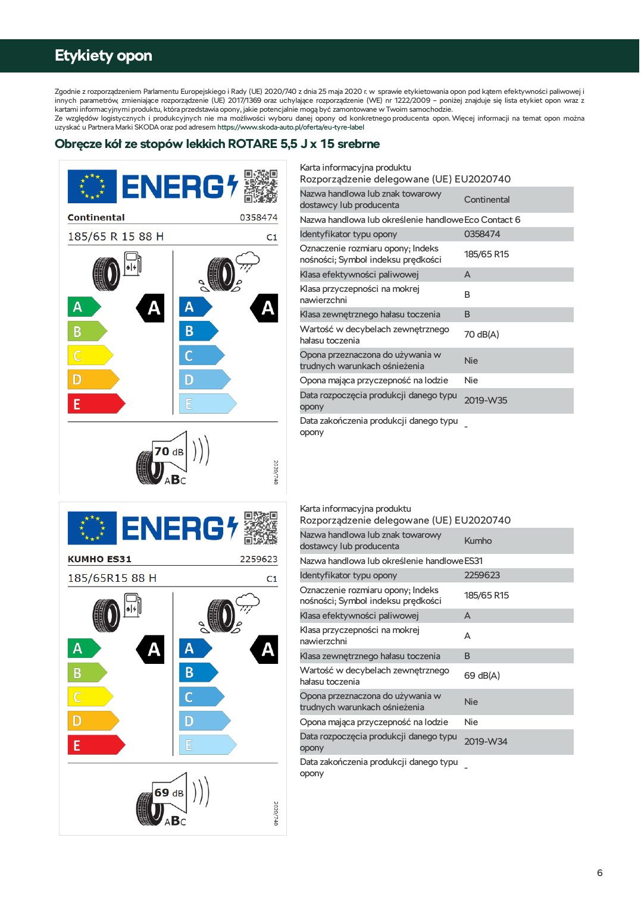

### Tekst z warstwy PDF

~~~~text
Etykiety opon
Zgodnie z rozporządzeniem Parlamentu Europejskiego i Rady (UE) 2020/740 z dnia 25 maja 2020 r. w sprawie etykietowania opon pod kątem efektywności paliwowej i
innych parametrów, zmieniające rozporządzenie (UE) 2017/1369 oraz uchylające rozporządzenie (WE) nr 1222/2009 – poniżej znajduje się lista etykiet opon wraz z
kartami informacyjnymi produktu, która przedstawia opony, jakie potencjalnie mogą być zamontowane w Twoim samochodzie.
Ze względów logistycznych i produkcyjnych nie ma możliwości wyboru danej opony od konkretnego producenta opon. Więcej informacji na temat opon można
uzyskać u Partnera Marki SKODA oraz pod adresem https://www.skoda-auto.pl/oferta/eu-tyre-label

Obręcze kół ze stopów lekkich ROTARE 5,5 J x 15 srebrne
                                                                         Karta informacyjna produktu
                                                                         Rozporządzenie delegowane (UE) EU2020740
                                                                         Nazwa handlowa lub znak towarowy       Continental
                                                                         dostawcy lub producenta
                                                                         Nazwa handlowa lub określenie handloweEco Contact 6
                                                                         Identyfikator typu opony               0358474
                                                                         Oznaczenie rozmiaru opony; Indeks      185/65 R15
                                                                         nośności; Symbol indeksu prędkości
                                                                         Klasa efektywności paliwowej           A
                                                                         Klasa przyczepności na mokrej          B
                                                                         nawierzchni
                                                                         Klasa zewnętrznego hałasu toczenia     B
                                                                         Wartość w decybelach zewnętrznego 70 dB(A)
                                                                         hałasu toczenia
                                                                         Opona przeznaczona do używania w       Nie
                                                                         trudnych warunkach ośnieżenia
                                                                         Opona mająca przyczepność na lodzie Nie
                                                                         Data rozpoczęcia produkcji danego typu 2019-W35
                                                                         opony
                                                                         Data zakończenia produkcji danego typu -
                                                                         opony

                                                                         Karta informacyjna produktu
                                                                         Rozporządzenie delegowane (UE) EU2020740
                                                                         Nazwa handlowa lub znak towarowy       Kumho
                                                                         dostawcy lub producenta
                                                                         Nazwa handlowa lub określenie handloweES31
                                                                         Identyfikator typu opony               2259623
                                                                         Oznaczenie rozmiaru opony; Indeks      185/65 R15
                                                                         nośności; Symbol indeksu prędkości
                                                                         Klasa efektywności paliwowej           A
                                                                         Klasa przyczepności na mokrej          A
                                                                         nawierzchni
                                                                         Klasa zewnętrznego hałasu toczenia     B
                                                                         Wartość w decybelach zewnętrznego 69 dB(A)
                                                                         hałasu toczenia
                                                                         Opona przeznaczona do używania w       Nie
                                                                         trudnych warunkach ośnieżenia
                                                                         Opona mająca przyczepność na lodzie Nie
                                                                         Data rozpoczęcia produkcji danego typu 2019-W34
                                                                         opony
                                                                         Data zakończenia produkcji danego typu -
                                                                         opony

                                                                                                                                                                 6
~~~~

## Strona 7

[Otwórz obraz strony 7 w pełnej rozdzielczości](assets/12-skoda-fabia-poz-3/page-007.jpg)

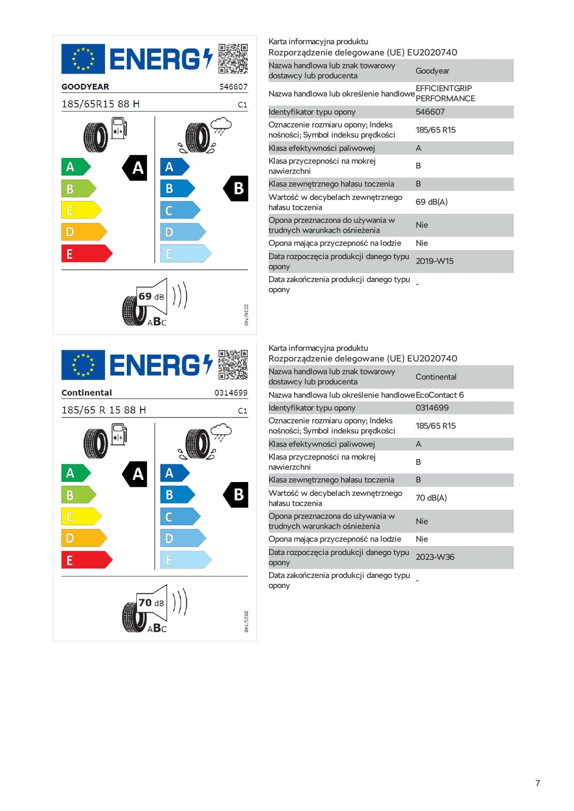

### Tekst z warstwy PDF

~~~~text
Karta informacyjna produktu
Rozporządzenie delegowane (UE) EU2020740
Nazwa handlowa lub znak towarowy      Goodyear
dostawcy lub producenta
Nazwa handlowa lub określenie handlowe EFFICIENTGRIP
                                       PERFORMANCE
Identyfikator typu opony               546607
Oznaczenie rozmiaru opony; Indeks      185/65 R15
nośności; Symbol indeksu prędkości
Klasa efektywności paliwowej           A
Klasa przyczepności na mokrej          B
nawierzchni
Klasa zewnętrznego hałasu toczenia     B
Wartość w decybelach zewnętrznego 69 dB(A)
hałasu toczenia
Opona przeznaczona do używania w       Nie
trudnych warunkach ośnieżenia
Opona mająca przyczepność na lodzie Nie
Data rozpoczęcia produkcji danego typu 2019-W15
opony
Data zakończenia produkcji danego typu -
opony

Karta informacyjna produktu
Rozporządzenie delegowane (UE) EU2020740
Nazwa handlowa lub znak towarowy       Continental
dostawcy lub producenta
Nazwa handlowa lub określenie handloweEcoContact 6
Identyfikator typu opony               0314699
Oznaczenie rozmiaru opony; Indeks      185/65 R15
nośności; Symbol indeksu prędkości
Klasa efektywności paliwowej           A
Klasa przyczepności na mokrej          B
nawierzchni
Klasa zewnętrznego hałasu toczenia     B
Wartość w decybelach zewnętrznego 70 dB(A)
hałasu toczenia
Opona przeznaczona do używania w       Nie
trudnych warunkach ośnieżenia
Opona mająca przyczepność na lodzie Nie
Data rozpoczęcia produkcji danego typu 2023-W36
opony
Data zakończenia produkcji danego typu -
opony

                                                       7
~~~~

## Strona 8

[Otwórz obraz strony 8 w pełnej rozdzielczości](assets/12-skoda-fabia-poz-3/page-008.jpg)

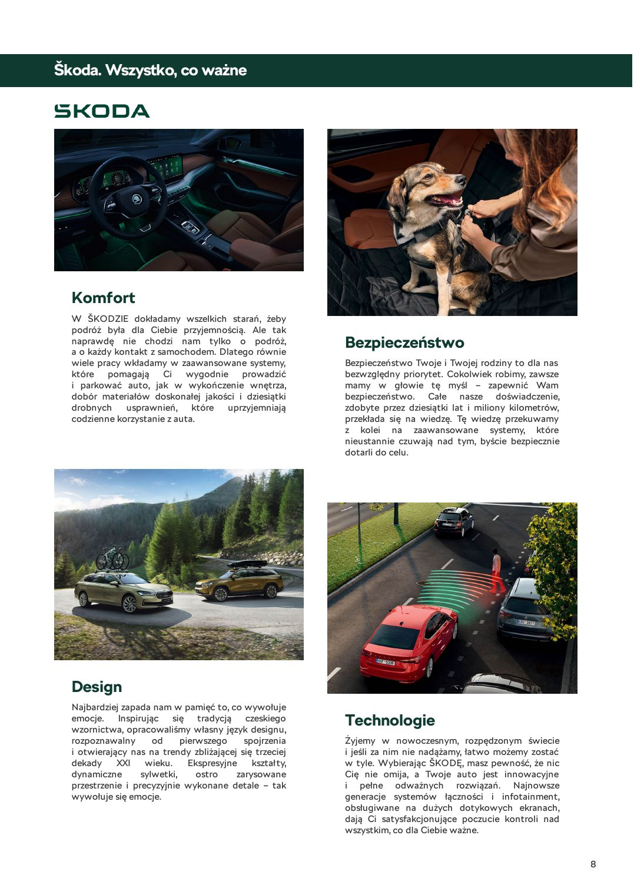

### Tekst z warstwy PDF

~~~~text
Škoda. Wszystko, co ważne

  Komfort
  W ŠKODZIE dokładamy wszelkich starań, żeby
  podróż była dla Ciebie przyjemnością. Ale tak
  naprawdę nie chodzi nam tylko o podróż,
  a o każdy kontakt z samochodem. Dlatego równie
                                                         Bezpieczeństwo
  wiele pracy wkładamy w zaawansowane systemy,           Bezpieczeństwo Twoje i Twojej rodziny to dla nas
  które pomagają Ci wygodnie prowadzić                   bezwzględny priorytet. Cokolwiek robimy, zawsze
  i parkować auto, jak w wykończenie wnętrza,            mamy w głowie tę myśl – zapewnić Wam
  dobór materiałów doskonałej jakości i dziesiątki       bezpieczeństwo. Całe nasze doświadczenie,
  drobnych usprawnień, które uprzyjemniają               zdobyte przez dziesiątki lat i miliony kilometrów,
  codzienne korzystanie z auta.                          przekłada się na wiedzę. Tę wiedzę przekuwamy
                                                         z kolei na zaawansowane systemy, które
                                                         nieustannie czuwają nad tym, byście bezpiecznie
                                                         dotarli do celu.

  Design
  Najbardziej zapada nam w pamięć to, co wywołuje
  emocje. Inspirując się tradycją czeskiego
  wzornictwa, opracowaliśmy własny język designu,
                                                         Technologie
  rozpoznawalny od           pierwszego    spojrzenia    Żyjemy w nowoczesnym, rozpędzonym świecie
  i otwierający nas na trendy zbliżającej się trzeciej   i jeśli za nim nie nadążamy, łatwo możemy zostać
  dekady XXI wieku. Ekspresyjne kształty,                w tyle. Wybierając ŠKODĘ, masz pewność, że nic
  dynamiczne       sylwetki,     ostro   zarysowane      Cię nie omija, a Twoje auto jest innowacyjne
  przestrzenie i precyzyjnie wykonane detale – tak       i pełne odważnych rozwiązań. Najnowsze
  wywołuje się emocje.                                   generacje systemów łączności i infotainment,
                                                         obsługiwane na dużych dotykowych ekranach,
                                                         dają Ci satysfakcjonujące poczucie kontroli nad
                                                         wszystkim, co dla Ciebie ważne.

                                                                                                              8
~~~~

## Strona 9

[Otwórz obraz strony 9 w pełnej rozdzielczości](assets/12-skoda-fabia-poz-3/page-009.jpg)

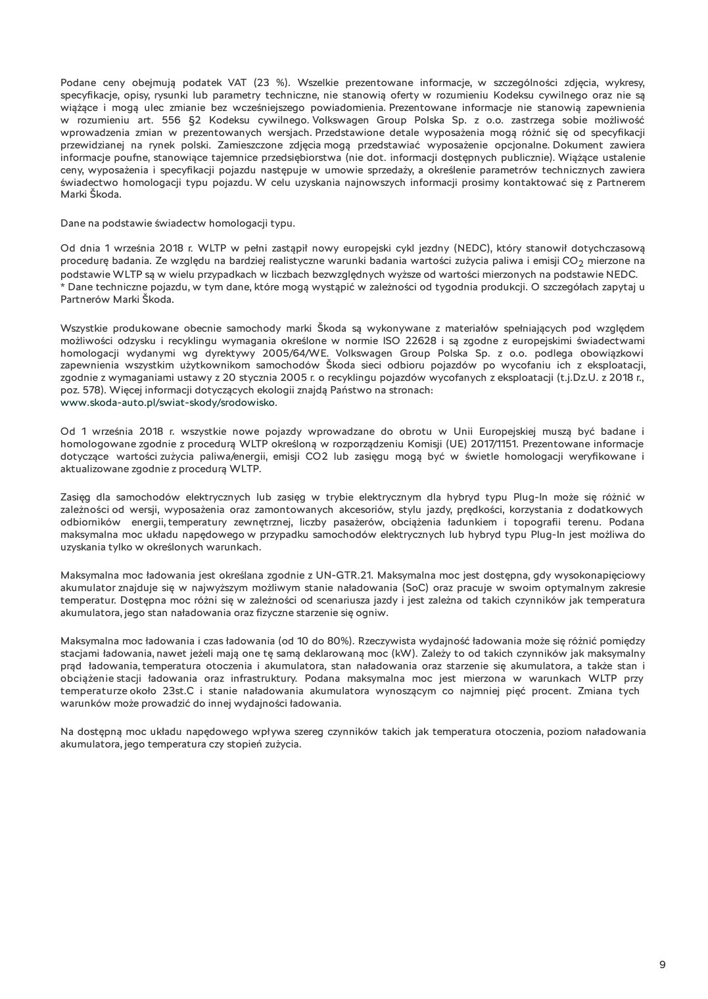

### Tekst z warstwy PDF

~~~~text
Podane ceny obejmują podatek VAT (23 %). Wszelkie prezentowane informacje, w szczególności zdjęcia, wykresy,
specyfikacje, opisy, rysunki lub parametry techniczne, nie stanowią oferty w rozumieniu Kodeksu cywilnego oraz nie są
wiążące i mogą ulec zmianie bez wcześniejszego powiadomienia. Prezentowane informacje nie stanowią zapewnienia
w rozumieniu art. 556 §2 Kodeksu cywilnego. Volkswagen Group Polska Sp. z o.o. zastrzega sobie możliwość
wprowadzenia zmian w prezentowanych wersjach. Przedstawione detale wyposażenia mogą różnić się od specyfikacji
przewidzianej na rynek polski. Zamieszczone zdjęcia mogą przedstawiać wyposażenie opcjonalne. Dokument zawiera
informacje poufne, stanowiące tajemnice przedsiębiorstwa (nie dot. informacji dostępnych publicznie). Wiążące ustalenie
ceny, wyposażenia i specyfikacji pojazdu następuje w umowie sprzedaży, a określenie parametrów technicznych zawiera
świadectwo homologacji typu pojazdu. W celu uzyskania najnowszych informacji prosimy kontaktować się z Partnerem
Marki Škoda.

Dane na podstawie świadectw homologacji typu.
Od dnia 1 września 2018 r. WLTP w pełni zastąpił nowy europejski cykl jezdny (NEDC), który stanowił dotychczasową
procedurę badania. Ze względu na bardziej realistyczne warunki badania wartości zużycia paliwa i emisji CO 2 mierzone na
podstawie WLTP są w wielu przypadkach w liczbach bezwzględnych wyższe od wartości mierzonych na podstawie NEDC.
* Dane techniczne pojazdu, w tym dane, które mogą wystąpić w zależności od tygodnia produkcji. O szczegółach zapytaj u
Partnerów Marki Škoda.

Wszystkie produkowane obecnie samochody marki Škoda są wykonywane z materiałów spełniających pod względem
możliwości odzysku i recyklingu wymagania określone w normie ISO 22628 i są zgodne z europejskimi świadectwami
homologacji wydanymi wg dyrektywy 2005/64/WE. Volkswagen Group Polska Sp. z o.o. podlega obowiązkowi
zapewnienia wszystkim użytkownikom samochodów Škoda sieci odbioru pojazdów po wycofaniu ich z eksploatacji,
zgodnie z wymaganiami ustawy z 20 stycznia 2005 r. o recyklingu pojazdów wycofanych z eksploatacji (t.j.Dz.U. z 2018 r.,
poz. 578). Więcej informacji dotyczących ekologii znajdą Państwo na stronach:
www.skoda-auto.pl/swiat-skody/srodowisko.

Od 1 września 2018 r. wszystkie nowe pojazdy wprowadzane do obrotu w Unii Europejskiej muszą być badane i
homologowane zgodnie z procedurą WLTP określoną w rozporządzeniu Komisji (UE) 2017/1151. Prezentowane informacje
dotyczące wartości zużycia paliwa/energii, emisji CO2 lub zasięgu mogą być w świetle homologacji weryfikowane i
aktualizowane zgodnie z procedurą WLTP.

Zasięg dla samochodów elektrycznych lub zasięg w trybie elektrycznym dla hybryd typu Plug-In może się różnić w
zależności od wersji, wyposażenia oraz zamontowanych akcesoriów, stylu jazdy, prędkości, korzystania z dodatkowych
odbiorników energii, temperatury zewnętrznej, liczby pasażerów, obciążenia ładunkiem i topografii terenu. Podana
maksymalna moc układu napędowego w przypadku samochodów elektrycznych lub hybryd typu Plug-In jest możliwa do
uzyskania tylko w określonych warunkach.

Maksymalna moc ładowania jest określana zgodnie z UN‑GTR.21. Maksymalna moc jest dostępna, gdy wysokonapięciowy
akumulator znajduje się w najwyższym możliwym stanie naładowania (SoC) oraz pracuje w swoim optymalnym zakresie
temperatur. Dostępna moc różni się w zależności od scenariusza jazdy i jest zależna od takich czynników jak temperatura
akumulatora, jego stan naładowania oraz fizyczne starzenie się ogniw.

Maksymalna moc ładowania i czas ładowania (od 10 do 80%). Rzeczywista wydajność ładowania może się różnić pomiędzy
stacjami ładowania, nawet jeżeli mają one tę samą deklarowaną moc (kW). Zależy to od takich czynników jak maksymalny
prąd ładowania, temperatura otoczenia i akumulatora, stan naładowania oraz starzenie się akumulatora, a także stan i
obciążenie stacji ładowania oraz infrastruktury. Podana maksymalna moc jest mierzona w warunkach WLTP przy
temperaturze około 23st.C i stanie naładowania akumulatora wynoszącym co najmniej pięć procent. Zmiana tych
warunków może prowadzić do innej wydajności ładowania.

Na dostępną moc układu napędowego wpływa szereg czynników takich jak temperatura otoczenia, poziom naładowania
akumulatora, jego temperatura czy stopień zużycia.

                                                                                                                           9
~~~~

## Strona 10

[Otwórz obraz strony 10 w pełnej rozdzielczości](assets/12-skoda-fabia-poz-3/page-010.jpg)

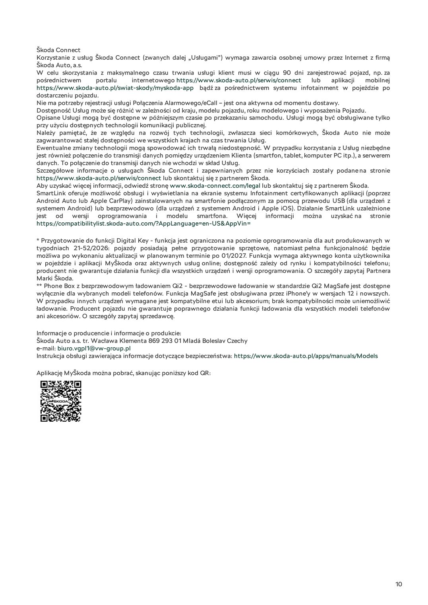

### Tekst z warstwy PDF

~~~~text
Škoda Connect
Korzystanie z usług Škoda Connect (zwanych dalej „Usługami”) wymaga zawarcia osobnej umowy przez Internet z firmą
Škoda Auto, a.s.
W celu skorzystania z maksymalnego czasu trwania usługi klient musi w ciągu 90 dni zarejestrować pojazd, np. za
pośrednictwem        portalu      internetowego https://www.skoda-auto.pl/serwis/connect lub aplikacji mobilnej
https://www.skoda-auto.pl/swiat-skody/myskoda-app bądź za pośrednictwem systemu infotainment w pojeździe po
dostarczeniu pojazdu.
Nie ma potrzeby rejestracji usługi Połączenia Alarmowego/eCall – jest ona aktywna od momentu dostawy.
Dostępność Usług może się różnić w zależności od kraju, modelu pojazdu, roku modelowego i wyposażenia Pojazdu.
Opisane Usługi mogą być dostępne w późniejszym czasie po przekazaniu samochodu. Usługi mogą być obsługiwane tylko
przy użyciu dostępnych technologii komunikacji publicznej.
Należy pamiętać, że ze względu na rozwój tych technologii, zwłaszcza sieci komórkowych, Škoda Auto nie może
zagwarantować stałej dostępności we wszystkich krajach na czas trwania Usług.
Ewentualne zmiany technologii mogą spowodować ich trwałą niedostępność. W przypadku korzystania z Usług niezbędne
jest również połączenie do transmisji danych pomiędzy urządzeniem Klienta (smartfon, tablet, komputer PC itp.), a serwerem
danych. To połączenie do transmisji danych nie wchodzi w skład Usług.
Szczegółowe informacje o usługach Škoda Connect i zapewnianych przez nie korzyściach zostały podane na stronie
https://www.skoda-auto.pl/serwis/connect lub skontaktuj się z partnerem Škoda.
Aby uzyskać więcej informacji, odwiedź stronę www.skoda-connect.com/legal lub skontaktuj się z partnerem Škoda.
SmartLink oferuje możliwość obsługi i wyświetlania na ekranie systemu Infotainment certyfikowanych aplikacji (poprzez
Android Auto lub Apple CarPlay) zainstalowanych na smartfonie podłączonym za pomocą przewodu USB (dla urządzeń z
systemem Android) lub bezprzewodowo (dla urządzeń z systemem Android i Apple iOS). Działanie SmartLink uzależnione
jest od wersji oprogramowania i modelu smartfona. Więcej informacji można uzyskać na stronie
https://compatibilitylist.skoda-auto.com/?AppLanguage=en-US&AppVin=

* Przygotowanie do funkcji Digital Key - funkcja jest ograniczona na poziomie oprogramowania dla aut produkowanych w
tygodniach 21-52/2026: pojazdy posiadają pełne przygotowanie sprzętowe, natomiast pełna funkcjonalność będzie
możliwa po wykonaniu aktualizacji w planowanym terminie po 01/2027. Funkcja wymaga aktywnego konta użytkownika
w pojeździe i aplikacji MyŠkoda oraz aktywnych usług online; dostępność zależy od rynku i kompatybilności telefonu;
producent nie gwarantuje działania funkcji dla wszystkich urządzeń i wersji oprogramowania. O szczegóły zapytaj Partnera
Marki Škoda.
** Phone Box z bezprzewodowym ładowaniem Qi2 - bezprzewodowe ładowanie w standardzie Qi2 MagSafe jest dostępne
wyłącznie dla wybranych modeli telefonów. Funkcja MagSafe jest obsługiwana przez iPhone’y w wersjach 12 i nowszych.
W przypadku innych urządzeń wymagane jest kompatybilne etui lub akcesorium; brak kompatybilności może uniemożliwić
ładowanie. Producent pojazdu nie gwarantuje poprawnego działania funkcji ładowania dla wszystkich modeli telefonów
ani akcesoriów. O szczegóły zapytaj sprzedawcę.

Informacje o producencie i informacje o produkcie:
Škoda Auto a.s. tr. Wacława Klementa 869 293 01 Mladá Boleslav Czechy
e-mail: biuro.vgpl1@vw-group.pl
Instrukcja obsługi zawierająca informacje dotyczące bezpieczeństwa: https://www.skoda-auto.pl/apps/manuals/Models

Aplikację MyŠkoda można pobrać, skanując poniższy kod QR:

                                                                                                                             10
~~~~

## Strona 11

[Otwórz obraz strony 11 w pełnej rozdzielczości](assets/12-skoda-fabia-poz-3/page-011.jpg)

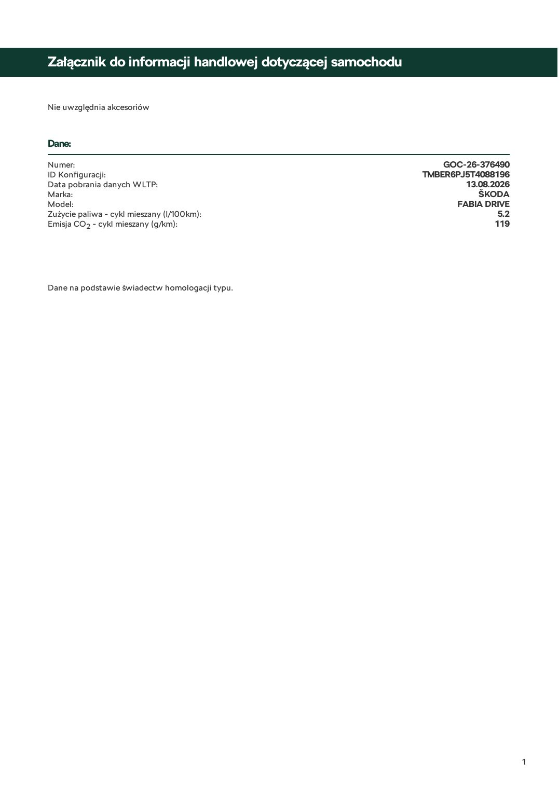

### Tekst z warstwy PDF

~~~~text
Załącznik do informacji handlowej dotyczącej samochodu

Nie uwzględnia akcesoriów

Dane:
Numer:                                                       GOC-26-376490
ID Konfiguracji:                                         TMBER6PJ5T4088196
Data pobrania danych WLTP:                                       13.08.2026
Marka:                                                              ŠKODA
Model:                                                         FABIA DRIVE
Zużycie paliwa - cykl mieszany (l/100km):                                5.2
Emisja CO 2 - cykl mieszany (g/km):                                     119

Dane na podstawie świadectw homologacji typu.

                                                                               1
~~~~
