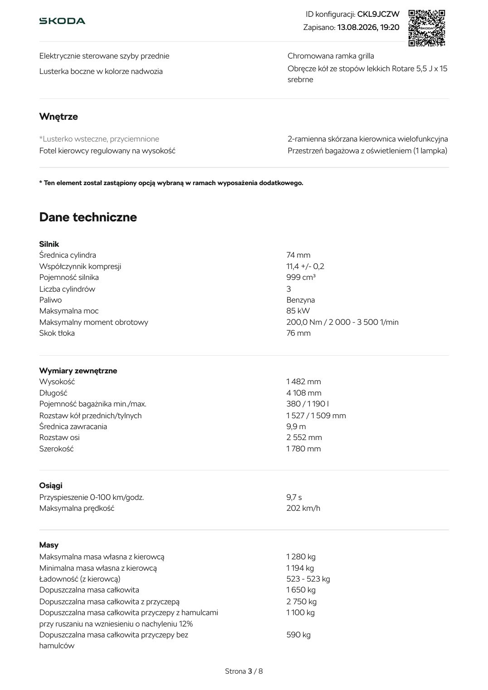
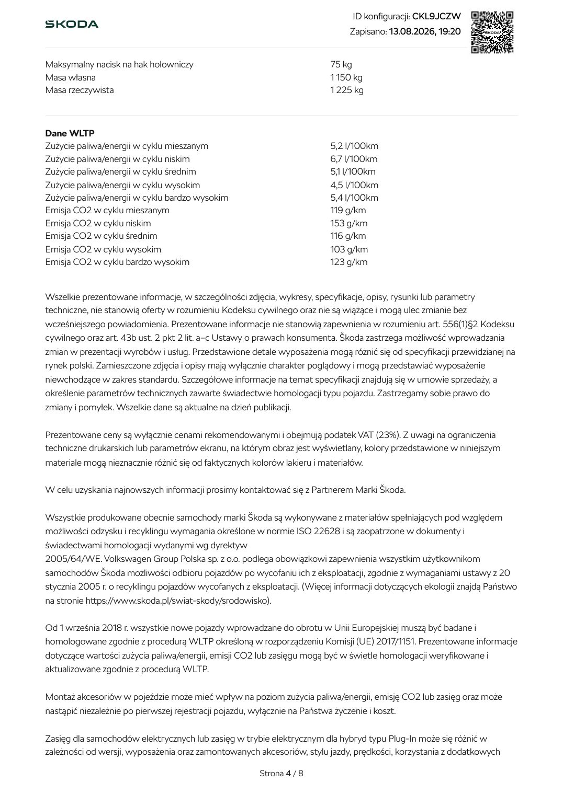
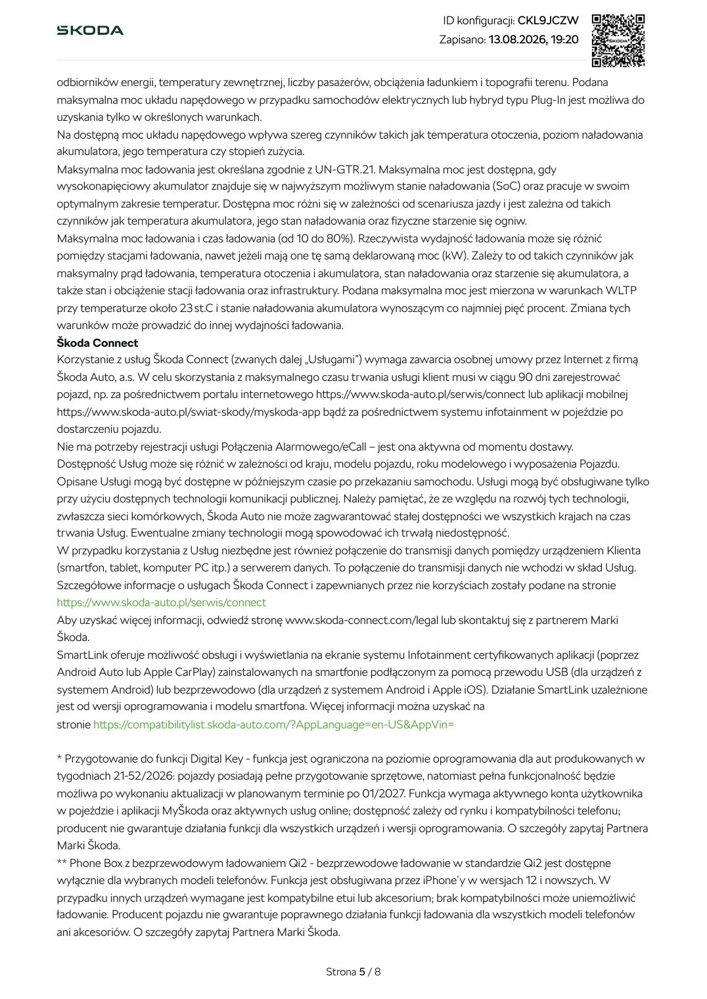
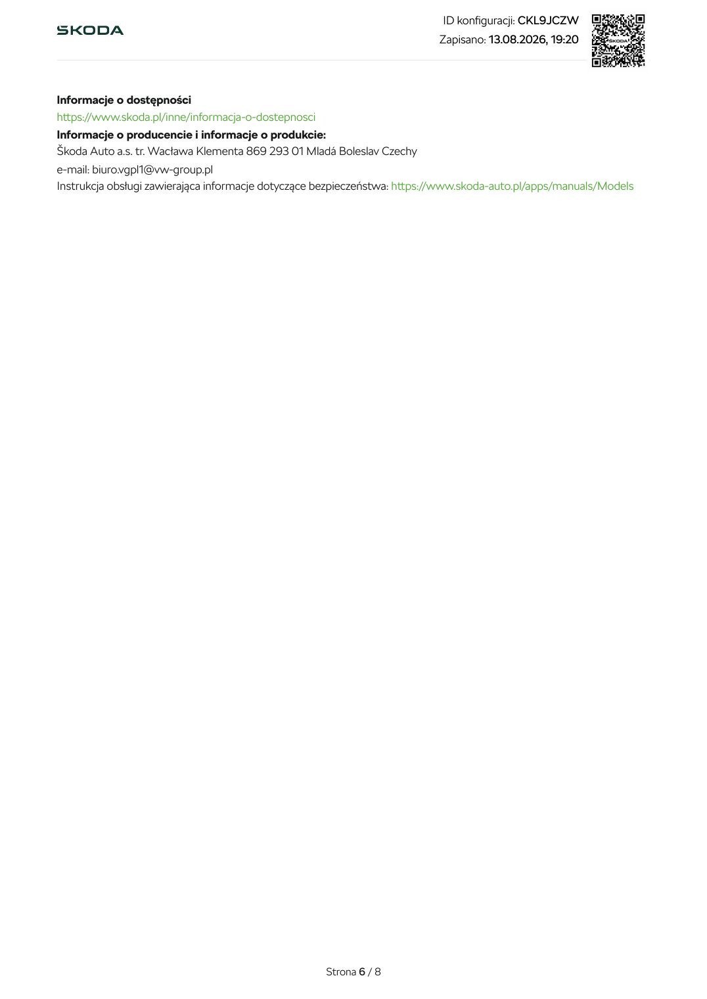
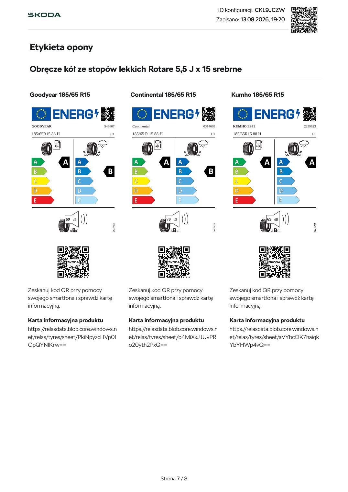
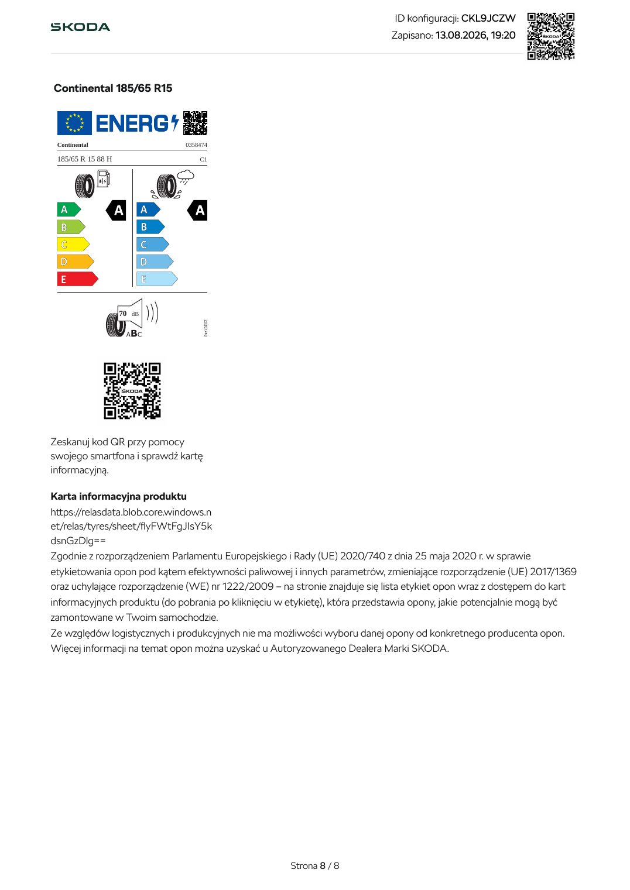

# Škoda Fabia Drive - konfiguracja CKL9JCZW

| Pole | Wartość |
|---|---|
| Źródłowy PDF | `Skoda Fabia 92 700 poz 2.pdf` |
| Liczba stron | 8 |
| Ekstrakcja tekstu | `pdftotext -layout`, UTF-8 |
| Reprezentacja wizualna | render każdej strony, 130 DPI, JPEG |

> Treść pozostawiono w brzmieniu źródłowym. Nie poprawiano literówek, wartości, nazw ani niespójności występujących w PDF-ie.

## Spis stron

[Strona 1](#strona-1) · [Strona 2](#strona-2) · [Strona 3](#strona-3) · [Strona 4](#strona-4) · [Strona 5](#strona-5) · [Strona 6](#strona-6) · [Strona 7](#strona-7) · [Strona 8](#strona-8)

## Strona 1

[Otwórz obraz strony 1 w pełnej rozdzielczości](assets/14-skoda-fabia-92-700-poz-2/page-001.jpg)

### Tekst z warstwy PDF

~~~~text
                                                                  ID konfiguracji: CKL9JCZW
                                                                 Zapisano: 13.08.2026, 19:20

Fabia
Drive
1,0 TSI (115 KM) 85 kW 7-biegowa DSG
Emisja CO2 w cyklu mieszanym 119 g/km / Zużycie paliwa/energii w cyklu mieszanym 5,2 l/100km

 Ceny                                                                                              Cena

 Twoja konfiguracja                                                                            93 850 zł
 Wybrane wyposażenie opcjonalne i usługi                                                        7700 zł

 Cena widocznej konfiguracji                                                                   101 550 zł
 Rata miesięczna *
    Skoda Leasing Niskich Rat                                                                       760 zł
    powered by

                                              Strona 1 / 8
~~~~

## Strona 2

[Otwórz obraz strony 2 w pełnej rozdzielczości](assets/14-skoda-fabia-92-700-poz-2/page-002.jpg)

### Tekst z warstwy PDF

~~~~text
                                                                              ID konfiguracji: CKL9JCZW
                                                                             Zapisano: 13.08.2026, 19:20

Wybrane wyposażenie i usługi                                                                                       Cena
Kolor
Błękit Race Metalizowany                                                                                         2400 zł

Obręcze kół
Obręcze kół ze stopów lekkich Rotare 5,5 J x 15 srebrne                                                              0 zł

Wnętrze
Wnętrze Loft

Bezpieczeństwo
Side Assist - funkcja monitorowania martwego pola z Rear Traffic Alert                                           3400 zł
  – Elektrycznie sterowane i składane, podgrzewane lusterka boczne
  – Side Assist

Komfort
Climatronic - dwustrefowa klimatyzacja automatyczna                                                              1900 zł
 – Climatronic - klimatyzacja automatyczna
 – Lusterko wsteczne automatycznie przyciemniane

KODY PJ3DLD/MASGEB1\GWPBWPB\GYOKYOK, 2027, NQ, 8X8X, GPY1PY1, GPHBPHB

Wyposażenie standardowe
Wyposażenie standardowe

Komfort, bezpieczeństwo i funkcjonalność

Driver alert z Driver monitoring + funkcja wykrywania                    Cyfrowy zestaw wskaźników Digital Display
zmęczenia kierowcy (ADA)
                                                                         Radio (ekran 8", dwa gniazda USB-C)
Sygnalizacja ostrzegawcza niezapiętych pasów
bezpieczeństwa z przodu i z tyłu                                         Smartlink
Front Assist - kontrola odstępu z funkcją awaryjnego                     *Klimatyzacja manualna
hamowania z Pedestrian Monitor
                                                                         EASY LIGHT ASSIST – czujnik zmierzchu
Lane Assist - asystent pasa ruchu
Easy Light Assist - czujnik zmierzchu                                    6 głośników
Drive Mode Select
                                                                         TPM – sygnalizacja spadku ciśnienia w oponach
Rozpoznawanie znaków drogowych
Hill Hold Control - system wspomagania ruszania pod                      Kamera cofania
wzniesienia                                                              Czujniki parkowania z przodu i z tyłu
Tempomat
                                                                         Kessy Full bez funkcji Safe
Bluetooth

Nadwozie

Reflektory LED Basic z przodu                                            *Elektrycznie sterowane i podgrzewane
Reflektory przeciwmgłowe z przodu                                        lusterka boczne

                                                        Strona 2 / 8
~~~~

## Strona 3

[Otwórz obraz strony 3 w pełnej rozdzielczości](assets/14-skoda-fabia-92-700-poz-2/page-003.jpg)

### Tekst z warstwy PDF

~~~~text
                                                                                  ID konfiguracji: CKL9JCZW
                                                                                  Zapisano: 13.08.2026, 19:20

Elektrycznie sterowane szyby przednie                                     Chromowana ramka grilla
Lusterka boczne w kolorze nadwozia                                        Obręcze kół ze stopów lekkich Rotare 5,5 J x 15
                                                                          srebrne

Wnętrze

*Lusterko wsteczne, przyciemnione                                         2-ramienna skórzana kierownica wielofunkcyjna
Fotel kierowcy regulowany na wysokość                                     Przestrzeń bagażowa z oświetleniem (1 lampka)

* Ten element został zastąpiony opcją wybraną w ramach wyposażenia dodatkowego.

Dane techniczne
Silnik
Średnica cylindra                                                        74 mm
Współczynnik kompresji                                                   11,4 +/- 0,2
Pojemność silnika                                                        999 cm³
Liczba cylindrów                                                         3
Paliwo                                                                   Benzyna
Maksymalna moc                                                           85 kW
Maksymalny moment obrotowy                                               200,0 Nm / 2 000 - 3 500 1/min
Skok tłoka                                                               76 mm

Wymiary zewnętrzne
Wysokość                                                                 1 482 mm
Długość                                                                  4 108 mm
Pojemność bagażnika min./max.                                            380 / 1 190 l
Rozstaw kół przednich/tylnych                                            1 527 / 1 509 mm
Średnica zawracania                                                      9,9 m
Rozstaw osi                                                              2 552 mm
Szerokość                                                                1 780 mm

Osiągi
Przyspieszenie 0-100 km/godz.                                            9,7 s
Maksymalna prędkość                                                      202 km/h

Masy
Maksymalna masa własna z kierowcą                                        1 280 kg
Minimalna masa własna z kierowcą                                         1 194 kg
Ładowność (z kierowcą)                                                   523 - 523 kg
Dopuszczalna masa całkowita                                              1 650 kg
Dopuszczalna masa całkowita z przyczepą                                  2 750 kg
Dopuszczalna masa całkowita przyczepy z hamulcami                        1 100 kg
przy ruszaniu na wzniesieniu o nachyleniu 12%
Dopuszczalna masa całkowita przyczepy bez                                590 kg
hamulców

                                                       Strona 3 / 8
~~~~

## Strona 4

[Otwórz obraz strony 4 w pełnej rozdzielczości](assets/14-skoda-fabia-92-700-poz-2/page-004.jpg)

### Tekst z warstwy PDF

~~~~text
                                                                                 ID konfiguracji: CKL9JCZW
                                                                                Zapisano: 13.08.2026, 19:20

Maksymalny nacisk na hak holowniczy                                        75 kg
Masa własna                                                                1 150 kg
Masa rzeczywista                                                           1 225 kg

Dane WLTP
Zużycie paliwa/energii w cyklu mieszanym                                   5,2 l/100km
Zużycie paliwa/energii w cyklu niskim                                      6,7 l/100km
Zużycie paliwa/energii w cyklu średnim                                     5,1 l/100km
Zużycie paliwa/energii w cyklu wysokim                                     4,5 l/100km
Zużycie paliwa/energii w cyklu bardzo wysokim                              5,4 l/100km
Emisja CO2 w cyklu mieszanym                                               119 g/km
Emisja CO2 w cyklu niskim                                                  153 g/km
Emisja CO2 w cyklu średnim                                                 116 g/km
Emisja CO2 w cyklu wysokim                                                 103 g/km
Emisja CO2 w cyklu bardzo wysokim                                          123 g/km

Wszelkie prezentowane informacje, w szczególności zdjęcia, wykresy, specyfikacje, opisy, rysunki lub parametry
techniczne, nie stanowią oferty w rozumieniu Kodeksu cywilnego oraz nie są wiążące i mogą ulec zmianie bez
wcześniejszego powiadomienia. Prezentowane informacje nie stanowią zapewnienia w rozumieniu art. 556(1)§2 Kodeksu
cywilnego oraz art. 43b ust. 2 pkt 2 lit. a–c Ustawy o prawach konsumenta. Škoda zastrzega możliwość wprowadzania
zmian w prezentacji wyrobów i usług. Przedstawione detale wyposażenia mogą różnić się od specyfikacji przewidzianej na
rynek polski. Zamieszczone zdjęcia i opisy mają wyłącznie charakter poglądowy i mogą przedstawiać wyposażenie
niewchodzące w zakres standardu. Szczegółowe informacje na temat specyfikacji znajdują się w umowie sprzedaży, a
określenie parametrów technicznych zawarte świadectwie homologacji typu pojazdu. Zastrzegamy sobie prawo do
zmiany i pomyłek. Wszelkie dane są aktualne na dzień publikacji.

Prezentowane ceny są wyłącznie cenami rekomendowanymi i obejmują podatek VAT (23%). Z uwagi na ograniczenia
techniczne drukarskich lub parametrów ekranu, na którym obraz jest wyświetlany, kolory przedstawione w niniejszym
materiale mogą nieznacznie różnić się od faktycznych kolorów lakieru i materiałów.

W celu uzyskania najnowszych informacji prosimy kontaktować się z Partnerem Marki Škoda.

Wszystkie produkowane obecnie samochody marki Škoda są wykonywane z materiałów spełniających pod względem
możliwości odzysku i recyklingu wymagania określone w normie ISO 22628 i są zaopatrzone w dokumenty i
świadectwami homologacji wydanymi wg dyrektyw
2005/64/WE. Volkswagen Group Polska sp. z o.o. podlega obowiązkowi zapewnienia wszystkim użytkownikom
samochodów Škoda możliwości odbioru pojazdów po wycofaniu ich z eksploatacji, zgodnie z wymaganiami ustawy z 20
stycznia 2005 r. o recyklingu pojazdów wycofanych z eksploatacji. (Więcej informacji dotyczących ekologii znajdą Państwo
na stronie https://www.skoda.pl/swiat-skody/srodowisko).

Od 1 września 2018 r. wszystkie nowe pojazdy wprowadzane do obrotu w Unii Europejskiej muszą być badane i
homologowane zgodnie z procedurą WLTP określoną w rozporządzeniu Komisji (UE) 2017/1151. Prezentowane informacje
dotyczące wartości zużycia paliwa/energii, emisji CO2 lub zasięgu mogą być w świetle homologacji weryfikowane i
aktualizowane zgodnie z procedurą WLTP.

Montaż akcesoriów w pojeździe może mieć wpływ na poziom zużycia paliwa/energii, emisję CO2 lub zasięg oraz może
nastąpić niezależnie po pierwszej rejestracji pojazdu, wyłącznie na Państwa życzenie i koszt.

Zasięg dla samochodów elektrycznych lub zasięg w trybie elektrycznym dla hybryd typu Plug-In może się różnić w
zależności od wersji, wyposażenia oraz zamontowanych akcesoriów, stylu jazdy, prędkości, korzystania z dodatkowych

                                                        Strona 4 / 8
~~~~

## Strona 5

[Otwórz obraz strony 5 w pełnej rozdzielczości](assets/14-skoda-fabia-92-700-poz-2/page-005.jpg)

### Tekst z warstwy PDF

~~~~text
                                                                              ID konfiguracji: CKL9JCZW
                                                                              Zapisano: 13.08.2026, 19:20

odbiorników energii, temperatury zewnętrznej, liczby pasażerów, obciążenia ładunkiem i topografii terenu. Podana
maksymalna moc układu napędowego w przypadku samochodów elektrycznych lub hybryd typu Plug-In jest możliwa do
uzyskania tylko w określonych warunkach.
Na dostępną moc układu napędowego wpływa szereg czynników takich jak temperatura otoczenia, poziom naładowania
akumulatora, jego temperatura czy stopień zużycia.
Maksymalna moc ładowania jest określana zgodnie z UN‑GTR.21. Maksymalna moc jest dostępna, gdy
wysokonapięciowy akumulator znajduje się w najwyższym możliwym stanie naładowania (SoC) oraz pracuje w swoim
optymalnym zakresie temperatur. Dostępna moc różni się w zależności od scenariusza jazdy i jest zależna od takich
czynników jak temperatura akumulatora, jego stan naładowania oraz fizyczne starzenie się ogniw.
Maksymalna moc ładowania i czas ładowania (od 10 do 80%). Rzeczywista wydajność ładowania może się różnić
pomiędzy stacjami ładowania, nawet jeżeli mają one tę samą deklarowaną moc (kW). Zależy to od takich czynników jak
maksymalny prąd ładowania, temperatura otoczenia i akumulatora, stan naładowania oraz starzenie się akumulatora, a
także stan i obciążenie stacji ładowania oraz infrastruktury. Podana maksymalna moc jest mierzona w warunkach WLTP
przy temperaturze około 23 st.C i stanie naładowania akumulatora wynoszącym co najmniej pięć procent. Zmiana tych
warunków może prowadzić do innej wydajności ładowania.
Škoda Connect
Korzystanie z usług Škoda Connect (zwanych dalej „Usługami”) wymaga zawarcia osobnej umowy przez Internet z firmą
Škoda Auto, a.s. W celu skorzystania z maksymalnego czasu trwania usługi klient musi w ciągu 90 dni zarejestrować
pojazd, np. za pośrednictwem portalu internetowego https://www.skoda-auto.pl/serwis/connect lub aplikacji mobilnej
https://www.skoda-auto.pl/swiat-skody/myskoda-app bądź za pośrednictwem systemu infotainment w pojeździe po
dostarczeniu pojazdu.
Nie ma potrzeby rejestracji usługi Połączenia Alarmowego/eCall – jest ona aktywna od momentu dostawy.
Dostępność Usług może się różnić w zależności od kraju, modelu pojazdu, roku modelowego i wyposażenia Pojazdu.
Opisane Usługi mogą być dostępne w późniejszym czasie po przekazaniu samochodu. Usługi mogą być obsługiwane tylko
przy użyciu dostępnych technologii komunikacji publicznej. Należy pamiętać, że ze względu na rozwój tych technologii,
zwłaszcza sieci komórkowych, Škoda Auto nie może zagwarantować stałej dostępności we wszystkich krajach na czas
trwania Usług. Ewentualne zmiany technologii mogą spowodować ich trwałą niedostępność.
W przypadku korzystania z Usług niezbędne jest również połączenie do transmisji danych pomiędzy urządzeniem Klienta
(smartfon, tablet, komputer PC itp.) a serwerem danych. To połączenie do transmisji danych nie wchodzi w skład Usług.
Szczegółowe informacje o usługach Škoda Connect i zapewnianych przez nie korzyściach zostały podane na stronie
https://www.skoda-auto.pl/serwis/connect
Aby uzyskać więcej informacji, odwiedź stronę www.skoda-connect.com/legal lub skontaktuj się z partnerem Marki
Škoda.
SmartLink oferuje możliwość obsługi i wyświetlania na ekranie systemu Infotainment certyfikowanych aplikacji (poprzez
Android Auto lub Apple CarPlay) zainstalowanych na smartfonie podłączonym za pomocą przewodu USB (dla urządzeń z
systemem Android) lub bezprzewodowo (dla urządzeń z systemem Android i Apple iOS). Działanie SmartLink uzależnione
jest od wersji oprogramowania i modelu smartfona. Więcej informacji można uzyskać na
stronie https://compatibilitylist.skoda-auto.com/?AppLanguage=en-US&AppVin=

* Przygotowanie do funkcji Digital Key - funkcja jest ograniczona na poziomie oprogramowania dla aut produkowanych w
tygodniach 21-52/2026: pojazdy posiadają pełne przygotowanie sprzętowe, natomiast pełna funkcjonalność będzie
możliwa po wykonaniu aktualizacji w planowanym terminie po 01/2027. Funkcja wymaga aktywnego konta użytkownika
w pojeździe i aplikacji MyŠkoda oraz aktywnych usług online; dostępność zależy od rynku i kompatybilności telefonu;
producent nie gwarantuje działania funkcji dla wszystkich urządzeń i wersji oprogramowania. O szczegóły zapytaj Partnera
Marki Škoda.
** Phone Box z bezprzewodowym ładowaniem Qi2 - bezprzewodowe ładowanie w standardzie Qi2 jest dostępne
wyłącznie dla wybranych modeli telefonów. Funkcja jest obsługiwana przez iPhone’y w wersjach 12 i nowszych. W
przypadku innych urządzeń wymagane jest kompatybilne etui lub akcesorium; brak kompatybilności może uniemożliwić
ładowanie. Producent pojazdu nie gwarantuje poprawnego działania funkcji ładowania dla wszystkich modeli telefonów
ani akcesoriów. O szczegóły zapytaj Partnera Marki Škoda.

                                                      Strona 5 / 8
~~~~

## Strona 6

[Otwórz obraz strony 6 w pełnej rozdzielczości](assets/14-skoda-fabia-92-700-poz-2/page-006.jpg)

### Tekst z warstwy PDF

~~~~text
                                                                           ID konfiguracji: CKL9JCZW
                                                                          Zapisano: 13.08.2026, 19:20

Informacje o dostępności
https://www.skoda.pl/inne/informacja-o-dostepnosci
Informacje o producencie i informacje o produkcie:
Škoda Auto a.s. tr. Wacława Klementa 869 293 01 Mladá Boleslav Czechy
e-mail: biuro.vgpl1@vw-group.pl
Instrukcja obsługi zawierająca informacje dotyczące bezpieczeństwa: https://www.skoda-auto.pl/apps/manuals/Models

                                                     Strona 6 / 8
~~~~

## Strona 7

[Otwórz obraz strony 7 w pełnej rozdzielczości](assets/14-skoda-fabia-92-700-poz-2/page-007.jpg)

### Tekst z warstwy PDF

~~~~text
                                                                                 ID konfiguracji: CKL9JCZW
                                                                                 Zapisano: 13.08.2026, 19:20

Etykieta opony

Obręcze kół ze stopów lekkich Rotare 5,5 J x 15 srebrne

Goodyear 185/65 R15                     Continental 185/65 R15                        Kumho 185/65 R15

 GOODYEAR                      546607    Continental                   0314699         KUMHO ES31                   2259623

 185/65R15 88 H                   C1     185/65 R 15 88 H                  C1          185/65R15 88 H                   C1

                  69 dB                                     70 dB                                       69 dB

Zeskanuj kod QR przy pomocy             Zeskanuj kod QR przy pomocy                   Zeskanuj kod QR przy pomocy
swojego smartfona i sprawdź kartę       swojego smartfona i sprawdź kartę             swojego smartfona i sprawdź kartę
informacyjną.                           informacyjną.                                 informacyjną.

Karta informacyjna produktu             Karta informacyjna produktu                   Karta informacyjna produktu
https://relasdata.blob.core.windows.n   https://relasdata.blob.core.windows.n         https://relasdata.blob.core.windows.n
et/relas/tyres/sheet/PkiNpyzcHVp0I      et/relas/tyres/sheet/b4MiXxJJUvPR             et/relas/tyres/sheet/aVYbcOK7haiqk
OpQYNlKrw==                             o20yth2PxQ==                                  YbYHWp4vQ==

                                                       Strona 7 / 8
~~~~

## Strona 8

[Otwórz obraz strony 8 w pełnej rozdzielczości](assets/14-skoda-fabia-92-700-poz-2/page-008.jpg)

### Tekst z warstwy PDF

~~~~text
                                                                              ID konfiguracji: CKL9JCZW
                                                                              Zapisano: 13.08.2026, 19:20

Continental 185/65 R15

 Continental                  0358474

 185/65 R 15 88 H                 C1

                    70 dB

Zeskanuj kod QR przy pomocy
swojego smartfona i sprawdź kartę
informacyjną.

Karta informacyjna produktu
https://relasdata.blob.core.windows.n
et/relas/tyres/sheet/flyFWtFgJIsY5k
dsnGzDlg==
Zgodnie z rozporządzeniem Parlamentu Europejskiego i Rady (UE) 2020/740 z dnia 25 maja 2020 r. w sprawie
etykietowania opon pod kątem efektywności paliwowej i innych parametrów, zmieniające rozporządzenie (UE) 2017/1369
oraz uchylające rozporządzenie (WE) nr 1222/2009 – na stronie znajduje się lista etykiet opon wraz z dostępem do kart
informacyjnych produktu (do pobrania po kliknięciu w etykietę), która przedstawia opony, jakie potencjalnie mogą być
zamontowane w Twoim samochodzie.
Ze względów logistycznych i produkcyjnych nie ma możliwości wyboru danej opony od konkretnego producenta opon.
Więcej informacji na temat opon można uzyskać u Autoryzowanego Dealera Marki SKODA.

                                                      Strona 8 / 8
~~~~
