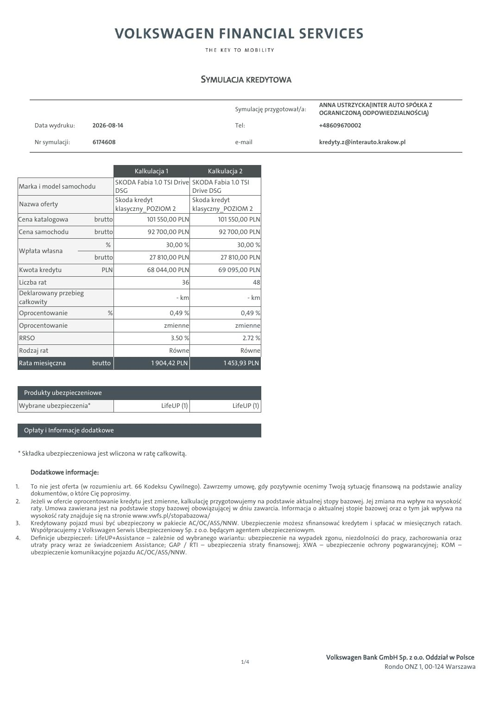
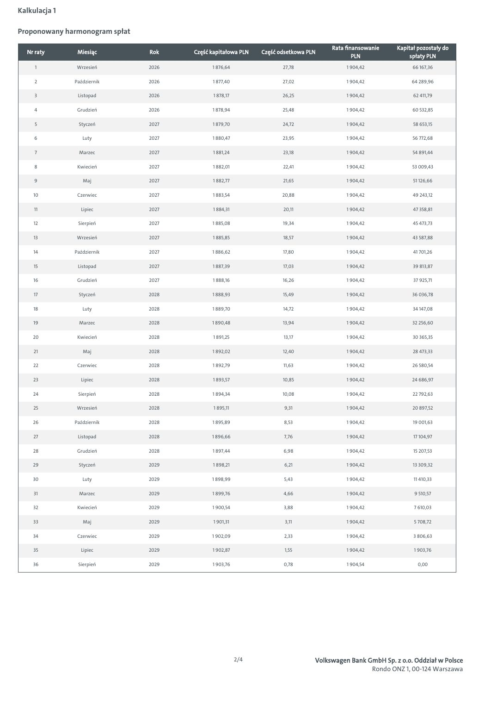
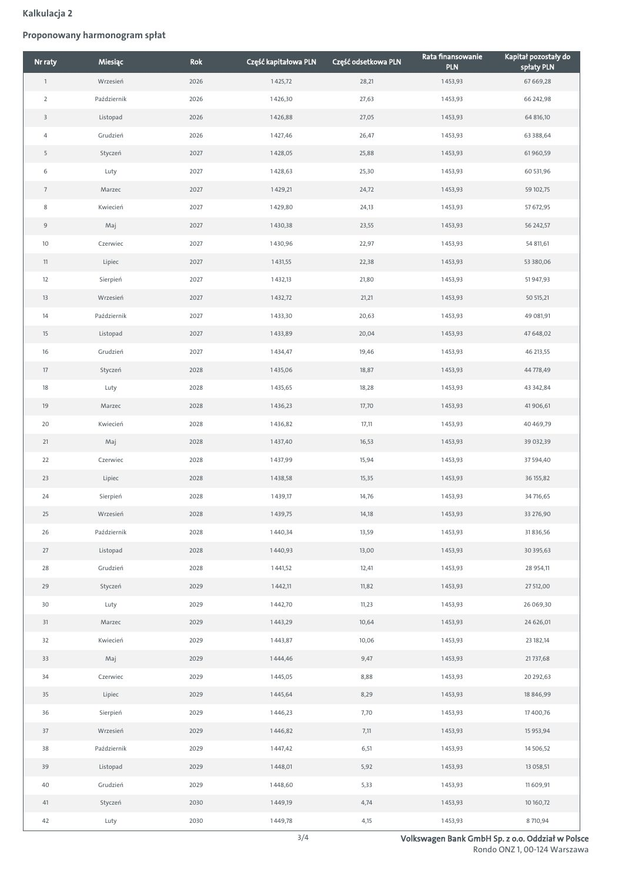
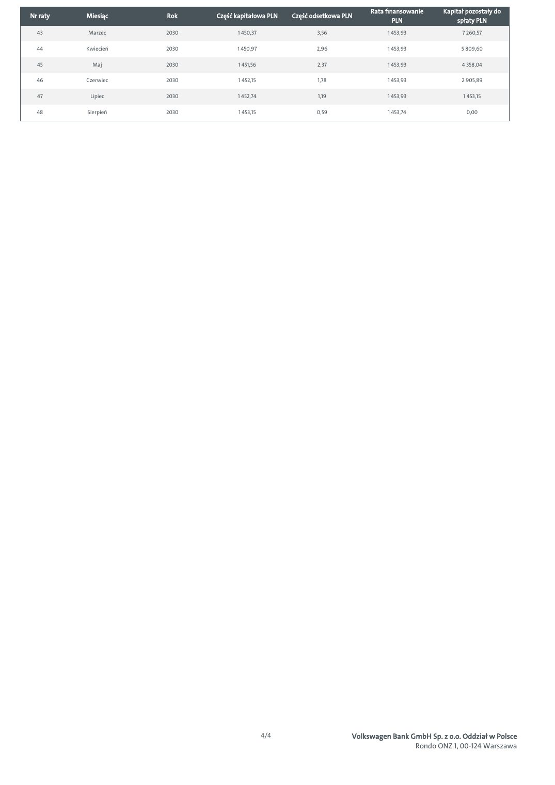

# Škoda - symulacja kredytowa 6174608

| Pole | Wartość |
|---|---|
| Źródłowy PDF | `simulation-6174608.pdf` |
| Liczba stron | 5 |
| Ekstrakcja tekstu | `pdftotext -layout`, UTF-8 |
| Reprezentacja wizualna | render każdej strony, 130 DPI, JPEG |

> Treść pozostawiono w brzmieniu źródłowym. Nie poprawiano literówek, wartości, nazw ani niespójności występujących w PDF-ie.

## Spis stron

[Strona 1](#strona-1) · [Strona 2](#strona-2) · [Strona 3](#strona-3) · [Strona 4](#strona-4) · [Strona 5](#strona-5)

## Strona 1

[Otwórz obraz strony 1 w pełnej rozdzielczości](assets/15-simulation-6174608/page-001.jpg)

### Tekst z warstwy PDF

~~~~text
                                                                    SYMULACJA KREDYTOWA

                                                                                                          ANNA USTRZYCKA(INTER AUTO SPÓŁKA Z
                                                                              Symulację przygotował/a:
                                                                                                          OGRANICZONĄ ODPOWIEDZIALNOŚCIĄ)
        Data wydruku:       2026-08-14                                        Tel:                        +48609670002

        Nr symulacji:       6174608                                           e-mail                      kredyty.z@interauto.krakow.pl

                                            Kalkulacja 1             Kalkulacja 2
                                      SKODA Fabia 1.0 TSI Drive SKODA Fabia 1.0 TSI
 Marka i model samochodu
                                      DSG                       Drive DSG
                                      Skoda kredyt              Skoda kredyt
 Nazwa oferty
                                      klasyczny_POZIOM 2        klasyczny_POZIOM 2
 Cena katalogowa            brutto              101 550,00 PLN          101 550,00 PLN
 Cena samochodu              brutto             92 700,00 PLN           92 700,00 PLN
                                %                      30,00 %                 30,00 %
 Wpłata własna
                             brutto              27 810,00 PLN           27 810,00 PLN
 Kwota kredytu                 PLN              68 044,00 PLN           69 095,00 PLN
 Liczba rat                                                   36                       48
 Deklarowany przebieg
                                                             - km                    - km
 całkowity
 Oprocentowanie                  %                         0,49 %               0,49 %
 Oprocentowanie                                       zmienne                 zmienne
 RRSO                                                      3.50 %                   2.72 %
 Rodzaj rat                                                Równe                Równe
 Rata miesięczna            brutto                1 904,42 PLN            1 453,93 PLN

     Produkty ubezpieczeniowe
 Wybrane ubezpieczenia*                              LifeUP (1)              LifeUP (1)

     Opłaty i Informacje dodatkowe

 * Składka ubezpieczeniowa jest wliczona w ratę całkowitą.

       Dodatkowe informacje:

1.     To nie jest oferta (w rozumieniu art. 66 Kodeksu Cywilnego). Zawrzemy umowę, gdy pozytywnie ocenimy Twoją sytuację finansową na podstawie analizy
       dokumentów, o które Cię poprosimy.
2.     Jeżeli w ofercie oprocentowanie kredytu jest zmienne, kalkulację przygotowujemy na podstawie aktualnej stopy bazowej. Jej zmiana ma wpływ na wysokość
       raty. Umowa zawierana jest na podstawie stopy bazowej obowiązującej w dniu zawarcia. Informacja o aktualnej stopie bazowej oraz o tym jak wpływa na
       wysokość raty znajduje się na stronie www.vwfs.pl/stopabazowa/
3.     Kredytowany pojazd musi być ubezpieczony w pakiecie AC/OC/ASS/NNW. Ubezpieczenie możesz sfinansować kredytem i spłacać w miesięcznych ratach.
       Współpracujemy z Volkswagen Serwis Ubezpieczeniowy Sp. z o.o. będącym agentem ubezpieczeniowym.
4.     Definicje ubezpieczeń: LifeUP+Assistance – zależnie od wybranego wariantu: ubezpieczenie na wypadek zgonu, niezdolności do pracy, zachorowania oraz
       utraty pracy wraz ze świadczeniem Assistance; GAP / RTI – ubezpieczenia straty finansowej; XWA – ubezpieczenie ochrony pogwarancyjnej; KOM –
       ubezpieczenie komunikacyjne pojazdu AC/OC/ASS/NNW.

                                                                                                             Volkswagen Bank GmbH Sp. z o.o. Oddział w Polsce
                                                                                1/4
                                                                                                                              Rondo ONZ 1, 00-124 Warszawa
~~~~

## Strona 2

[Otwórz obraz strony 2 w pełnej rozdzielczości](assets/15-simulation-6174608/page-002.jpg)

### Tekst z warstwy PDF

~~~~text
Kalkulacja 1

Proponowany harmonogram spłat

                                                                                      Rata finansowanie    Kapitał pozostały do
  Nr raty       Miesiąc         Rok    Część kapitałowa PLN    Część odsetkowa PLN
                                                                                              PLN               spłaty PLN
     1          Wrzesień        2026         1 876,64                 27,78                1 904,42              66 167,36

     2         Październik      2026         1 877,40                 27,02                1 904,42             64 289,96

     3          Listopad        2026          1 878,17                26,25                1 904,42              62 411,79

     4          Grudzień        2026         1 878,94                 25,48                1 904,42              60 532,85

     5          Styczeń         2027         1 879,70                 24,72                1 904,42              58 653,15

     6            Luty          2027         1 880,47                 23,95                1 904,42              56 772,68

     7           Marzec         2027         1 881,24                 23,18                1 904,42              54 891,44

     8          Kwiecień        2027         1 882,01                 22,41                1 904,42             53 009,43

     9            Maj           2027         1 882,77                 21,65                1 904,42              51 126,66

    10          Czerwiec        2027         1 883,54                 20,88                1 904,42              49 243,12

     11          Lipiec         2027          1 884,31                20,11                1 904,42              47 358,81

    12          Sierpień        2027         1 885,08                 19,34                1 904,42              45 473,73

    13          Wrzesień        2027         1 885,85                 18,57                1 904,42              43 587,88

    14         Październik      2027         1 886,62                 17,80                1 904,42              41 701,26

     15         Listopad        2027         1 887,39                 17,03                1 904,42              39 813,87

    16          Grudzień        2027         1 888,16                 16,26                1 904,42              37 925,71

     17         Styczeń         2028         1 888,93                 15,49                1 904,42             36 036,78

    18            Luty          2028         1 889,70                 14,72                1 904,42              34 147,08

    19           Marzec         2028         1 890,48                 13,94                1 904,42             32 256,60

    20          Kwiecień        2028          1 891,25                13,17                1 904,42              30 365,35

    21            Maj           2028         1 892,02                 12,40                1 904,42              28 473,33

    22          Czerwiec        2028         1 892,79                 11,63                1 904,42             26 580,54

    23           Lipiec         2028         1 893,57                 10,85                1 904,42             24 686,97

    24          Sierpień        2028         1 894,34                 10,08                1 904,42              22 792,63

    25          Wrzesień        2028          1 895,11                 9,31                1 904,42              20 897,52

    26         Październik      2028         1 895,89                 8,53                 1 904,42              19 001,63

    27          Listopad        2028         1 896,66                 7,76                 1 904,42              17 104,97

    28          Grudzień        2028         1 897,44                 6,98                 1 904,42              15 207,53

    29          Styczeń         2029         1 898,21                  6,21                1 904,42              13 309,32

    30            Luty          2029         1 898,99                 5,43                 1 904,42              11 410,33

    31           Marzec         2029         1 899,76                 4,66                 1 904,42              9 510,57

    32          Kwiecień        2029         1 900,54                 3,88                 1 904,42              7 610,03

    33            Maj           2029          1 901,31                 3,11                1 904,42              5 708,72

    34          Czerwiec        2029         1 902,09                  2,33                1 904,42              3 806,63

    35           Lipiec         2029         1 902,87                  1,55                1 904,42              1 903,76

    36          Sierpień        2029         1 903,76                 0,78                 1 904,54                0,00

                                                         2/4                     Volkswagen Bank GmbH Sp. z o.o. Oddział w Polsce
                                                                                                  Rondo ONZ 1, 00-124 Warszawa
~~~~

## Strona 3

[Otwórz obraz strony 3 w pełnej rozdzielczości](assets/15-simulation-6174608/page-003.jpg)

### Tekst z warstwy PDF

~~~~text
Kalkulacja 2

Proponowany harmonogram spłat

                                                                                      Rata finansowanie    Kapitał pozostały do
  Nr raty       Miesiąc         Rok    Część kapitałowa PLN    Część odsetkowa PLN
                                                                                              PLN               spłaty PLN
     1          Wrzesień        2026          1 425,72                28,21                1 453,93             67 669,28

     2         Październik      2026         1 426,30                 27,63                1 453,93             66 242,98

     3          Listopad        2026         1 426,88                 27,05                1 453,93              64 816,10

     4          Grudzień        2026         1 427,46                 26,47                1 453,93             63 388,64

     5          Styczeń         2027         1 428,05                 25,88                1 453,93             61 960,59

     6            Luty          2027         1 428,63                 25,30                1 453,93              60 531,96

     7           Marzec         2027          1 429,21                24,72                1 453,93              59 102,75

     8          Kwiecień        2027         1 429,80                 24,13                1 453,93              57 672,95

     9            Maj           2027         1 430,38                 23,55                1 453,93              56 242,57

    10          Czerwiec        2027         1 430,96                 22,97                1 453,93              54 811,61

    11           Lipiec         2027          1 431,55                22,38                1 453,93             53 380,06

    12          Sierpień        2027          1 432,13                21,80                1 453,93              51 947,93

    13          Wrzesień        2027         1 432,72                 21,21                1 453,93              50 515,21

    14         Październik      2027         1 433,30                 20,63                1 453,93              49 081,91

    15          Listopad        2027         1 433,89                 20,04                1 453,93             47 648,02

    16          Grudzień        2027         1 434,47                 19,46                1 453,93              46 213,55

    17          Styczeń         2028         1 435,06                 18,87                1 453,93             44 778,49

    18            Luty          2028         1 435,65                 18,28                1 453,93              43 342,84

    19           Marzec         2028         1 436,23                 17,70                1 453,93              41 906,61

    20          Kwiecień        2028         1 436,82                 17,11                1 453,93             40 469,79

    21            Maj           2028         1 437,40                 16,53                1 453,93             39 032,39

    22          Czerwiec        2028         1 437,99                 15,94                1 453,93              37 594,40

    23           Lipiec         2028         1 438,58                 15,35                1 453,93              36 155,82

    24          Sierpień        2028          1 439,17                14,76                1 453,93              34 716,65

    25          Wrzesień        2028         1 439,75                 14,18                1 453,93             33 276,90

    26         Październik      2028         1 440,34                 13,59                1 453,93              31 836,56

    27          Listopad        2028         1 440,93                 13,00                1 453,93              30 395,63

    28          Grudzień        2028          1 441,52                12,41                1 453,93              28 954,11

    29          Styczeń         2029          1 442,11                11,82                1 453,93              27 512,00

    30            Luty          2029         1 442,70                 11,23                1 453,93             26 069,30

    31           Marzec         2029         1 443,29                 10,64                1 453,93              24 626,01

    32          Kwiecień        2029         1 443,87                 10,06                1 453,93              23 182,14

    33            Maj           2029         1 444,46                 9,47                 1 453,93              21 737,68

    34          Czerwiec        2029         1 445,05                 8,88                 1 453,93             20 292,63

    35           Lipiec         2029         1 445,64                 8,29                 1 453,93             18 846,99

    36          Sierpień        2029         1 446,23                 7,70                 1 453,93              17 400,76

    37          Wrzesień        2029         1 446,82                  7,11                1 453,93              15 953,94

    38         Październik      2029         1 447,42                  6,51                1 453,93              14 506,52

    39          Listopad        2029         1 448,01                 5,92                 1 453,93              13 058,51

    40          Grudzień        2029         1 448,60                  5,33                1 453,93              11 609,91

    41          Styczeń         2030         1 449,19                 4,74                 1 453,93              10 160,72

    42            Luty          2030         1 449,78                  4,15                1 453,93              8 710,94

                                                         3/4                     Volkswagen Bank GmbH Sp. z o.o. Oddział w Polsce
                                                                                                  Rondo ONZ 1, 00-124 Warszawa
~~~~

## Strona 4

[Otwórz obraz strony 4 w pełnej rozdzielczości](assets/15-simulation-6174608/page-004.jpg)

### Tekst z warstwy PDF

~~~~text
                                                                           Rata finansowanie    Kapitał pozostały do
Nr raty   Miesiąc    Rok    Część kapitałowa PLN    Część odsetkowa PLN
                                                                                   PLN               spłaty PLN
  43      Marzec     2030         1 450,37                 3,56                 1 453,93              7 260,57

  44      Kwiecień   2030         1 450,97                 2,96                 1 453,93              5 809,60

  45        Maj      2030          1 451,56                 2,37                1 453,93              4 358,04

  46      Czerwiec   2030          1 452,15                 1,78                1 453,93              2 905,89

  47       Lipiec    2030         1 452,74                  1,19                1 453,93              1 453,15

  48      Sierpień   2030          1 453,15                0,59                 1 453,74                0,00

                                              4/4                     Volkswagen Bank GmbH Sp. z o.o. Oddział w Polsce
                                                                                       Rondo ONZ 1, 00-124 Warszawa
~~~~

## Strona 5

[Otwórz obraz strony 5 w pełnej rozdzielczości](assets/15-simulation-6174608/page-005.jpg)

### Tekst z warstwy PDF

~~~~text
                                         Poznaj produkty finansowe Volkswagen Financial Services

                        NAJEM                                        Kredyt JAK ABONAMENT                                                Kredyt KLASYCZNY

Dla kogo?                                                      Dla kogo?                                                      Dla kogo?
Jeśli cenisz sobie wygodę i chcesz mieć jedną stałą            Jeśli chcesz korzystać z rat niższych niż                      Jeśli preferujesz tradycyjne rozwiązania finansowe
miesięczną opłatę z wszystkimi usługami                        w tradycyjnym kredycie, a decyzję czy auto                     i chcesz korzystać z auta także po zakończeniu
dodatkowymi w cenie, zapytaj o NAJEM.                          wykupić wolisz podjąć później, zapytaj o kredyt                finansowania, zapytaj o kredyt KLASYCZNY.
                                                               JAK ABONAMENT.

                         NAJEM                                                        Kredyt                                                         Kredyt
                  Usługi w stałej opłacie                                        JAK ABONAMENT                                                     KLASYCZNY

                                                                                                      Za tę część
                                                                                                      nie płacisz

                                                                                                    Koniec umowy:
 Opcjonalna        Stała opłata            Koniec umowy:          Opcjonalny      Miesięczne raty   zwracasz auto lub             Opcjonalny     Okres finansowania   Ostatnia rata finalizuje
 opłata początkowa miesięczna               zwracasz auto         wkład własny                      spłacasz je jednorazowo       wkład własny          1-7 lat           zakup samochodu.
                                  i możesz wynająć kolejne                                          bądź w ratach                 0-70%
                                   w ramach nowej umowy

         Masz jedną stałą miesięczną opłatę                             Twoje raty są naliczane tylko od                               Masz tradycyjne finansowanie rozłożone
         i po prostu korzystasz z samochodu.                            prognozowanej utraty wartości umowy.                           nawet na 7 lat i korzystasz z niskich
                                                                                                                                       kosztów całkowitych kredytu.
         W opłacie jest już ubezpieczenie, serwis,                      Mając niskie raty, możesz zdecydować się
         assistance, auto zastępcze, pomoc                              na większy lub lepiej wyposażony                               Spłacasz w ratach całą wartość
         w przypadku szkody, a także opony (opcja).                     samochód.                                                      samochodu.

         Umowa się kończy – zwracasz auto                               Dopiero na koniec umowy decydujesz, czy                        Po zakończeniu finansowania nadal
         i możesz wziąć kolejne w ramach nowej                          wykupić auto jednorazowo lub w ratach,                         użytkujesz swoje auto.
         umowy.                                                         czy wziąć kolejne w ramach nowej
                                                                        umowy.

                                                             Zapytaj Doradcę o dodatkowe usługi

                                      Ubezpieczenia komunikacyjne                                                               Pakiety przeglądów serwisowych
              W raty możesz mieć wliczony pełen                          Korzystasz z likwidacji szkód                                    Płacisz z góry za przeglądy i w ten
              pakiet ubezpieczeń OC, AC i NNW,                           z pominięciem ubezpieczyciela                                    sposób uniezależniasz się od
              przygotowanych przez Allianz, Ergo                         sprawcy, a naprawy są wykonywane                                 ewentualnych wzrostów cen części
              Hestia lub Wartę.                                          w ASO i z użyciem oryginalnych części.                           oraz usług serwisowych.

                                                                                       O nas

   Jesteśmy nr 1 w finansowaniu aut osobowych w Polsce. Odpowiadając na potrzeby naszych Klientów, tworzymy                                              Zeskanuj kod i skorzystaj
   nowoczesne rozwiązania gwarantujące mobilność. Oferujemy im finansowanie, ubezpieczenia oraz wiele usług                                                z kalkulatora online.
   dodatkowych.

   Nr 1 w finansowaniu                      Największa firma                 Finansowanie aut marek:                Decyzja o finansowaniu
   samochodów osobowych*                    leasingowa w Polsce              Volkswagen, Audi, SEAT,                nawet w 60 minut
                                                                             Škoda, Volkswagen                      i formalności online
   *źródło: SAMAR, CEPiK; LEASING /                                          Samochody Dostawcze,
   CFM – rejestracje 2023
                                                                             Porsche i CUPRA

Niniejsza informacja nie stanowi oferty w rozumieniu Kodeksu cywilnego. Dostępność i warunki produktu mogą ulec zmianie. Warunki produktu określa umowa.
~~~~
