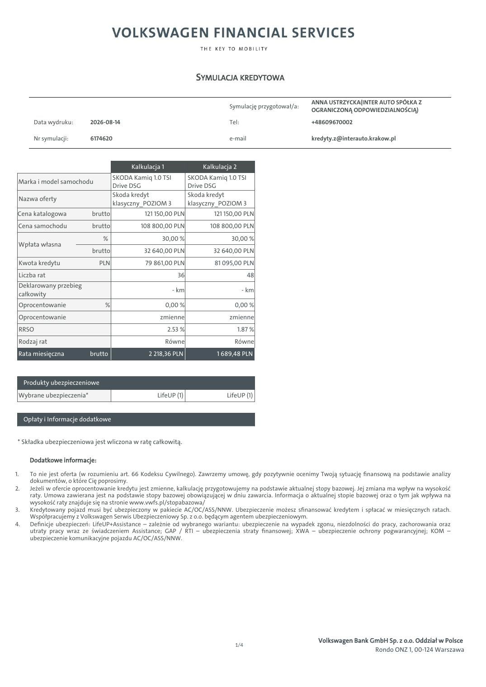
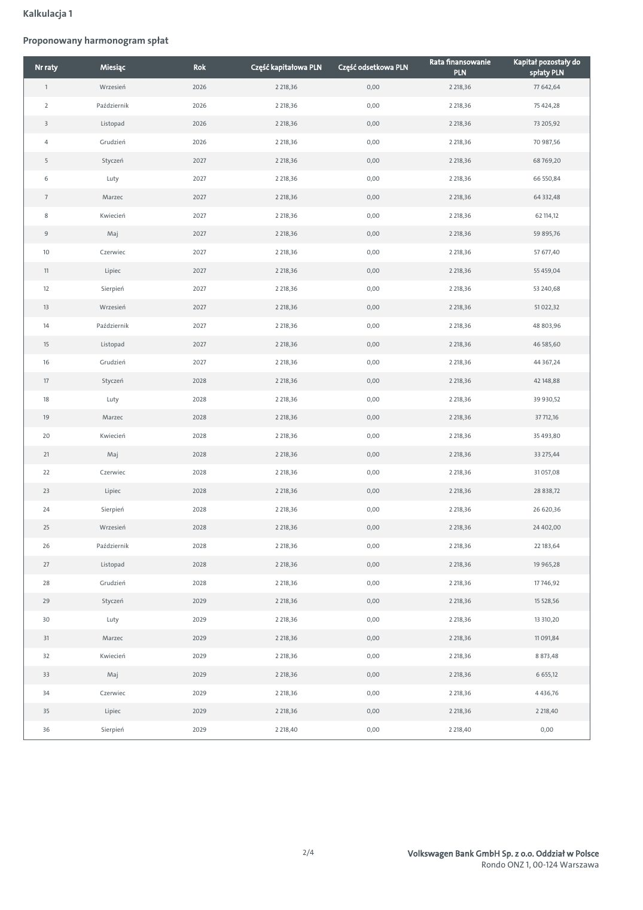
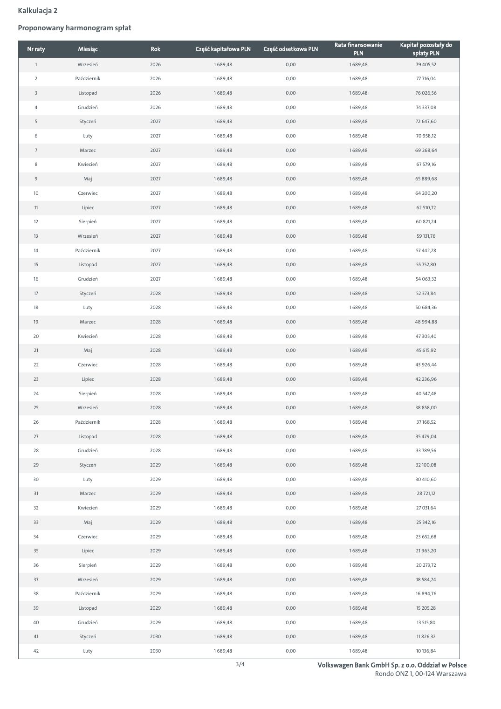
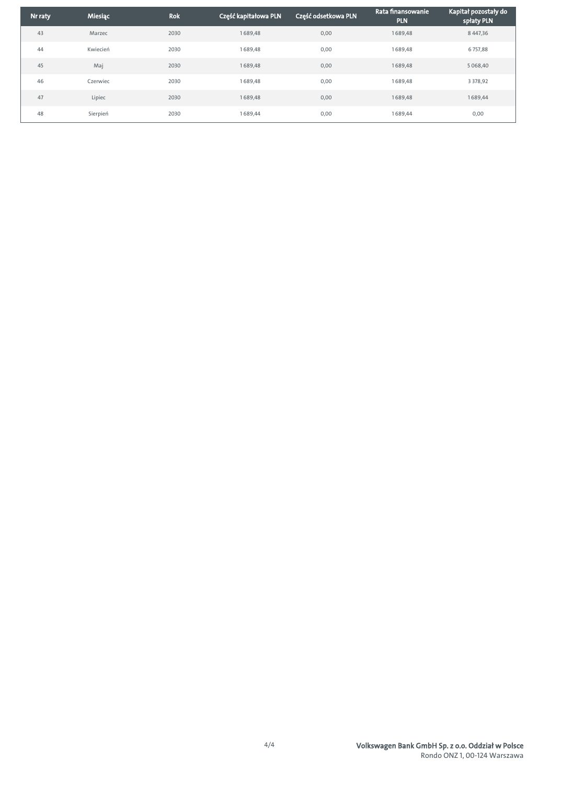

# Škoda - symulacja kredytowa 6174620

| Pole | Wartość |
|---|---|
| Źródłowy PDF | `simulation-6174620.pdf` |
| Liczba stron | 5 |
| Ekstrakcja tekstu | `pdftotext -layout`, UTF-8 |
| Reprezentacja wizualna | render każdej strony, 130 DPI, JPEG |

> Treść pozostawiono w brzmieniu źródłowym. Nie poprawiano literówek, wartości, nazw ani niespójności występujących w PDF-ie.

## Spis stron

[Strona 1](#strona-1) · [Strona 2](#strona-2) · [Strona 3](#strona-3) · [Strona 4](#strona-4) · [Strona 5](#strona-5)

## Strona 1

[Otwórz obraz strony 1 w pełnej rozdzielczości](assets/16-simulation-6174620/page-001.jpg)

### Tekst z warstwy PDF

~~~~text
                                                                      SYMULACJA KREDYTOWA

                                                                                                            ANNA USTRZYCKA(INTER AUTO SPÓŁKA Z
                                                                                 Symulację przygotował/a:
                                                                                                            OGRANICZONĄ ODPOWIEDZIALNOŚCIĄ)
        Data wydruku:       2026-08-14                                           Tel:                       +48609670002

        Nr symulacji:       6174620                                              e-mail                     kredyty.z@interauto.krakow.pl

                                            Kalkulacja 1                Kalkulacja 2
                                      SKODA Kamiq 1.0 TSI           SKODA Kamiq 1.0 TSI
 Marka i model samochodu
                                      Drive DSG                     Drive DSG
                                      Skoda kredyt                  Skoda kredyt
 Nazwa oferty
                                      klasyczny_POZIOM 3            klasyczny_POZIOM 3
 Cena katalogowa            brutto              121 150,00 PLN              121 150,00 PLN
 Cena samochodu              brutto            108 800,00 PLN              108 800,00 PLN
                                %                      30,00 %                    30,00 %
 Wpłata własna
                             brutto             32 640,00 PLN               32 640,00 PLN
 Kwota kredytu                 PLN               79 861,00 PLN              81 095,00 PLN
 Liczba rat                                                   36                          48
 Deklarowany przebieg
                                                             - km                       - km
 całkowity
 Oprocentowanie                  %                         0,00 %                  0,00 %
 Oprocentowanie                                       zmienne                    zmienne
 RRSO                                                      2.53 %                      1.87 %
 Rodzaj rat                                                Równe                   Równe
 Rata miesięczna            brutto                2 218,36 PLN               1 689,48 PLN

     Produkty ubezpieczeniowe
 Wybrane ubezpieczenia*                              LifeUP (1)                 LifeUP (1)

     Opłaty i Informacje dodatkowe

 * Składka ubezpieczeniowa jest wliczona w ratę całkowitą.

       Dodatkowe informacje:

1.     To nie jest oferta (w rozumieniu art. 66 Kodeksu Cywilnego). Zawrzemy umowę, gdy pozytywnie ocenimy Twoją sytuację finansową na podstawie analizy
       dokumentów, o które Cię poprosimy.
2.     Jeżeli w ofercie oprocentowanie kredytu jest zmienne, kalkulację przygotowujemy na podstawie aktualnej stopy bazowej. Jej zmiana ma wpływ na wysokość
       raty. Umowa zawierana jest na podstawie stopy bazowej obowiązującej w dniu zawarcia. Informacja o aktualnej stopie bazowej oraz o tym jak wpływa na
       wysokość raty znajduje się na stronie www.vwfs.pl/stopabazowa/
3.     Kredytowany pojazd musi być ubezpieczony w pakiecie AC/OC/ASS/NNW. Ubezpieczenie możesz sfinansować kredytem i spłacać w miesięcznych ratach.
       Współpracujemy z Volkswagen Serwis Ubezpieczeniowy Sp. z o.o. będącym agentem ubezpieczeniowym.
4.     Definicje ubezpieczeń: LifeUP+Assistance – zależnie od wybranego wariantu: ubezpieczenie na wypadek zgonu, niezdolności do pracy, zachorowania oraz
       utraty pracy wraz ze świadczeniem Assistance; GAP / RTI – ubezpieczenia straty finansowej; XWA – ubezpieczenie ochrony pogwarancyjnej; KOM –
       ubezpieczenie komunikacyjne pojazdu AC/OC/ASS/NNW.

                                                                                                              Volkswagen Bank GmbH Sp. z o.o. Oddział w Polsce
                                                                                   1/4
                                                                                                                               Rondo ONZ 1, 00-124 Warszawa
~~~~

## Strona 2

[Otwórz obraz strony 2 w pełnej rozdzielczości](assets/16-simulation-6174620/page-002.jpg)

### Tekst z warstwy PDF

~~~~text
Kalkulacja 1

Proponowany harmonogram spłat

                                                                                     Rata finansowanie    Kapitał pozostały do
  Nr raty       Miesiąc         Rok    Część kapitałowa PLN   Część odsetkowa PLN
                                                                                             PLN               spłaty PLN
     1          Wrzesień        2026         2 218,36                0,00                 2 218,36              77 642,64

     2         Październik      2026         2 218,36                0,00                 2 218,36              75 424,28

     3          Listopad        2026         2 218,36                0,00                 2 218,36              73 205,92

     4          Grudzień        2026         2 218,36                0,00                 2 218,36              70 987,56

     5          Styczeń         2027         2 218,36                0,00                 2 218,36             68 769,20

     6            Luty          2027         2 218,36                0,00                 2 218,36             66 550,84

     7           Marzec         2027         2 218,36                0,00                 2 218,36             64 332,48

     8          Kwiecień        2027         2 218,36                0,00                 2 218,36              62 114,12

     9            Maj           2027         2 218,36                0,00                 2 218,36             59 895,76

    10          Czerwiec        2027         2 218,36                0,00                 2 218,36              57 677,40

     11          Lipiec         2027         2 218,36                0,00                 2 218,36              55 459,04

    12          Sierpień        2027         2 218,36                0,00                 2 218,36             53 240,68

    13          Wrzesień        2027         2 218,36                0,00                 2 218,36              51 022,32

    14         Październik      2027         2 218,36                0,00                 2 218,36             48 803,96

     15         Listopad        2027         2 218,36                0,00                 2 218,36             46 585,60

    16          Grudzień        2027         2 218,36                0,00                 2 218,36              44 367,24

     17         Styczeń         2028         2 218,36                0,00                 2 218,36              42 148,88

    18            Luty          2028         2 218,36                0,00                 2 218,36             39 930,52

    19           Marzec         2028         2 218,36                0,00                 2 218,36              37 712,16

    20          Kwiecień        2028         2 218,36                0,00                 2 218,36             35 493,80

    21            Maj           2028         2 218,36                0,00                 2 218,36              33 275,44

    22          Czerwiec        2028         2 218,36                0,00                 2 218,36              31 057,08

    23           Lipiec         2028         2 218,36                0,00                 2 218,36              28 838,72

    24          Sierpień        2028         2 218,36                0,00                 2 218,36             26 620,36

    25          Wrzesień        2028         2 218,36                0,00                 2 218,36             24 402,00

    26         Październik      2028         2 218,36                0,00                 2 218,36              22 183,64

    27          Listopad        2028         2 218,36                0,00                 2 218,36              19 965,28

    28          Grudzień        2028         2 218,36                0,00                 2 218,36              17 746,92

    29          Styczeń         2029         2 218,36                0,00                 2 218,36              15 528,56

    30            Luty          2029         2 218,36                0,00                 2 218,36              13 310,20

    31           Marzec         2029         2 218,36                0,00                 2 218,36              11 091,84

    32          Kwiecień        2029         2 218,36                0,00                 2 218,36              8 873,48

    33            Maj           2029         2 218,36                0,00                 2 218,36              6 655,12

    34          Czerwiec        2029         2 218,36                0,00                 2 218,36              4 436,76

    35           Lipiec         2029         2 218,36                0,00                 2 218,36              2 218,40

    36          Sierpień        2029         2 218,40                0,00                 2 218,40                0,00

                                                        2/4                     Volkswagen Bank GmbH Sp. z o.o. Oddział w Polsce
                                                                                                 Rondo ONZ 1, 00-124 Warszawa
~~~~

## Strona 3

[Otwórz obraz strony 3 w pełnej rozdzielczości](assets/16-simulation-6174620/page-003.jpg)

### Tekst z warstwy PDF

~~~~text
Kalkulacja 2

Proponowany harmonogram spłat

                                                                                     Rata finansowanie    Kapitał pozostały do
  Nr raty       Miesiąc         Rok    Część kapitałowa PLN   Część odsetkowa PLN
                                                                                             PLN               spłaty PLN
     1          Wrzesień        2026         1 689,48                0,00                 1 689,48              79 405,52

     2         Październik      2026         1 689,48                0,00                 1 689,48              77 716,04

     3          Listopad        2026         1 689,48                0,00                 1 689,48             76 026,56

     4          Grudzień        2026         1 689,48                0,00                 1 689,48              74 337,08

     5          Styczeń         2027         1 689,48                0,00                 1 689,48             72 647,60

     6            Luty          2027         1 689,48                0,00                 1 689,48              70 958,12

     7           Marzec         2027         1 689,48                0,00                 1 689,48             69 268,64

     8          Kwiecień        2027         1 689,48                0,00                 1 689,48              67 579,16

     9            Maj           2027         1 689,48                0,00                 1 689,48             65 889,68

    10          Czerwiec        2027         1 689,48                0,00                 1 689,48             64 200,20

    11           Lipiec         2027         1 689,48                0,00                 1 689,48              62 510,72

    12          Sierpień        2027         1 689,48                0,00                 1 689,48              60 821,24

    13          Wrzesień        2027         1 689,48                0,00                 1 689,48              59 131,76

    14         Październik      2027         1 689,48                0,00                 1 689,48              57 442,28

    15          Listopad        2027         1 689,48                0,00                 1 689,48              55 752,80

    16          Grudzień        2027         1 689,48                0,00                 1 689,48              54 063,32

    17          Styczeń         2028         1 689,48                0,00                 1 689,48              52 373,84

    18            Luty          2028         1 689,48                0,00                 1 689,48             50 684,36

    19           Marzec         2028         1 689,48                0,00                 1 689,48             48 994,88

    20          Kwiecień        2028         1 689,48                0,00                 1 689,48              47 305,40

    21            Maj           2028         1 689,48                0,00                 1 689,48              45 615,92

    22          Czerwiec        2028         1 689,48                0,00                 1 689,48             43 926,44

    23           Lipiec         2028         1 689,48                0,00                 1 689,48             42 236,96

    24          Sierpień        2028         1 689,48                0,00                 1 689,48             40 547,48

    25          Wrzesień        2028         1 689,48                0,00                 1 689,48             38 858,00

    26         Październik      2028         1 689,48                0,00                 1 689,48              37 168,52

    27          Listopad        2028         1 689,48                0,00                 1 689,48              35 479,04

    28          Grudzień        2028         1 689,48                0,00                 1 689,48              33 789,56

    29          Styczeń         2029         1 689,48                0,00                 1 689,48              32 100,08

    30            Luty          2029         1 689,48                0,00                 1 689,48             30 410,60

    31           Marzec         2029         1 689,48                0,00                 1 689,48              28 721,12

    32          Kwiecień        2029         1 689,48                0,00                 1 689,48              27 031,64

    33            Maj           2029         1 689,48                0,00                 1 689,48              25 342,16

    34          Czerwiec        2029         1 689,48                0,00                 1 689,48              23 652,68

    35           Lipiec         2029         1 689,48                0,00                 1 689,48              21 963,20

    36          Sierpień        2029         1 689,48                0,00                 1 689,48              20 273,72

    37          Wrzesień        2029         1 689,48                0,00                 1 689,48              18 584,24

    38         Październik      2029         1 689,48                0,00                 1 689,48              16 894,76

    39          Listopad        2029         1 689,48                0,00                 1 689,48              15 205,28

    40          Grudzień        2029         1 689,48                0,00                 1 689,48              13 515,80

    41          Styczeń         2030         1 689,48                0,00                 1 689,48              11 826,32

    42            Luty          2030         1 689,48                0,00                 1 689,48              10 136,84

                                                        3/4                     Volkswagen Bank GmbH Sp. z o.o. Oddział w Polsce
                                                                                                 Rondo ONZ 1, 00-124 Warszawa
~~~~

## Strona 4

[Otwórz obraz strony 4 w pełnej rozdzielczości](assets/16-simulation-6174620/page-004.jpg)

### Tekst z warstwy PDF

~~~~text
                                                                          Rata finansowanie    Kapitał pozostały do
Nr raty   Miesiąc    Rok    Część kapitałowa PLN   Część odsetkowa PLN
                                                                                  PLN               spłaty PLN
  43      Marzec     2030         1 689,48                0,00                 1 689,48              8 447,36

  44      Kwiecień   2030         1 689,48                0,00                 1 689,48              6 757,88

  45        Maj      2030         1 689,48                0,00                 1 689,48              5 068,40

  46      Czerwiec   2030         1 689,48                0,00                 1 689,48              3 378,92

  47       Lipiec    2030         1 689,48                0,00                 1 689,48              1 689,44

  48      Sierpień   2030         1 689,44                0,00                 1 689,44                0,00

                                             4/4                     Volkswagen Bank GmbH Sp. z o.o. Oddział w Polsce
                                                                                      Rondo ONZ 1, 00-124 Warszawa
~~~~

## Strona 5

[Otwórz obraz strony 5 w pełnej rozdzielczości](assets/16-simulation-6174620/page-005.jpg)

### Tekst z warstwy PDF

~~~~text
                                         Poznaj produkty finansowe Volkswagen Financial Services

                        NAJEM                                        Kredyt JAK ABONAMENT                                                Kredyt KLASYCZNY

Dla kogo?                                                      Dla kogo?                                                      Dla kogo?
Jeśli cenisz sobie wygodę i chcesz mieć jedną stałą            Jeśli chcesz korzystać z rat niższych niż                      Jeśli preferujesz tradycyjne rozwiązania finansowe
miesięczną opłatę z wszystkimi usługami                        w tradycyjnym kredycie, a decyzję czy auto                     i chcesz korzystać z auta także po zakończeniu
dodatkowymi w cenie, zapytaj o NAJEM.                          wykupić wolisz podjąć później, zapytaj o kredyt                finansowania, zapytaj o kredyt KLASYCZNY.
                                                               JAK ABONAMENT.

                         NAJEM                                                        Kredyt                                                         Kredyt
                  Usługi w stałej opłacie                                        JAK ABONAMENT                                                     KLASYCZNY

                                                                                                      Za tę część
                                                                                                      nie płacisz

                                                                                                    Koniec umowy:
 Opcjonalna        Stała opłata            Koniec umowy:          Opcjonalny      Miesięczne raty   zwracasz auto lub             Opcjonalny     Okres finansowania   Ostatnia rata finalizuje
 opłata początkowa miesięczna               zwracasz auto         wkład własny                      spłacasz je jednorazowo       wkład własny          1-7 lat           zakup samochodu.
                                  i możesz wynająć kolejne                                          bądź w ratach                 0-70%
                                   w ramach nowej umowy

         Masz jedną stałą miesięczną opłatę                             Twoje raty są naliczane tylko od                               Masz tradycyjne finansowanie rozłożone
         i po prostu korzystasz z samochodu.                            prognozowanej utraty wartości umowy.                           nawet na 7 lat i korzystasz z niskich
                                                                                                                                       kosztów całkowitych kredytu.
         W opłacie jest już ubezpieczenie, serwis,                      Mając niskie raty, możesz zdecydować się
         assistance, auto zastępcze, pomoc                              na większy lub lepiej wyposażony                               Spłacasz w ratach całą wartość
         w przypadku szkody, a także opony (opcja).                     samochód.                                                      samochodu.

         Umowa się kończy – zwracasz auto                               Dopiero na koniec umowy decydujesz, czy                        Po zakończeniu finansowania nadal
         i możesz wziąć kolejne w ramach nowej                          wykupić auto jednorazowo lub w ratach,                         użytkujesz swoje auto.
         umowy.                                                         czy wziąć kolejne w ramach nowej
                                                                        umowy.

                                                             Zapytaj Doradcę o dodatkowe usługi

                                      Ubezpieczenia komunikacyjne                                                               Pakiety przeglądów serwisowych
              W raty możesz mieć wliczony pełen                          Korzystasz z likwidacji szkód                                    Płacisz z góry za przeglądy i w ten
              pakiet ubezpieczeń OC, AC i NNW,                           z pominięciem ubezpieczyciela                                    sposób uniezależniasz się od
              przygotowanych przez Allianz, Ergo                         sprawcy, a naprawy są wykonywane                                 ewentualnych wzrostów cen części
              Hestia lub Wartę.                                          w ASO i z użyciem oryginalnych części.                           oraz usług serwisowych.

                                                                                       O nas

   Jesteśmy nr 1 w finansowaniu aut osobowych w Polsce. Odpowiadając na potrzeby naszych Klientów, tworzymy                                              Zeskanuj kod i skorzystaj
   nowoczesne rozwiązania gwarantujące mobilność. Oferujemy im finansowanie, ubezpieczenia oraz wiele usług                                                z kalkulatora online.
   dodatkowych.

   Nr 1 w finansowaniu                      Największa firma                 Finansowanie aut marek:                Decyzja o finansowaniu
   samochodów osobowych*                    leasingowa w Polsce              Volkswagen, Audi, SEAT,                nawet w 60 minut
                                                                             Škoda, Volkswagen                      i formalności online
   *źródło: SAMAR, CEPiK; LEASING /                                          Samochody Dostawcze,
   CFM – rejestracje 2023
                                                                             Porsche i CUPRA

Niniejsza informacja nie stanowi oferty w rozumieniu Kodeksu cywilnego. Dostępność i warunki produktu mogą ulec zmianie. Warunki produktu określa umowa.
~~~~
