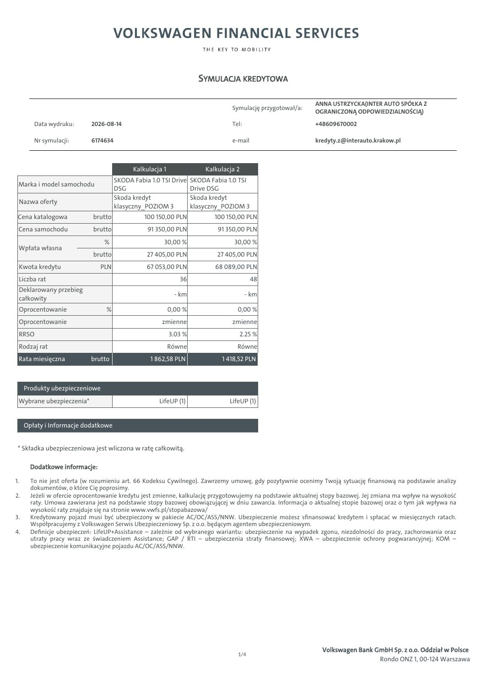
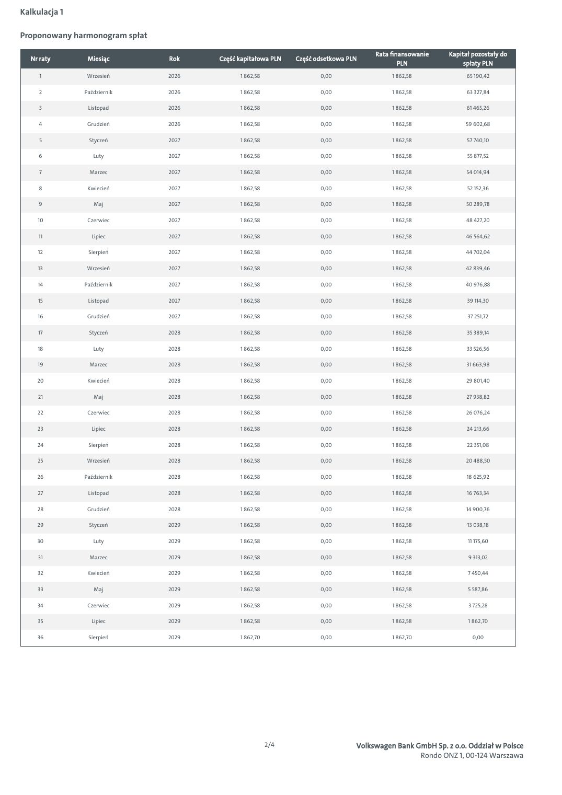
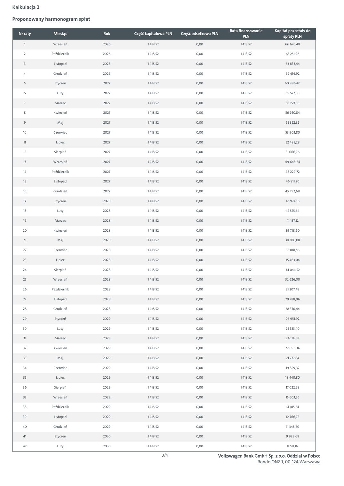
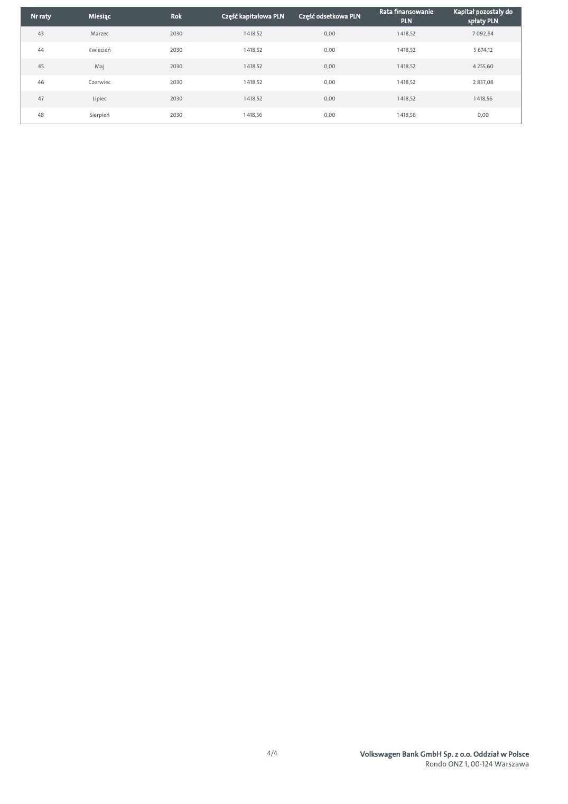

# Škoda - symulacja kredytowa 6174634

| Pole | Wartość |
|---|---|
| Źródłowy PDF | `simulation-6174634.pdf` |
| Liczba stron | 5 |
| Ekstrakcja tekstu | `pdftotext -layout`, UTF-8 |
| Reprezentacja wizualna | render każdej strony, 130 DPI, JPEG |

> Treść pozostawiono w brzmieniu źródłowym. Nie poprawiano literówek, wartości, nazw ani niespójności występujących w PDF-ie.

## Spis stron

[Strona 1](#strona-1) · [Strona 2](#strona-2) · [Strona 3](#strona-3) · [Strona 4](#strona-4) · [Strona 5](#strona-5)

## Strona 1

[Otwórz obraz strony 1 w pełnej rozdzielczości](assets/17-simulation-6174634/page-001.jpg)

### Tekst z warstwy PDF

~~~~text
                                                                    SYMULACJA KREDYTOWA

                                                                                                          ANNA USTRZYCKA(INTER AUTO SPÓŁKA Z
                                                                              Symulację przygotował/a:
                                                                                                          OGRANICZONĄ ODPOWIEDZIALNOŚCIĄ)
        Data wydruku:       2026-08-14                                        Tel:                        +48609670002

        Nr symulacji:       6174634                                           e-mail                      kredyty.z@interauto.krakow.pl

                                            Kalkulacja 1             Kalkulacja 2
                                      SKODA Fabia 1.0 TSI Drive SKODA Fabia 1.0 TSI
 Marka i model samochodu
                                      DSG                       Drive DSG
                                      Skoda kredyt              Skoda kredyt
 Nazwa oferty
                                      klasyczny_POZIOM 3        klasyczny_POZIOM 3
 Cena katalogowa            brutto              100 150,00 PLN          100 150,00 PLN
 Cena samochodu              brutto              91 350,00 PLN           91 350,00 PLN
                                %                      30,00 %                 30,00 %
 Wpłata własna
                             brutto              27 405,00 PLN           27 405,00 PLN
 Kwota kredytu                 PLN              67 053,00 PLN           68 089,00 PLN
 Liczba rat                                                   36                       48
 Deklarowany przebieg
                                                             - km                    - km
 całkowity
 Oprocentowanie                  %                         0,00 %               0,00 %
 Oprocentowanie                                       zmienne                 zmienne
 RRSO                                                      3.03 %                   2.25 %
 Rodzaj rat                                                Równe                Równe
 Rata miesięczna            brutto                1 862,58 PLN            1 418,52 PLN

     Produkty ubezpieczeniowe
 Wybrane ubezpieczenia*                              LifeUP (1)              LifeUP (1)

     Opłaty i Informacje dodatkowe

 * Składka ubezpieczeniowa jest wliczona w ratę całkowitą.

       Dodatkowe informacje:

1.     To nie jest oferta (w rozumieniu art. 66 Kodeksu Cywilnego). Zawrzemy umowę, gdy pozytywnie ocenimy Twoją sytuację finansową na podstawie analizy
       dokumentów, o które Cię poprosimy.
2.     Jeżeli w ofercie oprocentowanie kredytu jest zmienne, kalkulację przygotowujemy na podstawie aktualnej stopy bazowej. Jej zmiana ma wpływ na wysokość
       raty. Umowa zawierana jest na podstawie stopy bazowej obowiązującej w dniu zawarcia. Informacja o aktualnej stopie bazowej oraz o tym jak wpływa na
       wysokość raty znajduje się na stronie www.vwfs.pl/stopabazowa/
3.     Kredytowany pojazd musi być ubezpieczony w pakiecie AC/OC/ASS/NNW. Ubezpieczenie możesz sfinansować kredytem i spłacać w miesięcznych ratach.
       Współpracujemy z Volkswagen Serwis Ubezpieczeniowy Sp. z o.o. będącym agentem ubezpieczeniowym.
4.     Definicje ubezpieczeń: LifeUP+Assistance – zależnie od wybranego wariantu: ubezpieczenie na wypadek zgonu, niezdolności do pracy, zachorowania oraz
       utraty pracy wraz ze świadczeniem Assistance; GAP / RTI – ubezpieczenia straty finansowej; XWA – ubezpieczenie ochrony pogwarancyjnej; KOM –
       ubezpieczenie komunikacyjne pojazdu AC/OC/ASS/NNW.

                                                                                                             Volkswagen Bank GmbH Sp. z o.o. Oddział w Polsce
                                                                                1/4
                                                                                                                              Rondo ONZ 1, 00-124 Warszawa
~~~~

## Strona 2

[Otwórz obraz strony 2 w pełnej rozdzielczości](assets/17-simulation-6174634/page-002.jpg)

### Tekst z warstwy PDF

~~~~text
Kalkulacja 1

Proponowany harmonogram spłat

                                                                                     Rata finansowanie    Kapitał pozostały do
  Nr raty       Miesiąc         Rok    Część kapitałowa PLN   Część odsetkowa PLN
                                                                                             PLN               spłaty PLN
     1          Wrzesień        2026         1 862,58                0,00                 1 862,58              65 190,42

     2         Październik      2026         1 862,58                0,00                 1 862,58              63 327,84

     3          Listopad        2026         1 862,58                0,00                 1 862,58              61 465,26

     4          Grudzień        2026         1 862,58                0,00                 1 862,58             59 602,68

     5          Styczeń         2027         1 862,58                0,00                 1 862,58              57 740,10

     6            Luty          2027         1 862,58                0,00                 1 862,58              55 877,52

     7           Marzec         2027         1 862,58                0,00                 1 862,58              54 014,94

     8          Kwiecień        2027         1 862,58                0,00                 1 862,58              52 152,36

     9            Maj           2027         1 862,58                0,00                 1 862,58             50 289,78

    10          Czerwiec        2027         1 862,58                0,00                 1 862,58             48 427,20

     11          Lipiec         2027         1 862,58                0,00                 1 862,58             46 564,62

    12          Sierpień        2027         1 862,58                0,00                 1 862,58             44 702,04

    13          Wrzesień        2027         1 862,58                0,00                 1 862,58             42 839,46

    14         Październik      2027         1 862,58                0,00                 1 862,58             40 976,88

     15         Listopad        2027         1 862,58                0,00                 1 862,58              39 114,30

    16          Grudzień        2027         1 862,58                0,00                 1 862,58              37 251,72

     17         Styczeń         2028         1 862,58                0,00                 1 862,58              35 389,14

    18            Luty          2028         1 862,58                0,00                 1 862,58              33 526,56

    19           Marzec         2028         1 862,58                0,00                 1 862,58              31 663,98

    20          Kwiecień        2028         1 862,58                0,00                 1 862,58             29 801,40

    21            Maj           2028         1 862,58                0,00                 1 862,58              27 938,82

    22          Czerwiec        2028         1 862,58                0,00                 1 862,58             26 076,24

    23           Lipiec         2028         1 862,58                0,00                 1 862,58              24 213,66

    24          Sierpień        2028         1 862,58                0,00                 1 862,58              22 351,08

    25          Wrzesień        2028         1 862,58                0,00                 1 862,58             20 488,50

    26         Październik      2028         1 862,58                0,00                 1 862,58              18 625,92

    27          Listopad        2028         1 862,58                0,00                 1 862,58              16 763,34

    28          Grudzień        2028         1 862,58                0,00                 1 862,58             14 900,76

    29          Styczeń         2029         1 862,58                0,00                 1 862,58              13 038,18

    30            Luty          2029         1 862,58                0,00                 1 862,58              11 175,60

    31           Marzec         2029         1 862,58                0,00                 1 862,58              9 313,02

    32          Kwiecień        2029         1 862,58                0,00                 1 862,58              7 450,44

    33            Maj           2029         1 862,58                0,00                 1 862,58              5 587,86

    34          Czerwiec        2029         1 862,58                0,00                 1 862,58              3 725,28

    35           Lipiec         2029         1 862,58                0,00                 1 862,58              1 862,70

    36          Sierpień        2029         1 862,70                0,00                 1 862,70                0,00

                                                        2/4                     Volkswagen Bank GmbH Sp. z o.o. Oddział w Polsce
                                                                                                 Rondo ONZ 1, 00-124 Warszawa
~~~~

## Strona 3

[Otwórz obraz strony 3 w pełnej rozdzielczości](assets/17-simulation-6174634/page-003.jpg)

### Tekst z warstwy PDF

~~~~text
Kalkulacja 2

Proponowany harmonogram spłat

                                                                                      Rata finansowanie    Kapitał pozostały do
  Nr raty       Miesiąc         Rok    Część kapitałowa PLN    Część odsetkowa PLN
                                                                                              PLN               spłaty PLN
     1          Wrzesień        2026          1 418,52                0,00                 1 418,52             66 670,48

     2         Październik      2026          1 418,52                0,00                 1 418,52              65 251,96

     3          Listopad        2026          1 418,52                0,00                 1 418,52             63 833,44

     4          Grudzień        2026          1 418,52                0,00                 1 418,52              62 414,92

     5          Styczeń         2027          1 418,52                0,00                 1 418,52             60 996,40

     6            Luty          2027          1 418,52                0,00                 1 418,52              59 577,88

     7           Marzec         2027          1 418,52                0,00                 1 418,52              58 159,36

     8          Kwiecień        2027          1 418,52                0,00                 1 418,52             56 740,84

     9            Maj           2027          1 418,52                0,00                 1 418,52              55 322,32

    10          Czerwiec        2027          1 418,52                0,00                 1 418,52             53 903,80

    11           Lipiec         2027          1 418,52                0,00                 1 418,52              52 485,28

    12          Sierpień        2027          1 418,52                0,00                 1 418,52              51 066,76

    13          Wrzesień        2027          1 418,52                0,00                 1 418,52             49 648,24

    14         Październik      2027          1 418,52                0,00                 1 418,52              48 229,72

    15          Listopad        2027          1 418,52                0,00                 1 418,52              46 811,20

    16          Grudzień        2027          1 418,52                0,00                 1 418,52             45 392,68

    17          Styczeń         2028          1 418,52                0,00                 1 418,52              43 974,16

    18            Luty          2028          1 418,52                0,00                 1 418,52              42 555,64

    19           Marzec         2028          1 418,52                0,00                 1 418,52              41 137,12

    20          Kwiecień        2028          1 418,52                0,00                 1 418,52              39 718,60

    21            Maj           2028          1 418,52                0,00                 1 418,52             38 300,08

    22          Czerwiec        2028          1 418,52                0,00                 1 418,52              36 881,56

    23           Lipiec         2028          1 418,52                0,00                 1 418,52             35 463,04

    24          Sierpień        2028          1 418,52                0,00                 1 418,52              34 044,52

    25          Wrzesień        2028          1 418,52                0,00                 1 418,52             32 626,00

    26         Październik      2028          1 418,52                0,00                 1 418,52              31 207,48

    27          Listopad        2028          1 418,52                0,00                 1 418,52             29 788,96

    28          Grudzień        2028          1 418,52                0,00                 1 418,52              28 370,44

    29          Styczeń         2029          1 418,52                0,00                 1 418,52              26 951,92

    30            Luty          2029          1 418,52                0,00                 1 418,52              25 533,40

    31           Marzec         2029          1 418,52                0,00                 1 418,52              24 114,88

    32          Kwiecień        2029          1 418,52                0,00                 1 418,52             22 696,36

    33            Maj           2029          1 418,52                0,00                 1 418,52              21 277,84

    34          Czerwiec        2029          1 418,52                0,00                 1 418,52              19 859,32

    35           Lipiec         2029          1 418,52                0,00                 1 418,52             18 440,80

    36          Sierpień        2029          1 418,52                0,00                 1 418,52              17 022,28

    37          Wrzesień        2029          1 418,52                0,00                 1 418,52              15 603,76

    38         Październik      2029          1 418,52                0,00                 1 418,52              14 185,24

    39          Listopad        2029          1 418,52                0,00                 1 418,52              12 766,72

    40          Grudzień        2029          1 418,52                0,00                 1 418,52              11 348,20

    41          Styczeń         2030          1 418,52                0,00                 1 418,52              9 929,68

    42            Luty          2030          1 418,52                0,00                 1 418,52               8 511,16

                                                         3/4                     Volkswagen Bank GmbH Sp. z o.o. Oddział w Polsce
                                                                                                  Rondo ONZ 1, 00-124 Warszawa
~~~~

## Strona 4

[Otwórz obraz strony 4 w pełnej rozdzielczości](assets/17-simulation-6174634/page-004.jpg)

### Tekst z warstwy PDF

~~~~text
                                                                           Rata finansowanie    Kapitał pozostały do
Nr raty   Miesiąc    Rok    Część kapitałowa PLN    Część odsetkowa PLN
                                                                                   PLN               spłaty PLN
  43      Marzec     2030          1 418,52                0,00                 1 418,52              7 092,64

  44      Kwiecień   2030          1 418,52                0,00                 1 418,52              5 674,12

  45        Maj      2030          1 418,52                0,00                 1 418,52              4 255,60

  46      Czerwiec   2030          1 418,52                0,00                 1 418,52              2 837,08

  47       Lipiec    2030          1 418,52                0,00                 1 418,52              1 418,56

  48      Sierpień   2030          1 418,56                0,00                 1 418,56                0,00

                                              4/4                     Volkswagen Bank GmbH Sp. z o.o. Oddział w Polsce
                                                                                       Rondo ONZ 1, 00-124 Warszawa
~~~~

## Strona 5

[Otwórz obraz strony 5 w pełnej rozdzielczości](assets/17-simulation-6174634/page-005.jpg)

### Tekst z warstwy PDF

~~~~text
                                         Poznaj produkty finansowe Volkswagen Financial Services

                        NAJEM                                        Kredyt JAK ABONAMENT                                                Kredyt KLASYCZNY

Dla kogo?                                                      Dla kogo?                                                      Dla kogo?
Jeśli cenisz sobie wygodę i chcesz mieć jedną stałą            Jeśli chcesz korzystać z rat niższych niż                      Jeśli preferujesz tradycyjne rozwiązania finansowe
miesięczną opłatę z wszystkimi usługami                        w tradycyjnym kredycie, a decyzję czy auto                     i chcesz korzystać z auta także po zakończeniu
dodatkowymi w cenie, zapytaj o NAJEM.                          wykupić wolisz podjąć później, zapytaj o kredyt                finansowania, zapytaj o kredyt KLASYCZNY.
                                                               JAK ABONAMENT.

                         NAJEM                                                        Kredyt                                                         Kredyt
                  Usługi w stałej opłacie                                        JAK ABONAMENT                                                     KLASYCZNY

                                                                                                      Za tę część
                                                                                                      nie płacisz

                                                                                                    Koniec umowy:
 Opcjonalna        Stała opłata            Koniec umowy:          Opcjonalny      Miesięczne raty   zwracasz auto lub             Opcjonalny     Okres finansowania   Ostatnia rata finalizuje
 opłata początkowa miesięczna               zwracasz auto         wkład własny                      spłacasz je jednorazowo       wkład własny          1-7 lat           zakup samochodu.
                                  i możesz wynająć kolejne                                          bądź w ratach                 0-70%
                                   w ramach nowej umowy

         Masz jedną stałą miesięczną opłatę                             Twoje raty są naliczane tylko od                               Masz tradycyjne finansowanie rozłożone
         i po prostu korzystasz z samochodu.                            prognozowanej utraty wartości umowy.                           nawet na 7 lat i korzystasz z niskich
                                                                                                                                       kosztów całkowitych kredytu.
         W opłacie jest już ubezpieczenie, serwis,                      Mając niskie raty, możesz zdecydować się
         assistance, auto zastępcze, pomoc                              na większy lub lepiej wyposażony                               Spłacasz w ratach całą wartość
         w przypadku szkody, a także opony (opcja).                     samochód.                                                      samochodu.

         Umowa się kończy – zwracasz auto                               Dopiero na koniec umowy decydujesz, czy                        Po zakończeniu finansowania nadal
         i możesz wziąć kolejne w ramach nowej                          wykupić auto jednorazowo lub w ratach,                         użytkujesz swoje auto.
         umowy.                                                         czy wziąć kolejne w ramach nowej
                                                                        umowy.

                                                             Zapytaj Doradcę o dodatkowe usługi

                                      Ubezpieczenia komunikacyjne                                                               Pakiety przeglądów serwisowych
              W raty możesz mieć wliczony pełen                          Korzystasz z likwidacji szkód                                    Płacisz z góry za przeglądy i w ten
              pakiet ubezpieczeń OC, AC i NNW,                           z pominięciem ubezpieczyciela                                    sposób uniezależniasz się od
              przygotowanych przez Allianz, Ergo                         sprawcy, a naprawy są wykonywane                                 ewentualnych wzrostów cen części
              Hestia lub Wartę.                                          w ASO i z użyciem oryginalnych części.                           oraz usług serwisowych.

                                                                                       O nas

   Jesteśmy nr 1 w finansowaniu aut osobowych w Polsce. Odpowiadając na potrzeby naszych Klientów, tworzymy                                              Zeskanuj kod i skorzystaj
   nowoczesne rozwiązania gwarantujące mobilność. Oferujemy im finansowanie, ubezpieczenia oraz wiele usług                                                z kalkulatora online.
   dodatkowych.

   Nr 1 w finansowaniu                      Największa firma                 Finansowanie aut marek:                Decyzja o finansowaniu
   samochodów osobowych*                    leasingowa w Polsce              Volkswagen, Audi, SEAT,                nawet w 60 minut
                                                                             Škoda, Volkswagen                      i formalności online
   *źródło: SAMAR, CEPiK; LEASING /                                          Samochody Dostawcze,
   CFM – rejestracje 2023
                                                                             Porsche i CUPRA

Niniejsza informacja nie stanowi oferty w rozumieniu Kodeksu cywilnego. Dostępność i warunki produktu mogą ulec zmianie. Warunki produktu określa umowa.
~~~~
