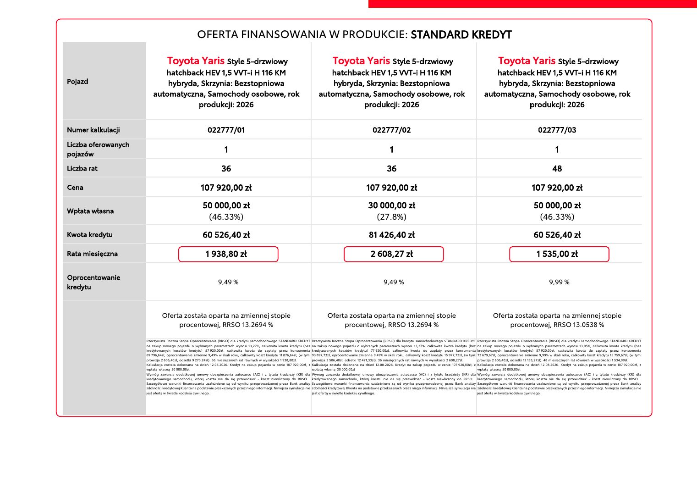
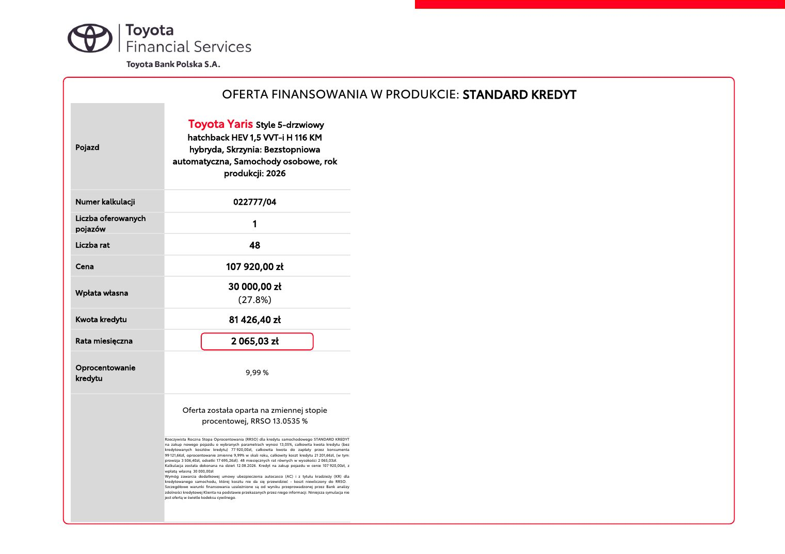
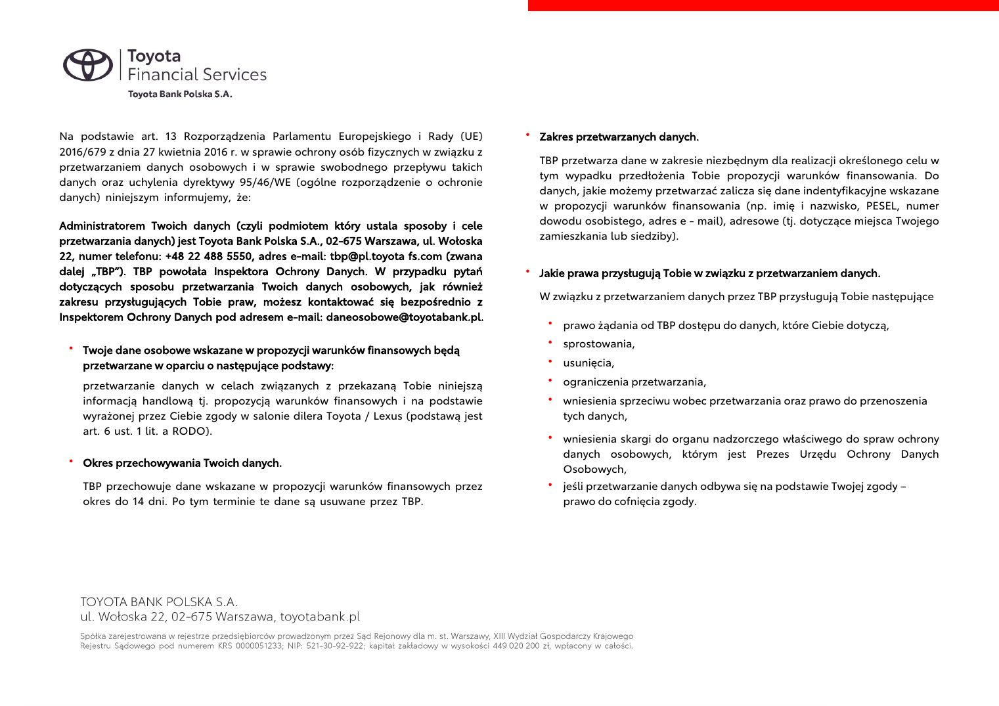

# Toyota Yaris Style Forest Green - oferta

| Pole | Wartość |
|---|---|
| Źródłowy PDF | `Toyota Yaris forest green wersja style..pdf` |
| Liczba stron | 4 |
| Ekstrakcja tekstu | `pdftotext -layout`, UTF-8 |
| Reprezentacja wizualna | render każdej strony, 130 DPI, JPEG |

> Treść pozostawiono w brzmieniu źródłowym. Nie poprawiano literówek, wartości, nazw ani niespójności występujących w PDF-ie.

## Spis stron

[Strona 1](#strona-1) · [Strona 2](#strona-2) · [Strona 3](#strona-3) · [Strona 4](#strona-4)

## Strona 1

[Otwórz obraz strony 1 w pełnej rozdzielczości](assets/18-toyota-yaris-forest-green-wersja-style/page-001.jpg)

### Tekst z warstwy PDF

~~~~text
Dealer:                                                                                        Oferta dla:
ANWA SPÓŁKA Z OGRANICZONĄ
ODPOWIEDZIALNOŚCIĄ
AL. Pokoju 57
31-564 Kraków

Osoba kontaktowa: BARTOSZ STRAUB                                                               Oferta finansowania: KS/076/2026/8/K1NKS/022777
Tel. 882379788                                                                                 Data: 12.08.2026
E-mail: b.straub@anwa.eu

OFERTĘ FINANSOWANIA ZNAJDZIESZ NA KOLEJNEJ STRONIE.

           Wymagane dokumenty do decyzji kredytowej:
           • dowód osobisty
           • oświadczenie współmałżonków o odpowiedzialności majątkowej
           • oświadczenie o uzyskiwanych dochodach

           Wybierając nasze usługi zyskujesz!
           • Łatwość w załatwieniu formalności – wszystko w jednym miejscu u Twojego dilera Toyoty.
           • Uproszczona procedura zawarcia umowy dla konsumenta.
           • Dostęp do szczegółów umowy i harmonogramu przez serwis internetowy.

Dziękujemy za zainteresowanie naszą ofertą finansowania.
Zadowolenie naszych Klientów oraz jakość świadczonych usług są dla nas najważniejsze.
~~~~

## Strona 2

[Otwórz obraz strony 2 w pełnej rozdzielczości](assets/18-toyota-yaris-forest-green-wersja-style/page-002.jpg)

### Tekst z warstwy PDF

~~~~text
                                                    OFERTA FINANSOWANIA W PRODUKCIE: STANDARD KREDYT

                                  Toyota Yaris Style 5-drzwiowy                                                                         Toyota Yaris Style 5-drzwiowy                                                                          Toyota Yaris Style 5-drzwiowy
                            hatchback HEV 1,5 VVT-i H 116 KM                                                                       hatchback HEV 1,5 VVT-i H 116 KM                                                                       hatchback HEV 1,5 VVT-i H 116 KM
Pojazd                       hybryda, Skrzynia: Bezstopniowa                                                                        hybryda, Skrzynia: Bezstopniowa                                                                        hybryda, Skrzynia: Bezstopniowa
                         automatyczna, Samochody osobowe, rok                                                                   automatyczna, Samochody osobowe, rok                                                                   automatyczna, Samochody osobowe, rok
                                     produkcji: 2026                                                                                        produkcji: 2026                                                                                        produkcji: 2026

Numer kalkulacji                                           022777/01                                                                                             022777/02                                                                                              022777/03
Liczba oferowanych
pojazów
                                                                     1                                                                                                      1                                                                                                      1

Liczba rat                                                         36                                                                                                     36                                                                                                     48

Cena                                                  107 920,00 zł                                                                                          107 920,00 zł                                                                                          107 920,00 zł

                                                        50 000,00 zł                                                                                          30 000,00 zł                                                                                           50 000,00 zł
Wpłata własna
                                                         (46.33%)                                                                                               (27.8%)                                                                                               (46.33%)

Kwota kredytu                                           60 526,40 zł                                                                                           81 426,40 zł                                                                                          60 526,40 zł

Rata miesięczna                                          1 938,80 zł                                                                                            2 608,27 zł                                                                                            1 535,00 zł

Oprocentowanie
                                                                 9,49 %                                                                                                 9,49 %                                                                                                 9,99 %
kredytu

                              Oferta została oparta na zmiennej stopie                                                               Oferta została oparta na zmiennej stopie                                                               Oferta została oparta na zmiennej stopie
                                   procentowej, RRSO 13.2694 %                                                                            procentowej, RRSO 13.2694 %                                                                            procentowej, RRSO 13.0538 %

                     Rzeczywista Roczna Stopa Oprocentowania (RRSO) dla kredytu samochodowego STANDARD KREDYT Rzeczywista Roczna Stopa Oprocentowania (RRSO) dla kredytu samochodowego STANDARD KREDYT Rzeczywista Roczna Stopa Oprocentowania (RRSO) dla kredytu samochodowego STANDARD KREDYT
                     na zakup nowego pojazdu o wybranych parametrach wynosi 13,27%, całkowita kwota kredytu (bez na zakup nowego pojazdu o wybranych parametrach wynosi 13,27%, całkowita kwota kredytu (bez na zakup nowego pojazdu o wybranych parametrach wynosi 13,05%, całkowita kwota kredytu (bez
                     kredytowanych kosztów kredytu) 57 920,00zł, całkowita kwota do zapłaty przez konsumenta kredytowanych kosztów kredytu) 77 920,00zł, całkowita kwota do zapłaty przez konsumenta kredytowanych kosztów kredytu) 57 920,00zł, całkowita kwota do zapłaty przez konsumenta
                     69 796,64zł, oprocentowanie zmienne 9,49% w skali roku, całkowity koszt kredytu 11 876,64zł, (w tym: 93 897,73zł, oprocentowanie zmienne 9,49% w skali roku, całkowity koszt kredytu 15 977,73zł, (w tym: 73 679,67zł, oprocentowanie zmienne 9,99% w skali roku, całkowity koszt kredytu 15 759,67zł, (w tym:
                     prowizja 2 606,40zł, odsetki 9 270,24zł). 36 miesięcznych rat równych w wysokości 1 938,80zł.          prowizja 3 506,40zł, odsetki 12 471,33zł). 36 miesięcznych rat równych w wysokości 2 608,27zł.         prowizja 2 606,40zł, odsetki 13 153,27zł). 48 miesięcznych rat równych w wysokości 1 534,99zł.
                     Kalkulacja została dokonana na dzień 12.08.2026. Kredyt na zakup pojazdu w cenie 107 920,00zł, z Kalkulacja została dokonana na dzień 12.08.2026. Kredyt na zakup pojazdu w cenie 107 920,00zł, z Kalkulacja została dokonana na dzień 12.08.2026. Kredyt na zakup pojazdu w cenie 107 920,00zł, z
                     wpłatą własną 50 000,00zł                                                                              wpłatą własną 30 000,00zł                                                                              wpłatą własną 50 000,00zł
                     Wymóg zawarcia dodatkowej umowy ubezpieczenia autocasco (AC) i z tytułu kradzieży (KR) dla Wymóg zawarcia dodatkowej umowy ubezpieczenia autocasco (AC) i z tytułu kradzieży (KR) dla Wymóg zawarcia dodatkowej umowy ubezpieczenia autocasco (AC) i z tytułu kradzieży (KR) dla
                     kredytowanego samochodu, której kosztu nie da się przewidzieć - koszt niewliczony do RRSO. kredytowanego samochodu, której kosztu nie da się przewidzieć - koszt niewliczony do RRSO. kredytowanego samochodu, której kosztu nie da się przewidzieć - koszt niewliczony do RRSO.
                     Szczegółowe warunki finansowania uzależnione są od wyniku przeprowadzonej przez Bank analizy Szczegółowe warunki finansowania uzależnione są od wyniku przeprowadzonej przez Bank analizy Szczegółowe warunki finansowania uzależnione są od wyniku przeprowadzonej przez Bank analizy
                     zdolności kredytowej Klienta na podstawie przekazanych przez niego informacji. Niniejsza symulacja nie zdolności kredytowej Klienta na podstawie przekazanych przez niego informacji. Niniejsza symulacja nie zdolności kredytowej Klienta na podstawie przekazanych przez niego informacji. Niniejsza symulacja nie
                     jest ofertą w świetle kodeksu cywilnego.                                                               jest ofertą w świetle kodeksu cywilnego.                                                               jest ofertą w świetle kodeksu cywilnego.
~~~~

## Strona 3

[Otwórz obraz strony 3 w pełnej rozdzielczości](assets/18-toyota-yaris-forest-green-wersja-style/page-003.jpg)

### Tekst z warstwy PDF

~~~~text
                                                    OFERTA FINANSOWANIA W PRODUKCIE: STANDARD KREDYT

                                 Toyota Yaris Style 5-drzwiowy
                            hatchback HEV 1,5 VVT-i H 116 KM
Pojazd                       hybryda, Skrzynia: Bezstopniowa
                         automatyczna, Samochody osobowe, rok
                                     produkcji: 2026

Numer kalkulacji                                          022777/04
Liczba oferowanych
pojazów
                                                                     1

Liczba rat                                                         48

Cena                                                  107 920,00 zł

                                                       30 000,00 zł
Wpłata własna
                                                         (27.8%)

Kwota kredytu                                           81 426,40 zł

Rata miesięczna                                          2 065,03 zł

Oprocentowanie
                                                                 9,99 %
kredytu

                              Oferta została oparta na zmiennej stopie
                                   procentowej, RRSO 13.0535 %

                     Rzeczywista Roczna Stopa Oprocentowania (RRSO) dla kredytu samochodowego STANDARD KREDYT
                     na zakup nowego pojazdu o wybranych parametrach wynosi 13,05%, całkowita kwota kredytu (bez
                     kredytowanych kosztów kredytu) 77 920,00zł, całkowita kwota do zapłaty przez konsumenta
                     99 121,66zł, oprocentowanie zmienne 9,99% w skali roku, całkowity koszt kredytu 21 201,66zł, (w tym:
                     prowizja 3 506,40zł, odsetki 17 695,26zł). 48 miesięcznych rat równych w wysokości 2 065,03zł.
                     Kalkulacja została dokonana na dzień 12.08.2026. Kredyt na zakup pojazdu w cenie 107 920,00zł, z
                     wpłatą własną 30 000,00zł
                     Wymóg zawarcia dodatkowej umowy ubezpieczenia autocasco (AC) i z tytułu kradzieży (KR) dla
                     kredytowanego samochodu, której kosztu nie da się przewidzieć - koszt niewliczony do RRSO.
                     Szczegółowe warunki finansowania uzależnione są od wyniku przeprowadzonej przez Bank analizy
                     zdolności kredytowej Klienta na podstawie przekazanych przez niego informacji. Niniejsza symulacja nie
                     jest ofertą w świetle kodeksu cywilnego.
~~~~

## Strona 4

[Otwórz obraz strony 4 w pełnej rozdzielczości](assets/18-toyota-yaris-forest-green-wersja-style/page-004.jpg)

### Tekst z warstwy PDF

~~~~text
Na podstawie art. 13 Rozporządzenia Parlamentu Europejskiego i Rady (UE)            • Zakres przetwarzanych danych.
2016/679 z dnia 27 kwietnia 2016 r. w sprawie ochrony osób fizycznych w związku z
                                                                                      TBP przetwarza dane w zakresie niezbędnym dla realizacji określonego celu w
przetwarzaniem danych osobowych i w sprawie swobodnego przepływu takich
                                                                                      tym wypadku przedłożenia Tobie propozycji warunków finansowania. Do
danych oraz uchylenia dyrektywy 95/46/WE (ogólne rozporządzenie o ochronie
                                                                                      danych, jakie możemy przetwarzać zalicza się dane indentyfikacyjne wskazane
danych) niniejszym informujemy, że:
                                                                                      w propozycji warunków finansowania (np. imię i nazwisko, PESEL, numer
Administratorem Twoich danych (czyli podmiotem który ustala sposoby i cele            dowodu osobistego, adres e - mail), adresowe (tj. dotyczące miejsca Twojego
przetwarzania danych) jest Toyota Bank Polska S.A., 02-675 Warszawa, ul. Wołoska      zamieszkania lub siedziby).
22, numer telefonu: +48 22 488 5550, adres e-mail: tbp@pl.toyota fs.com (zwana
dalej „TBP”). TBP powołała Inspektora Ochrony Danych. W przypadku pytań             • Jakie prawa przysługują Tobie w związku z przetwarzaniem danych.
dotyczących sposobu przetwarzania Twoich danych osobowych, jak również
zakresu przysługujących Tobie praw, możesz kontaktować się bezpośrednio z             W związku z przetwarzaniem danych przez TBP przysługują Tobie następujące
Inspektorem Ochrony Danych pod adresem e-mail: daneosobowe@toyotabank.pl.
                                                                                        • prawo żądania od TBP dostępu do danych, które Ciebie dotyczą,
                                                                                        • sprostowania,
 • Twoje dane osobowe wskazane w propozycji warunków finansowych będą
    przetwarzane w oparciu o następujące podstawy:                                      • usunięcia,

    przetwarzanie danych w celach związanych z przekazaną Tobie niniejszą               • ograniczenia przetwarzania,
    informacją handlową tj. propozycją warunków finansowych i na podstawie              • wniesienia sprzeciwu wobec przetwarzania oraz prawo do przenoszenia
    wyrażonej przez Ciebie zgody w salonie dilera Toyota / Lexus (podstawą jest           tych danych,
    art. 6 ust. 1 lit. a RODO).
                                                                                        • wniesienia skargi do organu nadzorczego właściwego do spraw ochrony
                                                                                          danych osobowych, którym jest Prezes Urzędu Ochrony Danych
 • Okres przechowywania Twoich danych.
                                                                                          Osobowych,
    TBP przechowuje dane wskazane w propozycji warunków finansowych przez               • jeśli przetwarzanie danych odbywa się na podstawie Twojej zgody –
    okres do 14 dni. Po tym terminie te dane są usuwane przez TBP.                        prawo do cofnięcia zgody.
~~~~
